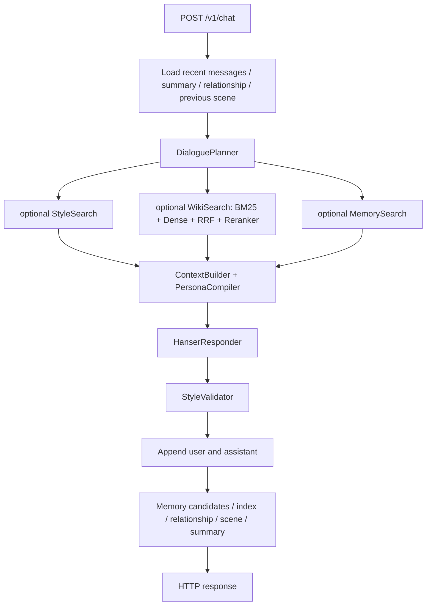

# Current Implementation Audit

审计日期：2026-09-05。基线是当前目录中的真实源码、SQLite 快照和本次执行结果，不是 README 的 Phase 宣称。原规格保持不变。

## Executive conclusion

系统已经具备 Phase 1–6 的主要模块和一条实际运行的 Python 聊天链路，但不能判定“Phase 6 已验收”。统一 Responder 和职责分层值得保留；Phase 5 数据质量、Phase 6 记忆语义正确性以及资源/上下文生命周期需要补验收与局部修复。

证据入口：[`snapshot.json`](audit_artifacts/phase6/snapshot.json)、[`unit_tests.log`](audit_artifacts/phase6/unit_tests.log)、[`fault_probes.json`](audit_artifacts/phase6/fault_probes.json)、[`runtime_traces.jsonl`](audit_artifacts/phase6/runtime_traces.jsonl)、[`CURRENT_SYSTEM_EVALUATION.md`](CURRENT_SYSTEM_EVALUATION.md)。MEASURED 指本次执行；INFERRED 指从代码推导、未直接证明用户体验；NOT_EXECUTED 不算通过。

## Actual Architecture

这是 modular monolith：FastAPI、明确的服务编排、三个结构化检索工具、一个 PersonaCompiler、一个 ContextBuilder、一个 HanserResponder、确定性格式处理、SQLite 持久化及回复后记忆管线。没有运行时多 Agent、LangChain 或 LangGraph 依赖。**KEEP AS IS**。

| 边界 | 当前实现 | 结论 |
|---|---|---|
| HTTP | `hanser_agent/api.py:create_app`，`POST /v1/chat` | 实际调用 `ChatAgentService.send`；本次用 ASGI HTTP transport 验证，未启动 WPF |
| Planner | `agent/planner.py:DialoguePlanner.plan` | Local Qwen3.5，Pydantic 输出，外部一跳 fallback，再规则 fallback |
| Fact | `WikiSearchTool → HybridRetriever → local reranker` | chunk BM25、dense、RRF、rerank 全在调用链 |
| Style | `StyleSearchTool.search` | 独立 collection，规则标签＋dense＋简单加权 |
| Memory | `MemorySearchTool → MemoryRetriever` | 独立 collection；检索结果按 user_id 过滤，但过滤发生在全局 top-k 后 |
| Persona | `PersonaCompiler.compile → PersonaSnapshot.render` | 固定 identity/voice/boundaries＋common 和本轮 mode behavior；state 原样渲染 |
| Context | `ContextBuilder.build` | 所有检索数据拼到单个 system message；有字符统计，无 token 截断 |
| Responder | `HanserResponder.respond` | 所有正常 Python 路由只调用命名 `responder` profile |
| Validation | `StyleValidator.normalize` | 保护 URL、代码、书名、引用；只做标点和空白处理 |
| Persistence | `ConversationStore.append_turn` | user/assistant 同事务；然后才执行 post-turn |
| Post-turn | `PostTurnPipeline.process` | regex extractor、阈值 gate、SQLite upsert、embedding、关系、scene、摘要，均在返回 HTTP 前等待 |
| Providers | `model_gateway.py`、`retrieval/embedding.py`、`retrieval/reranker.py` | 生成 provider 与业务分离；专用检索模型独立，合理，无须强塞进单一网关 |

## Runtime Call Graph

`asyncio.gather` 只并行工具任务；Style、Fact、Memory 共享一个 embedder，编码有 inference lock，因此不能将三段 wall time 相加作为总时长，也不能假定 embedding 真正并行。

### A–F 实际路径

| 场景 | 实际路径与限制 | 本次证据 |
|---|---|---|
| A 普通闲聊 | Planner 通常选择 Style/Memory；事实工具不调用；同一 Persona/Responder | runtime `continuity` 1–8 |
| B Wiki factual | Planner 先卸载 Ollama，再 Hybrid/Reranker；证据进入同一 ContextBuilder | runtime `mixed` 2、4、9 |
| C Wiki follow-up | Planner 输入最近最多 8 条消息和摘要，生成 standalone_query；无单独 follow-up responder | runtime `mixed` 3；`test_planner_fallback.py` |
| D Memory recall | `need_memory` 默认 true；取 user_id 的 active memories；普通回复后才写新记忆 | runtime `continuity` 9–14；cross-session artifact |
| E Long conversation | 完整消息持久化，近期 12 条；20 条消息触发摘要，增量覆盖每 12 条；不是语义 summarizer | 两组 20 轮 trace；`ConversationSummarizer.update` |
| F relationship/scene | 读取前一轮状态，经 Compiler 渲染；本轮情绪主要靠 Planner/当前用户文本；scene 本轮处理完才更新 | runtime context/post_turn 快照；`CharacterStateEngine` |

不存在正常 API 的 streaming、debug context API、conversation branch/edit API、独立主动 callback engine。WPF 只有迁移客户端与代码片段，缺少可重新构建的 WPF 工程，现有二进制是否接入 Python **NOT_EXECUTED**。因此“Python 中只有一个 Responder”不能扩大为“发布的旧 WPF 二进制绝无旧路径”。

## Phase 0–6 Completion Matrix

总体状态按最弱的必要验收项判断，不能把局部通过上升为整个 Phase 完成。细分结果如下。

| Phase | Requirement | Code exists | Runtime active | Tests | Behavior verified | Status | Evidence |
|---|---|---|---|---|---|---|---|
| 0 | 可用 chat、原 Persona、冻结 baseline、git tag | 部分 | Python 是 | 原 30 项测试通过 | 本次建立快照 | PARTIAL | 无 `.git`/tags/历史；`snapshot.json` 不等于历史 tag |
| 1 | 闲聊/Wiki 共享 final responder | 是 | 是 | unified/context/API tests | 实际普通/Wiki/follow-up 通过同一对象 | VERIFIED | `api.build_chat_agent`、`agent.service.send`、runtime traces |
| 1 | fallback/validator 覆盖 | 是 | 是 | formatter tests | 正常输出包括空模型文本 fallback 经过 normalize；网络失败直接报错 | IMPLEMENTED | `responder/service.py`；无备用普通聊天 responder |
| 2 | local reranker 替代在线 Prometheus | 是 | 是 | 注入及格式测试 | 实际 Wiki 检索调用本地模型 | VERIFIED | `WikiSearchTool.search`、本次 retrieval benchmark |
| 2 | 相比旧方案质量提升、失败 graceful degrade | 部分 | 失败时没有降级 | 原测试未覆盖故障 | 注入失败直接抛 RuntimeError；旧 Prometheus A/B 未重跑 | PARTIAL | `fault_probes:reranker_failure` |
| 3 | structured local plan、rewrite、fallback | 是 | 是 | gateway/fallback tests | 本次本地 router 结果见 Eval；线上有模式误判 | IMPLEMENTED | `DialoguePlan`、`DialoguePlanner`；不能把 schema success 当语义正确 |
| 4 | BM25/Dense/RRF/rerank/chunk/source | 是 | 是 | chunk/RRF/vector tests | 本次四路检索复测 | VERIFIED | retrieval log 与 runtime evidence |
| 4 | update/delete/reindex/embedding lifecycle | 全量 rebuild 部分具备 | 手动离线 | 缺更新生命周期测试 | 跨 store 缓存返回旧索引已复现 | NEEDS_REWORK | `indexer.py`、`SQLiteVectorStore._cache`、fault probe |
| 5 | inventory/extraction/labels/style store/retrieval/compiler | 是 | 是 | 三项 Style tests | 886 rows、111 次选择、真实生成消融 | IMPLEMENTED | diagnostics、frozen_contexts、ablation outputs |
| 5 | 来源质量与“更像 Hanser”的验收 | 不充分 | 错误标签/混合话语参与检索 | 原测试未覆盖真实格式 | 文本抽查 9/50 有明确结构问题；评审结果见 Persona Review | NEEDS_REWORK | corpus_assessment；style:1308/1513/1717 等 |
| 6 | persistent conversation/summary/user memory | 是 | 是 | memory tests | 实际 20 轮、跨会话复现 | IMPLEMENTED | runtime/cross_session artifacts |
| 6 | episode/shared-event provenance/conflict/false recall | 部分 | 是 | 原测试只测 name 同 key 覆盖 | 问句变 shared_event；正负喜好并存；完成事件不关闭 | NEEDS_REWORK | extractor、store、fault probes、runtime |
| 6 | relationship/scene | 是 | 是 | 只测试字段出现/增加 | 状态影响无稳定净收益结论；scene 落后一轮 | IMPLEMENTED_BUT_UNVERIFIED | D/E消融、state stress、runtime |
| 6 | inspector/edit/delete | API 有，UI 无 | API 是 | list/edit/delete pass | 删除为逻辑删除；旧 history/summary 可继续保留同一内容 | PARTIAL | `api.py`、`MemoryStore.delete_memory` |

总体：**Phase 0 PARTIAL；Phase 1 VERIFIED（限 Python 路径）；Phase 2 PARTIAL；Phase 3 IMPLEMENTED；Phase 4 PARTIAL/NEEDS_REWORK lifecycle；Phase 5 NEEDS_REWORK；Phase 6 NEEDS_REWORK。** 不存在一个诚实的“最后所有内容都验收通过的 Phase 6”标签。

## Spec vs Code Differences

| Spec 目标 | 代码现实 | 判断 |
|---|---|---|
| Context 按 token budget 剪裁 | 仅 `block_characters`；`dropped_blocks` 从未填充 | 必须补预算和丢弃顺序；60,000 字符诊断照单全收 |
| 本轮 update_for_turn 后 compile | 前一轮 Scene 注入，本轮结束更新 | 小幅修正，不建情绪引擎 |
| semantic summary | 每条截前160字符、拼接后保留最后800字符 | 截断会丢掉 role/否定/早期信息；需要来源片段和覆盖策略 |
| episode/shared joke/promise | 类型枚举有，Extractor 不产出 episode/shared_joke/promise/relationship_event | 类型存在不等于能力已实现 |
| Prompt name/version/hash/date | 固定 `persona_v1`，planner 无版本/hash；内容变化无需改 VERSION | 不满足可复现要求；本次 snapshot 哈希仅补审计基线 |
| traces/context tokens/TTFT | trace_id 只存消息；Provider 丢弃 usage；无生产 stage trace/TTFT | 本次 harness 可测不等于生产已具备 |
| GroundingValidator/repetition checks | 在线只有标点与空白替换 | 用离线 grounding eval 加门禁；不补串行多 Judge |
| ModelResourceManager | Wiki 前卸载 planner；reranker 一旦加载常驻，无反向交接 | 支持做独占资源交替实验；当前长延迟含冷启动/并发审计混杂，尚不能单因归责 |
| 日常 Local-first | Responder 配置为外部 `deepseek-v4-flash` | Phase 7 尚未完成；不把模型名称当官方版本/量化证据 |
| Tool Registry | 三个直接依赖的工具 | 当前规模 **KEEP AS IS**，不必为目录对齐加 registry |
| uncertainty.md/relationship.md | 合并在 boundaries 和动态 state | 文件数量不是缺陷，不为补文件拆分 |

## Dead / Bypassed Components

- `persona/schemas.py:PersonaSnapshot.render` 不渲染 `style_rules`。YAML `prompt_rules` 被加载但不进入模型；现有 voice/behavior 恰好重复了部分规则，掩盖配置空转。不要再添加一套规则；选一处为权威并测试改动能反映到渲染结果。
- `ContextBundle.dropped_blocks` 是空壳诊断字段，不是预算器。
- `AgentRunContext` 是遗留数据类，当前服务未使用；`search_documents`/`context_snippets` 与 `LLMClient` 主要服务旧离线路径，`parse_json` 仍被 ModelGateway 使用，不能整文件删掉。
- `legacy_prometheus.py` 与 `prompts/prometheus.md` 用于离线评测，未发现 Python `/v1/chat` 调用；保留回归对照合理。
- `context_before/context_after` 存在 Style 表，但 runtime `_style_block` 只注入 user_context/response；污染边界不能靠“库里保存前后文”自动修复。
- 旧 `.pyc` 文件（例如 pipeline）存在，但对应源码不在当前树；不能从缓存文件推断它还在路由执行。

## Architecture Violations and Invariants

20 条核心不变量均建议保留，**没有 Architecture Invariant Challenge**。问题在实现守不住约定，不在原则错误。

1. Memory 有 source_message_ids，但只是“用户曾说过”的来源，不能证明共同事件发生。自报事实与双方共同事件缺少证据等级边界。
2. Memory/Style/Wiki 均有文字标签，但仍直接插入 system message。特别是 Scene 中 current_topic/emotional_context/unresolved_threads 原样进入 Persona。这里是 trust-boundary 风险；已证明危险文本可到达该位置，不能声称所有 prompt injection 都能成功。
3. 同一 conversation_id 不校验 user_id；写入时还能覆盖会话 owner。当前 localhost 单用户降低暴露面，但跨窗口/将来多用户时会串历史。不是“全局 memory top-k 把别人记忆直接返回”：Memory SQL 确实过滤 user_id，实际是候选饥饿问题，需区分。
4. Prompt 版本没有内容寻址；索引也没有 revision/dimension/config 完整标识。SQLite 仍适合作为 SoT；问题是生命周期一致性。

## P0 / P1 / P2 Findings

| ID / Priority | Problem / Evidence | Impact | Fix guideline / Cost / Risk / Measure |
|---|---|---|---|
| F01 P0 | 问句 shared_event、否定/条件句误抽取、正负喜好不同 key；7个故障探针及真实多轮 | 持久化错误连续性，可能在后续会话复用 | 先拒写未证实共同经历；原子偏好 subject/predicate；来源+assertion type；1–2 slices，中风险；false-write、correction、cross-session gate |
| F02 P1 | Persona corpus 混合说话人/错配；50抽样9项明确结构缺陷 | 模型学错反应、复制转录注释 | 重做边界及 reviewed eligibility，定向补场景；低代码/中数据成本；源文本回放＋blind pairwise |
| F03 P1 | Wiki→casual 资源交接不完整；runtime 有百秒级请求，部分时段存在并发审计混杂 | 长尾等待损害聊天节奏，具体原因贡献未分清 | 先独占GPU交替20轮、分冷热/阶段，再选释放策略；小改动/中风险；GPU/latency |
| F04 P1 | Context 无 token budget；provider context_window 对兼容端点未约束 | 长输入可能截断/失败且不知丢了什么 | 简单 budgeter，保留身份/current request/证据边界；中成本/中风险；超窗组合测试与token账本 |
| F05 P1 | conversation owner 未校验 | 相同ID跨user混入历史 | owner校验先于任何读取，已归属ID不能改user；低成本/中兼容风险；双user API regression |
| F06 P1 | live vector cache 不知外部 rebuild；style/fact分批更新无原子切换 | 陈旧召回、空窗、模型更换漏索引 | revision+完整性检查+原子发布/显式重启；中成本/中风险；update/delete/reindex 故障恢复 |
| F07 P2 | MemoryPatch(content=None) 通过模型，SQL空SET出错 | inspector请求500 | 拒绝全None patch；低成本/低风险；API422 case |
| F08 P2 | `persona_v1` 固定、usage/traces未保存、旧Judge没看到Wiki evidence | 难以追溯回归或比较模型 | prompt hash、输入快照、eval rubric和候选顺序；低成本/低风险；结果可复跑 |
| F09 EXPERIMENT | Relationship/Scene 数字全部注入，收益尚无稳定证明 | 可能只增token和迎合；scene落后 | 先 controlled disabled/enabled，不扩字段；低成本；source-blind pairwise+drift |
| F10 P1 | `responder/service.py:HanserResponder.respond` 把空content替换为不知道；真实mixed第5轮provider空可见内容 | 用户庆祝考上却收到“憨憨不知道哦”，技术失败伪装成角色反应 | 结构化错误/限次同Responder重试；低成本/中API兼容风险；provider200空content和正常unknown分开验收 |

## Technical Debt / Fault Boundaries

`asyncio.gather` 中任一 Style/Fact/Memory 异常会使整个 send 失败。BM25Reranker 是显式 profile 回滚，不是自动 fallback；Hybrid dense 异常也不会自动走 BM25。生产缺少结构化 degraded status。

`append_turn` 在 post-turn 之前提交；embedding 写入失败可能产生“回复已持久化，但 HTTP 失败”。`upsert_candidate` 重复 content 返回 created=False，之后同一候选不会重试 index。此项为 **INFERRED**，需通过故障注入验收，不能声称本次已经实际丢过用户数据。

`memories` 无 active key 唯一约束；`messages` 无 conversation/turn_index 唯一约束；单会话并发 send 无锁。并发重复序号/状态覆盖是代码风险，本次主行为集顺序执行，**NOT_EXECUTED** 并发压测。不要用事件溯源修复，先小范围事务和请求幂等。

数据库初始化采用 `CREATE TABLE IF NOT EXISTS`，没有 schema migration version；不会迁移未来列改动。后续真正新增列时加入小型编号迁移即可，现在不迁库、不换 DB。

## What stays unchanged

**KEEP AS IS**：统一 Responder、模型角色分工、SQLite、Fact/Style/Memory 分离、确定性 normalizer、按需 Style examples、轻量模块边界、外部 Teacher/Judge 留在离线、WPF 暂作过渡。没有证据支持微服务、通用插件、复杂状态机、新 Behavior Store、框架迁移或立即 LoRA。
