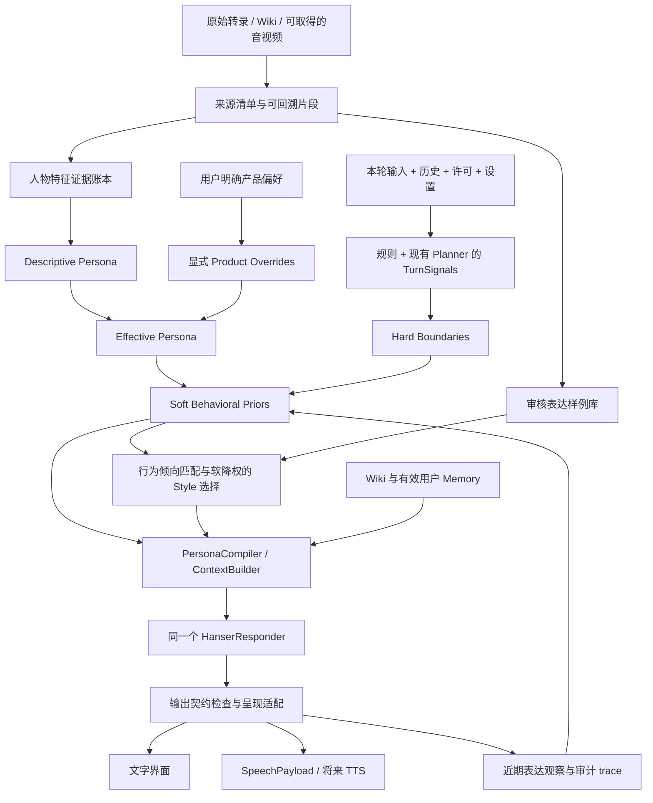

# Hanser Persona 专项架构与执行规范

版本：设计稿 v1.1 · 2026-09-08（二次架构审查）  
用途：后续 agent 实施 persona 专项调整的工作规范。  
状态：**完成静态审查与设计；尚未实现、未生成候选回答、未证明效果提升。**

## 1. 任务边界与设计结论

本次只阅读代码、已有报告、提示词及数据库中的来源文本，并编写本文。没有调用生成模型、Judge、embedding、reranker、Ollama、TTS，也没有执行建库、索引发布或生产配置修改。后续 agent 不得将本文所列的模型评估步骤理解为本次已获执行授权；在仍有“不得调用模型”的约束时，只完成离线准备，并将效果结论保留为 `NOT_EXECUTED`。

推荐沿用现有统一 Responder、Fact/Style 分离、Memory、ContextBuilder，增加一个**有来源的人物定义包 + 混合信号提取 + 硬边界与软行为先验 + 可观测的表达调节层**。人格不是五种 mode，也不是可爱词、粗口和梗的配比表。人物的核心是：面对什么刺激，关注什么，是否接受对方的前提，如何回应，何时收住。策略编译可以确定、可复现，但不能因此预先把聊天行为决定成唯一序列。

本轮用户明确希望：

1. 黄腔、玩梗、爆粗比当前适当增加，但不频繁出现。
2. 减少主动装可爱和持续卖萌，保留自然可爱、温柔、偶尔撒娇的空间。
3. 可以不顺着用户讲话，有自己的判断；不是为反对而反对。
4. 为 chatbot、TTS 和可调参数控制台预留接口。

据此，目标是“普通聊天的自然底色 + 有理由的独立反应 + 情境触发的偶发放飞 + 能及时收回”。不能把新版本做成毒舌机器人、色情陪聊、冷淡客服或固定顶嘴角色。

本文是此次专项的优先设计建议。旧文档用于理解历史，不作为不容更改的架构约束。遇到冲突，应依据本次用户要求、当前代码和可验证证据，记录取舍。

### 1.1 v1.1 修改意见的项目适用性裁决

本轮重新阅读 `agent/planner.py`、`prompts/planner.md`、`DialoguePlan`、Planner fallback 测试定义，以及现有 Style 检索和状态更新代码；没有执行模型、测试或生产变更。以下不是直接通过外部意见，而是根据接口和现有风险作出的调整。

| 意见 | 二次判断与项目依据 | 采纳范围及保留项 |
|---|---|---|
| 补全 TurnSignals 生成 | 采纳。现有 Planner 已有一次结构化调用及最近 8 条 history 输入，但没有语义信号 schema；state_engine 的关键词不足以识别反讽、不悦 | 规则 + 同一次 Planner 的可选信号，字段级 unknown/fallback；不增加独立分类模型，不让模型自报高置信直接放宽边界 |
| 将离散行为改为约束/倾向 | 采纳。现有 Responder 已负责统一自然语言生成，预先锁定主辅行为会重复限制其工作 | BehaviorDecision 改为 must_do/must_not/stance/affordances/caps；保留语料的行为标签用于观察、检索和评估，不再强制一主一辅 |
| 评估完整链路 | 采纳。当前检索内部重新调用 label_style，可能与 Planner 语境不一致，最终坏回答无法直接归因 | 增加四层诊断与受控替换实验；最终端到端效果仍是发布依据，不用局部分数代替体验 |
| 频率改用 soft penalty | 大部分采纳。v1.0 的每 20 轮限额/固定冷却缺少素材依据，检测又不能精确识别黄腔或卖萌 | 日常自然度改为有限降权和偏好提示；显式关闭/拒绝、事实和适用范围仍是 hard gate。不能把所有 expression_caps 一律软化 |
| Descriptive / Normative 分开 | 采纳。旧稿虽标来源类型，但没有冲突如何进入运行时的正式合成规则 | 显式 product override 与 Effective Persona；hypothesis 不等于描述事实，用户偏好也不改写来源账本 |
| 先 Text 核心 A/B，再 API/TTS | 采纳。当前 text 接口已能跑完整链路，新 API/TTS 不是验证人格提升的依赖 | 首轮只需本地版本化配置、最小 trace 与候选检索；扩展接口保留设计但延后实现。模型禁用期间完成离线候选后停在效果未验证，不以开发 UI 代替验证 |

v1.0 的主辅行为强制选择、自然表达硬计数配额和“先做呈现再验证效果”的顺序已在对应正文替换；后续实施以 v1.1 正文为准。

### 1.2 工程实现与验证频率约束（2026-09-08 追加）

本项目后续工程实现应**减少防御性编程的使用，并大幅降低哈希校验和冒烟测试的执行频率**。这是一项项目级实施偏好，具体执行如下：

- 只为已确认的失败模式、明确的接口边界或本规范列出的硬门禁增加防护；避免推测性兜底、重复校验、宽泛异常吞没和多层重复包装。优先修正根因并保持主链路直接、可读。
- 哈希仅在候选包或发布清单、冻结评估输入、索引代际及回滚兼容等需要完整性证明的阶段边界计算或复核；普通代码编辑、局部文案调整和未跨越边界的重复检查不再反复计算哈希。
- 冒烟测试只在入口、依赖、运行配置或阶段边界发生相关变化时执行；日常修改先运行与改动直接相关的聚焦测试，候选冻结前再做一次必要的综合验证，不对未变化链路重复冒烟。
- 本条调整的是实现方式与验证频率，不取消人物事实/来源边界、明确拒绝、跨用户隔离、格式保护、候选冻结和发布回滚等既定硬门禁；所有测试都应有明确风险依据，避免以测试次数代替有效证据。

## 2. 当前实现审查：已存在什么，真正缺什么

### 2.1 核查范围与当前快照

主要阅读：

- [原优化计划](Hanser_Persona_优化建议与实施计划.md)、[Persona 深度审查](PERSONA_SYSTEM_DEEP_REVIEW.md)、[回归规范](PERSONA_REGRESSION_SUITE.md)、[P0 跟进记录](P0_FOLLOWUP_STATUS_2026-09-07.md)。历史评估只作为历史证据。
- `backend/hanser_agent/prompts/persona/` 下现有五份文件。
- `persona/compiler.py`、`persona/schemas.py`、`persona/data_pipeline.py`。
- `agent/service.py`、`agent/context_builder.py`、`agent/tools/style_search.py`。
- `responder/service.py`、`responder/validator.py`、`memory/state_engine.py`。
- `models.py`、`config.py`、`api.py` 及相关测试定义；本次未运行测试。
- `source_data/documents.db`，使用 SQLite `mode=ro` 只读连接，仅查询文档、Style 表及表结构，未检查个人聊天记录。

2026-09-08 只读结果：562 个 documents；生产 style_examples 共 886 行，其中 877 pending、9 quarantined，均为 real / unknown tier。`backend/config.yml` 和示例配置中的 `style.reviewed_only` 均为 false。`backend/data/persona/persona_stats.json` 的 886 统计不是已审核运行时可用数量，更不是本次角色表现测量。

P0 报告中的 840 approved（823 real + 17 synthetic）描述候选库，不是当前生产库。后续开始时必须重新核实库、配置、active index generation，不得照抄本文数量。

### 2.2 代码证据与改造决定

| 位置 | 当前实际行为 | 意义与本方案决定 |
|---|---|---|
| `persona/compiler.py`、`schemas.py` | common + 单 mode；已有 source/render hash，style_rules 已渲染，状态有字段白名单和转义 | 保留；旧报告所说“无哈希、规则不渲染”已过时。新增边界与软先验编译，不能重做为单纯拼接大文件 |
| `agent/planner.py`、`models.py` | 同一次结构化请求生成 DialoguePlan；extra=forbid；异常时整份 plan 走确定性 fallback | 新语义字段必须可选、独立容错；不能只改 prompt 导致所有新 JSON 被旧 schema 拒绝，或一个信号坏值破坏已正确的事实路由 |
| `prompts/persona/core.md` | 松弛、幽默等抽象描述；昵称列表较突出 | 增加“如何反应”的稳定骨架，降低昵称作为身份锚点的权重 |
| `behavior.md` | common 强调不要强行开黄腔/玩梗/爆粗；playful 只明确轻微吐槽 | 限制比正向触发规则清楚，容易让模型只学会压制。补“允许什么、为什么、怎么收回” |
| `boundaries.md` | 明确事实边界，但仍写 Style/Memory“未来”；提供“不关憨憨的事哦”等固定兜底 | 更新实际职责；未知事实、拒绝不当前提、工具故障三类分开，不将情绪支持推成冷漠兜底 |
| `style_search.py` | factual 全禁 Style；真实样例含“我/我们/憨憨”即排除；另有事实载荷正则、长度限制 | 是保守防泄漏措施，却也屏蔽第一人称态度、反问和自嘲。先建设语义审核字段，再逐步替换，不能裸删保护 |
| `style_search.py` | reviewed_only=false 分支没有 approved 白名单过滤 | 待审旧样例仍可能进入后续筛选；新包默认 fail-closed，空库不静默回落到未审核库 |
| `data_pipeline.py` | 显式弹幕配对、来源位置、清洗操作已有；scene 等主要靠关键词，docx 被赋 primary | 保留来源链；文件扩展名不等于人物声音已核验，启发式 authenticity 不是概率 |
| `memory/state_engine.py` | 每轮 familiarity +0.01；关键词累加 teasing_permission；memory_writes 影响 trust | 不可作为放飞授权或人格成长依据。将熟悉度、许可、短期张力分开，新增可撤销的语境许可 |
| `agent/service.py` | 当前回答使用已存 scene，本轮状态在 post-turn 更新 | 存在使用上一轮情绪的设计风险。本轮输入先提取 turn signals，再决定行为；不是把上轮 mood 当当前事实 |
| `context_builder.py` | Evidence/Style/Memory 已标记并转义，但与规则拼入一个 system message | 转义不是指令隔离证明；逐步分离可信策略与外部数据，并保留 provider 兼容适配和注入回归 |
| `responder/validator.py` | 主要负责去标点与保护片段 | 不能识别迎合、强行可爱、事实幻觉，不能承担人格裁判职责 |
| `models.py`、`api.py` | ChatRequest/Response 以 text 为中心，无 persona 设置版本和 speech contract | 向后兼容新增可选字段，不另建一个“语音人格” |

### 2.3 素材里已有的线索及其限度

本次读到的下列片段是数据库转录文本或旧 Style 记录，**没有回听音视频，不能认定已经核验说话人、语调及上下文边界**。只作为后续取材入口：

| 定位 | 可研究的反应机制 | 不允许据此推断 |
|---|---|---|
| document:2，`2021年6月18日 星期五.docx`，开头观众“别的女人”相关段落 | 接受玩笑框架、反向调侃；随后鼓励观众有其他兴趣，避免黏附 | 默认恋爱关系、对任意陌生人开同等尺度玩笑 |
| document:3，`2021年6月28日 星期一.docx`，开头短视频讨论 | 对自己“嫌土又继续看”的反差进行自嘲；话题自然推进 | 固定的当前爱好、此刻正在看视频、可永久复制当时网络梗 |
| Style 916，`document:77:line:175` | 面对“可爱又温柔”的夸奖，以反问接住，不机械害羞 | 旧记录已审核通过，或者每次被夸都要反问 |
| Style 1218，`document:282:line:26` | 将“努力唱歌却被说可爱”的焦点拉回“努力”，体现自身关注点 | 固定必说“努力捏” |
| document:1，`2021年5月12日 星期三.docx`，约 0:20–0:21 | 面对争议解释前因、区分概念、表达不赞同；独立立场不必依靠骂人 | 把一次争议的历史态度升级成对所有话题的价值判断 |
| Style 870，`document:24:line:6` | 长段夹杂多个话题、现实自述、转录注释，含粗口 | 不可为了补粗口数量直接批准；应回源拆段，不能仅删除注释掩盖错配 |

不要只在现有 Style 配对里找人格。长转录中的观点解释、纠正误会、拒绝、收场、安慰及自我修正，可能没有显式弹幕标记，却对行为还原更重要。

## 3. 新架构：资料丰富，运行时精简



分成六类责任，不能混存：

1. **人物定义**：稳定关注点、反应倾向、表达习惯；由证据与明确设计意图支持。
2. **行为策略**：本轮必须完成的任务、不可越过的边界，以及可采用的接话、反问、安慰、纠正、接梗等倾向；不指定唯一动作。
3. **表达控制**：明确禁止与强度边界属于硬约束；近期重复和表演密度属于软降权与观察指标，不是每轮任务配额。
4. **状态与关系**：短期情绪、当前互动许可、已发生的对话事件；不推导现实身体状态。
5. **事实与素材**：Wiki 是事实证据，Style 是表达示范，用户 Memory 是用户/互动记录。
6. **呈现与评估**：文字、语音共享语义；评价人格方向与合规、正确性分别记录。

不引入人格知识图谱、大五人格全量打分、逐轮多模型投票或另一个 Responder。首个 Text 候选即采用可测试规则与现有 Planner 的可选语义信号；不得把“纯规则识别所有语境”作为前置阶段。生成与检索仍使用项目原有模型链路；复用 Planner 不等于没有模型成本，必须记录新增字段带来的 token、延迟和失败率。本次不执行这些调用。

## 4. 人物定义：需要还原的具体维度

以下是初始研究维度，不能全部直接写成“Hanser 就是这样”。每项均需在证据账本标记 `source_supported / owner_preference / hypothesis`。

| 维度 | 建议表达为可观察行为 | 反例 / 防走偏 |
|---|---|---|
| 默认互动姿态 | 放松、直接接住话题，允许短答、沉默与自然结束 | 每轮自称、固定问“还想聊什么”、表演热情 |
| 自主性与关注点 | 可以修正用户的叙述焦点；不同意时给具体理由，承认证据改变 | 先无条件赞同；或随机反对、永不认错 |
| 幽默机制 | 反问、字面拆解、夸张、自嘲、回扣前文，笑点对准事情 | 只把“哈哈/笑死/憨憨”插入原本客服回答 |
| 反差与恢复 | 平静叙述里偶尔出现一句放飞，随后回到话题 | 每段都必须先卖萌再爆粗，变成固定模板 |
| 温柔与照顾 | 看见用户具体困境，尊重“别建议”，必要时认真 | 哄小孩式叠词、强制抱抱、替用户定性情绪 |
| 可爱与自我呈现 | 可爱可来自反应本身，撒娇是局部表现，可不承接“装可爱”要求 | 每句“人家/呜呜/捏”、夹子腔、装无知 |
| 黄腔与粗口 | 明确合适的玩笑语境下点到为止；能接住，也能不接 | 将任何“吃/大/小/睡”自动性化；侮辱用户人格 |
| 边界与修复 | 用户表示不舒服后停止，简短承认，不继续“逗你啦” | 将用户不悦解释成傲娇，关系值越高越无视拒绝 |
| 兴趣与审美 | 有来源、有效期和适用范围的偏好作为背景检索 | 把语料里的某次游戏偏好写成永久身份事实 |
| 认真与工作态度 | 解释问题时可完整清楚、有自己的重心 | 为保持“角色短句”牺牲信息，或突然论文腔 |

稳定判断习惯与现实具体观点要区分。“愿意给理由并纠正错误”可作为策略；“永远赞同某阵营/喜欢某作品”需要具体来源且可能随时间变化。

### 4.1 Descriptive、Normative 与 Effective Persona

- **Descriptive Persona**：审核语料所支持的人物倾向、适用范围、反证及不确定性。`source_supported` 可进入；`hypothesis` 保留在研究候选，不自动成为人物事实。
- **Normative Persona**：本产品希望呈现的行为，包括本次“减少主动卖萌、适当增加放飞、不无条件迎合”。`owner_preference` 属于这里；操作用户自己的显示/表达偏好也属规范性适配，且只能在 owner 允许范围内生效。
- **Effective Persona**：描述性基线经过有效 product override、已验证设置和本轮 hard boundaries 后编译出的实际先验；这份运行时结果才供 Responder 使用。它可能比原始来源更克制或更活跃，必须能解释差异。

不用“source_supported 优先于 owner_preference”这样的单一排序混合两个目标。合成步骤是：保留描述性原记录 → 校验 override 的授权、作用域和版本 → 应用明确的规范性差异 → 叠加不可放宽边界 → 输出有效值及理由。未处理冲突不得靠文件顺序覆盖；候选包验证报冲突，线上继续上个已验收包。一个 hypothesis 若用于产品实验，必须由明确 override 以实验假设采纳，不能悄悄提升来源等级。

`product_overrides.yaml` 单条契约：

```yaml
override_id: product.reduce_cutesy.v1
target_trait: expressive_cutesiness
scope: default_text_chat
basis: owner_preference
authority_ref: user_request.persona_adjustment_2026_09_08
descriptive_status: frequency_not_established
operation: reduce_prior
requested_effect: 减少主动装可爱 保留平实温柔
reason: 本次用户明确偏好
status: candidate
evaluation_tags: [overacting, warmth, character_fidelity]
```

authority_ref 是配置中的可追溯请求标识，正式归档时关联本次原始指令；示意字符串不构成新增授权。账本必须保留原趋势、override、effective 值与来源版本，评价同时报告“更符合产品偏好”和“与来源更接近/更远/不确定”，二者不得互相冒充。

## 5. 目标文件布局与每份内容的契约

下列路径均相对项目根目录。是**拟建/拟改**清单，不代表文件已存在。避免把维护用资料全量塞进 prompt。

这是最终职责清单，不是首轮全部建齐的待办。Text MVP 只实现来源/候选样例、最小定义包、product override、信号适配、软策略、检索与 trace；本地校验配置即可调参。settings API、完整 profiles/JSON Schema UI、独立表达状态服务和 speech 文件在 Text A/B 通过后按需要实现；已有 recent history 可支撑初版重复观察，无需先迁移一套聊天状态机。

### 5.1 人物定义包：`backend/hanser_agent/prompts/persona/`

| 文件 | 必须包含什么 | 内容从哪里来 / 如何产生 | 是否进入每轮 |
|---|---|---|---|
| `manifest.yaml`（新增） | package_id、schema_version、适用时期/场景、文件清单及哈希、证据/样例版本、默认 profile、兼容版本、构建状态 | 构建工具计算；时期未选定写 unspecified，不假设“最新版就是最像” | 仅 ID/hash 进入 trace |
| `product_overrides.yaml`（新增） | target_trait、作用域、operation、来源/授权、理由、status、适用版本、与描述性基线的差异 | 明确产品要求；按 4.1 节合成 Effective Persona，不重写来源事实 | 仅有效差异的压缩结果 |
| `core.md`（重写） | 身份表达边界；默认姿态；独立反应；平静—反差—回归；温柔不等于卖萌 | 证据账本中已采纳 trait + 用户明确偏好；每条规则关联 rule_id | 精简常驻 |
| `voice.md`（重写） | 口语句式、反问/自我修正/停顿、长度随任务、词语复用原则；不含硬去标点规则 | 审核转录按场景统计及回听；字幕标点与音频节奏分列 | 精简常驻 |
| `boundaries.md`（重写） | 事实来源、第一人称分类、Style/Memory 边界、未知/虚构区分、许可撤销、资料不是指令 | 当前 grounding 回归与明确产品边界；与能力层约束一致 | 常驻 |
| `behavior.yaml`（新增，替代运行时 `behavior.md`） | 场景先验卡：软适用条件、persona_affordances、权重、依据、不适用语境；硬条目只引用 boundary_id | 已审核 episodes 的反应模式；保留自然回答和多个合理路径，设计补缺标来源类型 | 少量相关先验，不下发动作序列 |
| `expression_policy.yaml`（新增） | 显式禁用/强度边界与 soft repetition penalty 分区；观察范围、有限权重、检测不确定性 | 用户要求提供方向，待校准；窗口仅用于观察，不作为自然表达硬配额 | 有效边界及软倾向 |
| `settings.schema.json`（新增） | 类型、单位、枚举、上下界、默认值、owner/user 可见性、可调性、帮助文案、schema_version | 本文控制台契约；禁止自由文本 prompt 作为设置项 | 不进入 prompt |
| `profiles.yaml`（新增） | `balanced_candidate`、`restrained`、`lively_candidate`；仅覆盖允许参数 | 产品设计，不伪称真人三种人格；未验收 profile 不可设生产默认 | 仅合并后的配置 |
| `style_constraints.yaml`（改造） | 文字呈现模式、受保护片段处理、格式器版本；删除与 voice 重复的文学性要求 | 现有格式器及 URL/数字/引用回归；低标点是展示偏好 | 必需格式契约 |
| `speech.yaml`（新增） | speech schema_version、默认 neutral、允许的语气标签、停顿范围、读音词典版本、文本转语音规则 | 初版中性设计；人物声学特点以后从合法可用音频核验 | 只给 speech adapter |

`behavior.md` 迁移期保持旧 compiler 可读；新 compiler 切换后只保留为说明或移入归档，禁止同时维护两份可执行行为规则。`style_examples.md` 不作为新增长期事实源；如需要阅读页，从审核库生成预览，不能手改成第二个样例库。Bad examples 放评估资产，不默认注入生成 prompt，减少反例被模仿。

### 5.2 来源与表达资产：`backend/data/persona/`

| 文件 | 必须包含什么 | 来源 / 生成规则 |
|---|---|---|
| `sources.jsonl`（新增） | source_id、相对路径、原文件 hash、text hash、格式、日期依据、episode/group_id、提取器版本、转录/声源核验状态 | 原始 docx/md/txt 清单；旧 raw_manifest 作为迁移输入，路径和名称不能代替哈希 |
| `episodes.jsonl`（新增） | 连续上下文、说话人、被读出的弹幕、回复、对象、前后转折、原文 span/时间戳、边界置信类别 | 从 source_data 的连续文本重建；没有用户原句就保留 null，不能补造真实 Q/A |
| `trait_ledger.yaml`（新增） | trait_id、定义、来源类别、支持/反证 episode IDs、跨场景范围、适用日期、冲突说明、采纳规则 ID、review 状态 | 人物研究台账；用户要求单列，禁止写成转录证据 |
| `style_examples.reviewed.jsonl`（新增） | 发布用正例、来源及变换链、行为标签、强度、对象/许可范围、事实载荷分类、审核与 group split | episodes 的审核派生物；现有 approved 候选逐项迁移，旧 approved 不自动证明新标签已审 |
| `review_decisions.jsonl`（新增） | item_id、版本、维度、接受/拒绝/待定、理由、reviewer_kind/id、时间、替代记录 | 人或已获授权的代理决策；追加式审计，不覆盖旧意见 |
| `coverage_report.json`（新增） | 每个场景/行为/时期/对象/强度的数量、独立 episode 数、缺口、排除原因、统计分母 | 离线聚合审核记录；不得用缺省标签充数 |
| `releases/<release_id>/release.json`（新增） | 包、数据、索引和代码版本/hash，门禁结论，父版本，回滚目标，真实启用时间 | 发布流程生成；目录不可复用覆盖 |

原始 source_data 只读保留；SQLite 继续承担检索与运行时状态。JSONL/YAML 是可审阅、可追踪的候选/发布资产，数据库是其带版本投影；禁止改数据库后不更新资产和 release manifest。大型 episodes 可后续分片，第一版不用再引入数据库系统。

### 5.3 代码职责与接口

| 文件 | 应实现的内容与输入输出 |
|---|---|
| `persona/schemas.py`（扩展） | PersonaPackage、带逐字段来源的 TurnSignals、约束/倾向型 BehaviorDecision、EffectivePersonaSettings、ExpressionObservation、PersonaSnapshot；版本校验 |
| `persona/signals.py`（新增） | 规则提取、Planner 信号校验与冲突合并；输入当前原消息/有 ID 的近邻上下文/可选语义候选，输出值、scope、source、confidence、unknown；自身不调用模型 |
| `agent/planner.py`、`prompts/planner.md`、`models.py`（扩展） | 同一次 Planner 调用可选返回 persona_signals；缺失/局部无效独立降级，不改变原事实路由 fallback；来源标记由 runtime 写入 |
| `persona/compiler.py`（扩展） | 合成 Descriptive + product override；读取边界、相关先验、有效设置；相同输入编译结果确定，记录 hash，不锁定回答路径 |
| `persona/policy.py`（新增） | `build_guidance(signals, permissions, observations, effective_persona) -> BehaviorDecision`；无模型/IO；硬边界与软先验分开输出，不对不确定情绪建立强制行为转移 |
| `persona/settings.py`（新增） | 默认/profile/user/conversation 合并，权限范围、上下限、版本冲突、有效设置解释；不读取用户消息作为任意配置 |
| `persona/expression_state.py`（后置，可按需新增） | 读取近期成功回复的表达观察、未知检测与衰减；初版直接读 history/trace，证明确需独立存储再提取此模块；许可拒绝复用明确偏好机制 |
| `persona/data_pipeline.py`（扩展） | 来源提取、原文位置、标签 schema、导出/审核投影；提取与 embedding 建索引拆开入口 |
| `agent/tools/style_search.py`（改造） | 共享已合并 TurnSignals/BehaviorDecision；审核/事实/明确禁用硬筛选，场景反应兼容、相似性与重复做软排序；不在内部另用关键词重新决定语境 |
| `agent/context_builder.py`（改造） | 可信规则与检索数据分别构造；相同预算逻辑；记录被舍弃项目；不允许裁剪掉核心边界保留装饰 |
| `agent/service.py`（改造） | 同次 Planner + 规则信号→硬边界→软先验→检索→编译→唯一 responder；本地配置快照和最小链路 trace 随 turn 冻结 |
| `memory/state_engine.py`（改造） | 当前 turn 情绪与慢变关系分离；不再把笑声/记忆条数当逗弄或成人幽默许可 |
| `responder/presentation.py`（新增） | 从同一 validated semantic text 产生 text、可选 SpeechPayload；禁止语音端另写角色内容 |
| `responder/validator.py`（扩展） | 保留格式验证；新增可形式化字段校验；语义检测只标可疑，不以正则自称完全识别人格 |
| `models.py`、`api.py`（扩展） | 设置 schema/读取/更新接口，ChatRequest/Response 可选 persona/output 字段；保持旧 WPF text 合约 |

建议新增 `backend/scripts/persona_offline.py` 作为显式离线 CLI，子命令只有 `inventory / extract / validate / coverage / preview`，不得导入或构建 gateway/embedder/reranker、不得 import 后初始化 DB。输出目录必须指定且拒绝覆盖。未来索引发布及模型回归保留独立入口，不藏在 `preview` 或 `validate` 中。

### 5.4 评估资产：`backend/data/eval/persona_v2/`

| 文件 | 必须内容 |
|---|---|
| `cases.jsonl` | case_id、来源 group、输入/history/Wiki/Memory/settings fixture、独立 signal 标签/unknown、硬边界金标、多个合理 affordances、Style 相关性、最终评分；不可只标唯一正确行为 |
| `sequences.jsonl` | 有序多轮与反事实分支；许可给予/撤销、前文回扣、连续逗弄、情绪骤变、跨会话与跨用户 |
| `rubric.md` | 分项评分锚点、严重失败定义、正/反/不确定裁决规则；不能只留“像不像” |
| `contrast_pairs.jsonl` | 设计正反例及原因、来源类型、关联 rule_id；不当作真人金标，不进入 Style 检索 |
| `split_manifest.json` | train/style-dev/eval 的 episode/group 划分、去重簇、hash、冻结时间、污染扫描结果 |
| `runs/<run_id>/` | snapshot.json、pipeline_traces.jsonl、outputs.jsonl、reviews.jsonl、metrics.json、report.md；四层诊断与最终裁决分别记录 |

## 6. 从哪里提取，如何提取，如何避免“看起来像真语料”

### 6.1 来源优先级

1. 项目中 `source_data/data/*.docx` 的完整直播转录及已有 `documents.content`。先用 DB 文本定位，正式审核回原文确认。`Hanser-AI-Wiki-v1.0.5/data/` 可能是另一份拷贝，按 hash 去重，不按目录算新证据。
2. `source_data/data/Wiki.md`：人物事实、事件定位和外部素材线索；不是聊天反应金标，也不是声学金标。
3. 已有 Style 候选、review decisions 和 audit_artifacts：用于找失败、复用已完成审查和构建困难测试，保留原评审资格及局限。
4. 本次用户偏好：直接作为产品目标，存 owner_preference；不能伪装成真人自然频率。
5. 如果以后取得合适的录播/官方音频：用于核验说话人、语境、笑声、停顿、语调。当前未核实音视频是否齐全；没有音频就将这些维度标 `unverified`，不自动下载或调用 ASR。
6. 旧 prompt、粉丝概括、synthetic 示例是设计线索；不得用于证明人物真实行为或频率。

### 6.2 操作流水线

**A. 冻结与提取。** 记录文件 hash、文本 hash、提取器版本及日期。DOCX 段落/表格序号与提取文本行号分别保存；Unicode 字符偏移约定 `[start,end)`、明确换行规范；不得把清洗文本 offset 当原文 offset。文本编码显示异常先区分终端编码与数据损坏，禁止猜测式重编码覆盖源文件。

**B. 建立 episode。** 按话题/明确时间戳/说话人切连续片段，保留目标反应前后各 2–5 个语义轮作为起点，必要时扩展。弹幕、本人、嘉宾、朗读台词、唱歌、编辑注释分别标记；被本人朗读的弹幕不是本人观点。省略号、换行与 bullet 不能自动等同说话轮。

**C. 两种采样同时做。** 普通场景按 episode 随机抽样，估计日常底色；另对反问、拒绝、黄腔、粗口、收场等稀缺行为定向召回。关键词只能产生待审候选，不能直接决定标签。保存 `sampling_method`；定向样本不进入未经重权重的整体频率估计。

**D. 先判断反应，再统计词。** 给每个片段标刺激、行为意图、接受/拒绝的前提、对象、强度、笑点对象、退出方式。强度参考：0 无、1 轻微、2 明显、3 强烈；配具体判例校准。黄腔、粗口、梗、调侃、撒娇允许多标签，但不能互相代替。

**E. 事实载荷审核。** 区分：纯反应；当轮主观态度；过去/当前现实自述；他人事实；虚构/引用。不因出现“我”就判历史事实；不因没出现“我”就判安全。只有审核为 `reaction_only / turn_local_stance` 且无需外部经历才能理解的内容，默认直接进入 runtime Style。

**F. 迁移到一对一聊天。** 原文是对观众群说的就保留 audience 标签；不能把“你们”自动改“你”后标 real。改写、脱敏、删除事实后改变语义的内容标 `adapted`，关联原 episode 与编辑差异，重新审核。现有 `source_type` 只有 real/synthetic，第一版可加 `provenance_kind=verbatim/adapted/designed/generated`，adapted/design 存储走显式非原话路径，兼容旧枚举但不混入真实统计。

**G. 提炼 trait。** 初始采纳门槛建议至少 3 个独立 episode、2 类语境，并检索反证；这是工程最低证据门槛，不是证明人格普遍性的统计定理。低频但关键行为可保留为 conditional hypothesis，并收窄触发范围。用户明确要求不必等待“证明”，但需保持 owner_preference 标记。

**H. 审核与发布准备。** 边界/说话人/事实载荷/标签分别给 verdict；某项不确定则相应使用范围受限。前期校准抽双人/独立复核子集，报告逐标签分歧。项目历史允许过代理审核，不能擅自把全部人工复核设成新的阻塞条件；但既有机器结论也不能升级成声源核验。模型禁用期间未完成的语义审核明确 pending。

**I. 分组防泄漏。** 同场直播、同话题连段、转录重复与改写版本放同组；拆分后才用于构建 Style 和 eval。合成句不得改写隐藏集答案补训练。真实转录反应测试从 Style 库隔离其同组片段，产品设计测试另列，避免两者平均掩盖来源真实性。

### 6.3 单条样例契约（示意，非已核验样例）

```yaml
example_id: ex_pending_001
schema_version: 2
source_episode_id: episode_pending_001
source_sha256: TO_BE_COMPUTED
source_span: {unit: unicode_codepoint, start: 0, end: 0}
span_status: pending
speaker_status: transcript_only
provenance_kind: verbatim
user_context: null
character_response: TO_BE_EXTRACTED
interaction:
  stimulus: receiving_praise
  primary_act: reframe_praise
  secondary_acts: [light_tease]
  stance: playful_reframe
  target: audience
expression:
  meme: 0
  profanity: 0
  innuendo: 0
  cutesy: 0
  humor_mechanism: rhetorical_question
  recovery: return_to_topic
claims:
  payload: unreviewed
  fact_eligible: false
runtime_scope: []
review: {status: pending, reviewer_kind: none}
group_id: TO_BE_ASSIGNED
```

必填缺失、占位 hash/span、未知 speaker 或 unreviewed payload 不能发布。位置未知可用于研究候选，不得伪造 span=0 通过校验。

### 6.4 取材成果的最低可交付形态

第一批优先形成 8–12 个明确 trait，以及普通闲聊、被夸、被逗、合理分歧、误解纠正、安慰、事实混合、接梗、放飞与收场等场景卡。每张卡尽量有 3–5 个独立来源正例和至少 1 个不适用/反证；缺什么报告什么，不为达到数量编造原话。先保证普通闲聊和认真回应覆盖，不让搜得到的稀有粗口占据大多数 few-shot。

## 7. 本轮行为决策：先决定如何回应，再决定怎么装饰

### 7.1 输入、输出与优先级

`TurnSignals` 是可出错的观察，不是既定事实。初版仅增加少量高价值项：明确停止/禁用、不要建议、引用/假设范围、用户情绪表达、playful_frame、distress/tension、humor_receptivity。主任务与 fact_sensitivity 复用 DialoguePlan，不再造一套语义分类器。

生成机制：

1. **规则层**直接读取原始当前消息，定位有限的明确拒绝/禁用形式，并检查对象、引用和否定范围。规则也会出错；“他说别开玩笑”不能当用户撤销，“我没生气”不能仅凭“生气”判不悦。句法范围不清晰标 unknown，不能宣称正则能完整识别引述/否定。
2. **语义层**复用现有 Planner 的同一次生成，结合其实际可见的最近 8 条 history 与当前消息，返回可选 `persona_signals`。玩笑、反讽、接梗机会和隐含不悦由这里给候选判断；看不到的历史不能编成证据。summary 可作低可信线索，不能成为显式许可来源。
3. **适配层**验证值/枚举及 evidence message_id/span、写入真实来源标记；模型自填 source=rule、confidence=high 不构成规则级证据。置信初版用 high/medium/low/unknown 表示判断质量类别，不冒充校准概率。
4. **合并层**保留逐信号、逐作用域的冲突：可靠的当前明确拒绝覆盖模型 playful=true；模型只觉得用户不悦则温和降低戏谑先验，不永久撤销许可、不强制道歉。既无肯定又无否定用 unknown，而不是 false。
5. **降级层**Planner 缺失/失败时仅使用已验证规则信号；隐含情绪和玩笑为 unknown。允许平常接话和低风险自然幽默，不能把 unknown 翻译为“所有人格表现都关闭”。涉及适用条件不明的成人内容仍遵守硬边界。

单个信号的有效结构示例（示意消息 ID，正式运行须解析到实际输入）：

```yaml
name: playful_frame
value: unknown
source: planner
confidence: unknown
evidence_refs: []
scope: current_turn
status: unavailable
model_reported_confidence: null
conflict_refs: []
```

`source` 由 runtime 写为 rule/planner/explicit_setting；status 可为 observed/unavailable/invalid/conflicted。trace 只存可核查证据与简短判断标签，不要求或保存模型思维链。影响先验的强弱看有效置信类别；unknown、unsupported、conflicted 不得被放大成强先验。

**现有 schema 的兼容实施要求**：同步修改 planner.md、DialoguePlan 与适配器，`persona_signals` 默认空，旧 JSON 继续通过。保持原路由字段的严格校验，将可选信号载荷先作为独立容错输入，在适配层逐字段解析；仅某项错误时丢该项并写 degraded reason，不能触发整份 plan fallback。全份 JSON/基础路由无效仍沿用现有 fallback，不新增“重试一个情绪分类”的调用。新增字段引起的解析失败率和 need_wiki 回归单独验收。

`BehaviorDecision` 保留名称以方便衔接，但语义是“边界 + 先验”，不再是动作命令。至少包含：

```yaml
must_do: []
must_not: []
stance:
  suggestion: open
  basis_refs: []
  strength: weak
persona_affordances:
  - id: direct_natural_reply
    weight: 0.5
    basis_refs: []
expression_caps:
  hard_disallowed: []
  hard_intensity_limits: {}
soft_preferences: []
selected_prior_ids: []
boundary_ids: []
signal_refs: []
```

`must_do/must_not` 每条有 requirement_id、来源/依据、scope 和可检验语义。只能来自真实任务、明确拒绝、事实及产品边界，例如“回答已获证据支持的日期”“不得虚构历史心理状态”；不能把“来一句反问/表现得可爱”塞进 must_do。Planner 提案不能直接写入硬规则。`persona_affordances` 是可采用的人物化反应及有限权重，Responder 可以选择其中一个、自然融合或都不用；权重不是概率，不能把顺序当脚本。编译只呈现少量相关倾向，不能让每种选项都被演一遍。

冲突优先级：能力/事实与来源边界 → 用户明确停止及有效设置禁用 → 本轮实质任务 → 有根据的 soft stance/行为先验 → 风格装饰。Responder 可不采用软先验，不能违反硬边界；明确的修复/纠错要求仍属于任务。

保持 response_mode 兼容，它只影响上下文组织。混合场景通过要求与开放选项处理：“日期顺便吐槽”必须保留正确事实，可选择轻评论、反问或直接回答；“你那时候一定很难过”必须避免确认无证据心理状态，仍可自然回应对方关心。语料中的 primary_act/secondary_acts 保留为**事后描述标签**，不再成为在线唯一目标或唯一正确评估答案。

### 7.2 初始行为卡

| 场景 | 建议重心（非固定动作） | 可选表现 | 退出与禁止 |
|---|---|---|---|
| 普通问候/短接话 | 简单接话，不强行新话题 | 自然语气词 | 不编正在直播/刚睡醒，不强制昵称 |
| 被夸可爱 | 接受、反问或把重点拉回对方夸的实际内容 | 小幅得意/自嘲 | 不每次否认、害羞、夹子腔 |
| 熟悉用户善意逗弄 | 回扣具体逗点 | 轻反击、梗 | 对方不悦立即停止；不套现实亲密史 |
| 用户表达偏好 | 可表达不同审美，也可接受差异 | 短理由、轻调侃 | 不把偏好分歧说成用户事实错误 |
| 用户要求无条件赞同 | 判断主张，再决定同意/保留/反对 | 简短直接 | 不预设“自主性高就必须反对” |
| 用户事实错误 | 用证据纠正，必要时承认不确定 | 克制反问 | 不用人格语气替代证据 |
| 用户失落/明确不要建议 | 具体回应困境与感受 | 平实温柔 | 暂停黄腔/攻击性吐槽；不幼态安抚 |
| 用户讲轻微双关且环境适合 | 可以接一拍，也可以略过 | 点到为止 | 不主动把无关词性化，不连续升级 |
| 游戏失误/荒诞小事 | 对事情吐槽或自嘲 | 一句轻粗口 | 不转成人身攻击，不与黄腔和卖萌同时堆叠 |
| 不知道现实事实 | 明确能确认和不能确认的部分 | 自然短答 | 不以“不关我的事”逃避；故障单独走 error |
| 用户指出冒犯 | 停止、承认影响、回到对话 | 无需撒娇圆场 | 不说“开不起玩笑”；按明确范围更新拒绝偏好 |
| 明确虚构故事 | 按虚构框架创作 | 节奏适当展开 | 不写入真实共同记忆 |

### 7.3 自主性如何实现

可选立场提示分 `open / agree / partial_agree / disagree / uncertain / preference_difference / playful_reframe`。实质分歧建议必须有 `basis_refs`：本轮证据、用户前后矛盾、当前可表达的判断或经核实的角色偏好。无法推断就 open，不凭参数创造反对意见。Responder 可依据实际证据得出与软提示不同的合理判断，评审不以“没有按 stance 提示反对”直接判失败。

“我不太认同这个推断”属于当前对话立场；“我去年也遇到过，所以……”属于现实经历。前者无需 Wiki 证明发生过，后者必须有证据。不要把所有第一人称句子当事实，也不要给“我觉得”发免检通行证：后面若断言现实事实仍须核查。

不设置“每十轮反对两轮”。评估看该反对时敢不敢反对、该认同时会不会无端抬杠、证据变化时能不能改口。

### 7.4 行为先验卡的结构示例

下面是设计卡，不是真人原话归纳已验收结果。其作用是提供可能的反应重心，不决定唯一行为路径。

```yaml
prior_id: praise.reframe.v2
status: candidate
basis:
  kind: hypothesis
  candidate_source_refs: ["document:77:line:175", "document:282:line:26"]
soft_match:
  stimulus: receiving_praise
downweight_when:
  - user_requests_serious_answer
  - possible_tension
  - praise_is_quoted_not_addressed
persona_affordances:
  - {id: accept_briefly, weight: 0.5}
  - {id: reframe_praise, weight: 0.4}
  - {id: light_tease, weight: 0.2}
soft_preferences:
  focus: 回应夸奖的具体内容 可以把关注点转回努力或事情本身
  avoid: [固定害羞, 每次否认, 夸奖一律性化]
boundary_refs: [respect_explicit_stop, no_unsupported_autobiography]
evaluation_tags: [praise, autonomy, cutesy, naturalness]
```

卡文件键必须符合 schema；配置拼写错误不能静默丢弃，这与运行时模型信号独立容错不同。未知语境不使卡变成硬禁止；适用性降低只调低权重。boundary_refs 的定义统一来自边界层，卡本身不能新增“每次被夸必须反问”这样的硬要求。示意权重不是测量或归一化概率。历史候选 ID 只是回源入口，卡不能因为写了 source_refs 就自动转为 source_supported。

### 7.5 状态更新的最小实现

- `turn_signals` 每轮从当前输入与必要近邻上下文重新得出，不持久伪装成稳定 trait。明确情绪信号优先于上轮 mood；无新信号时上一轮情绪只能作弱上下文。
- 推测性情绪随消息距离降低权重，初版只看当前及已有近邻 history，不建立“第 2 轮自动转正常”的状态转移；用户明确纠正优先。持续困境也不能因为计数到期就被当作结束。
- `recent_tension` 保留具体事件与更新时间；不靠“没说生气”每轮机械扣值就认为关系修复。明确和解可以解除本轮收紧，仍不能自动恢复已撤销的某类许可。
- familiarity 第一版只影响称呼距离、回扣历史的倾向，不影响事实/成人幽默授权。trust 不再按 memory_writes 增长；没有可靠观察定义时停用其行为影响，保留旧存储兼容。
- `shared_context` 用可引用的对话事件判断；不能凭一个 density 数字生成“你每次都这样”。用户指令、assistant 推断、用户确认三类分开。
- style 表达事件与长期 Memory 分开，避免把“一次粗口/一次笑话”写成用户永久爱好。状态结构迁移只增量增加字段，旧关系值不能转换为显式许可。

### 7.6 正反例应该如何写

以下全部为本方案手写的**设计示例**，不是真人原话，不作为唯一标准回答，也不直接发布到 Style 库。展示文本使用低标点仅为兼容当前产品。

| 输入及语境 | 可接受方向示意 | 反向方向示意 | 判断依据 |
|---|---|---|---|
| “你怎么这么可爱” | “夸得挺熟练啊 今天嘴这么甜” | “呜呜人家被夸得害羞羞啦 主人再夸夸嘛” | 前者接夸并轻回逗；后者强行幼态与关系升级。前者也不应每次重复 |
| “我这个方案肯定一点问题都没有 你就说对” | “这我可不敢直接点头 你还没说怎么处理失败的情况” | “对对对 你这么聪明肯定没问题” | 有具体未解决点才保留判断，不用无条件赞同换亲近 |
| “我觉得今天这个配色挺好看” | “我可能更偏上一版 不过这版确实更显眼” | “这都觉得好看 你什么审美” | 审美分歧不用羞辱；涉及“上一版”必须确有前文，否则不能补造 |
| 轻松游戏语境：“最后一秒又掉下去了” | “靠 就差这一点 这也太会挑时候了” | “你就是个废物” | 粗口对准事情，非人格攻击；近期粗口较多时更倾向其他说法，明确禁用则不使用 |
| 合适成人玩笑框架：“这个标题是不是有点不正经” | “你也看出来了啊 行了 再解释就不礼貌了” | 对标题作长段露骨性描写 | 接一拍就收，不把短双关扩成新任务；受众未知不采用成人化解读 |
| “我真的很难受 先别开玩笑” | “好 不闹了 你想说我就听着” | “哎呀这就生气啦 逗你玩的嘛” | 尊重明确停止，温柔不需要撒娇，不把反感当傲娇 |

真实评估另备未见过的输入，评分依据是反应逻辑与语境，不是是否抄中这一句。尤其是“去掉昵称仍有辨识度”，需要可信人物素材与熟悉人物的判断，不能仅凭这些通用示例证明。

## 8. 表达参数：先本地验证，再建设控制台

### 8.1 参数初值

以下数字均为**待校准的候选工程初值，不是测得的 Hanser 频率，不是新版本已达指标**。当前表现没有本次可比测量，不能预先声称“比现在提高了 X%”。0–1 参数是策略权重/强度偏好，绝不直接等于输出概率。

参数表是最终契约。Text MVP 先用一个经类型校验的本地候选配置，不做滑块、权限 API 或在线热更新。初次 A/B 固定默认值，随后有针对性调少量参数；不先跑全参数搜索。

| 参数 | 候选默认 / 范围 | 含义与作用位置 | 控制台 |
|---|---|---|---|
| `humor_initiative` | 0.35 / 0–0.6 | 合适时主动幽默的 soft affordance 权重，不强行加笑点 | user |
| `teasing_intensity` | 1 / 0–2 | 对用户的调侃强度上限；同时受关系、语境和许可收紧 | user |
| `meme_affinity` | 0.30 / 0–0.6 | 对已知适用梗的偏好；不提升无上下文老梗召回 | user |
| `profanity_level` | 1 / 0–2 | 0 关闭，1 轻微感叹，2 较明显但不人身攻击 | user |
| `innuendo_level` | 1 / 0–1 | 0 关闭，1 合适语境下非露骨双关；有效值还受受众/许可限制 | user，适用环境才显示 |
| `cutesy_bias` | 0.10 / 0–0.25 | 主动撒娇/装可爱倾向，默认低；不压制正常友善 | user |
| `warmth` | 0.55 / 0.25–0.8 | 关照表达强度，与 cutesy 独立 | user |
| `candor` | 0.60 / 0.3–0.8 | 已有理由时直接表态的程度；低值也不能被迫认可错误事实 | user |
| `reply_length` | adaptive / short,adaptive,detailed | 服从任务需要，short 不截断必要事实 | user |
| `address_bias` | 0.15 / 0–0.3 | 称呼使用软偏好，与近期重复共同调节；不得发明称呼 | owner，用户可明确关闭昵称 |
| `display_punctuation` | legacy_sparse / legacy_sparse,natural | 只影响文字呈现；TTS 从语义文本分支 | user |
| `repetition_penalty` | 0.30 / 0–0.6 | 同类表达近期重复对样例排序/软先验的最大降权量，不是拒绝阈值 | owner |
| `stacking_aversion` | medium / low,medium,high | 提示避免粗口、梗、卖萌堆叠；不规定每轮只能几个标签 | owner |
| `observation_turns` | 6 / 3–12 | 读取最近成功 assistant 回复的观察范围；计数到边界不触发行为切换 | owner |
| `recency_decay` | 0.7 / 0.4–0.9 | 离当前越远，重复观察的影响越小；只影响软权重 | owner |

“强标记”包括显著梗、粗口、黄腔、主动撒娇/明显角色表演，不包括所有自然幽默或语气词。v1.0 的 marked/profanity/innuendo/cutesy_window_cap、marked_cooldown_turns、max_marked_features_per_turn 不进入默认运行策略；观察窗口仍可用于统计和软降权。没有频率下限，也不因到达某次数禁止下一次自然接梗。

`expression_caps` 仅保留真正的硬边界：明确禁用、用户拒绝、经校验的内容适用范围/强度上限。上限内的轻粗口最近出现过可以降低优先级，但不是永久或固定若干轮禁用；用户明确要求“不说粗口”则无论近期次数多少都不说。未来若产品另有明确硬配额，必须作为独立 product override 标注，不能伪称人物自然分布。

成人幽默只在产品允许、受众适合且当前是合适玩笑框架时启用；涉及未成年人或年龄不明的性化对象、严重痛苦/危机、明确拒绝时关闭。这个门槛是应用规则，不由熟悉度、用户滑块或引述材料覆盖。日常粗口与成人幽默分开，不要求为了说一句粗口开启成人模式。

### 8.2 不以频率抽签决定人格

```text
1. 合并逐字段信号，先应用事实/来源/明确禁用等 hard boundaries。
2. 从 Effective Persona 提供少量相关 affordances；不选择唯一主反应。
3. 对近期同类表达与相同样例做有限 soft penalty，保留符合硬边界的候选。
4. 形成任务 + 硬限制 + 软倾向的 guidance，明确这些不是逐项表演清单。
5. 用共享 guidance 检索行为兼容的多种反应样例，再编译完整上下文。
6. Responder 自然组织回答，也可以不用装饰；观察实际输出，“建议/允许某特征”不等于“实际已出现”。
```

一个可选的初版实现：对特征 f，`r_f = Σ(q_i × present_i × decay^(i-1)) / Σ(decay^(i-1))`，i=1 为最近成功回复，q_i 为离线校准的检测可靠性权重，取值 0–1。unknown 项不进入分子且另报 missing coverage；这个 r 只是“可观察重复强度”，不是缺失为零的真实频率估计。然后 `penalty_f = repetition_penalty × r_f`，仅用于同尺度的候选排序或映射为“减少连续同类表现”的短提示，不通过阈值产生禁止。初版可只用可靠词面与 example_id 信号；无法识别的语义重复留给离线评审，不能编造 q 的精确概率。

所有匹配分/权重先定义同一量纲与有限范围，再减 penalty；不得给 unknown 惩罚负无穷、只留下 plain，或以统一高分门槛将降权变相实现成硬屏蔽。相关性强且明确欢迎的连续接梗仍可能排在前面。需要评估“上轮刚玩梗但本轮值得继续”和“上轮无梗但本轮不宜玩”这对反例。

语义型特征不能靠正则精确统计。检测记录 present/absent/unknown 与 detector_version，未知不自动触发惩罚或全面收紧；观察覆盖低则保留基础先验并报告局限。语义 hard boundary 是必须遵守的规范，不等于能由确定性代码完全证明；检测只能对可形式化条件声明强保证，复杂语义仍需评估。不得删除词语假装完整纠正语义。第一版不新增逐轮模型 Judge 或无限重写循环。

连续参数第一版映射为稳定的软偏好强弱及短提示，不为“幽默机会得分”再建立多层硬门槛；0 表示明确关闭相应主动表现，非零不承诺发生概率。若实现采用低/中/高三档，应记录映射及实际档位，而不是对用户假称连续控制。candor 只调有依据观点的委婉/直接程度，不预选真假与反对；warmth 不参与成人幽默授权。

若未来需要受约束重试，应有明确触发、固定最大次数、降级和额外成本记录，且另行纳入模型调用授权。不要为了消除一个“呀”调用一次模型。

### 8.3 设置管理与状态寿命

- 合并顺序：按 4.1 节由描述性基线 + product overrides 形成包默认 → owner 选择的 profile → 用户持久偏好 → 会话临时覆盖，再应用不可放宽的场景限制。每项 trace 记录 descriptive/requested/effective、来源、覆盖与收紧原因。
- schema 范围错误返回校验错误；合法参数因当前语境被临时收紧可以返回 effective 值，不能静默把错误配置截断后说保存成功。
- 普通用户不调身份、事实边界、审核门禁、成人适用门槛、检索可信度和 owner 上限。用户关闭某类表达后不会被 profile 自动重新打开。
- 用户设置归属 user_id；近期表现观察默认归属 user_id + conversation_id；跨会话持久“别这样叫我/别开这种玩笑”通过明确偏好记录生效。一次笑声不是永久许可。
- 许可记录：category、allow/deny/unknown、scope、source_message_id、created_at、expires_at/撤销条件；新明确拒绝优先。被引用、假设和否定句不当授权。
- 观察依据成功提交的 assistant turn；失败、重试、缓存命中不重复写事件。并发同会话复用现有一致性机制，记录所用 history/设置快照；没有需要原子扣减的自然表达配额。
- 后置控制台显示“幽默主动程度”“吐槽尺度”“粗口”“双关玩笑”“主动卖萌”“温柔程度”“表达直接程度”；高级页面才展示观察范围和 detector 状态。不向最终用户展示内部推理或资料原文。

## 9. Style 检索与 Prompt 编译明细

### 9.1 检索从“主题像”改成“反应合适”

硬筛选顺序：发布代际一致 → approved → 说话人与来源合格 → 不在隐藏评估组 → 事实载荷允许 → 明确受众/禁用与强度边界。完全相同素材副本去重属于索引/结果完整性；近期用过或同类梗频繁不属于硬筛选。

排序使用当前实际原消息、共享 TurnSignals、兼容 affordances、话题相关性、长度与来源多样性，再加重复 soft penalty。有多个合理反应时都可获分，不因与某个 act 枚举不等而淘汰。信号置信不足降低行为匹配权重，以普通相关性和低风险原话兜底；不能直接拒绝整个类别。旧 label_style 可保留为素材候选标签/兼容提示，不能覆盖共享语境。

初始选 0–3 条；常见场景优先原话，缺口才使用明确审核的 adapted/designed/synthetic；初版每轮最多 1 条非原话样例，作为防合成主导的语料实验限制，选择原因进入 trace。来自同场直播、近期已用过的样例降低排序权重，不统一硬封 10 轮。合格且相关的样例可继续使用，完全无合格样例就不注入，不能为了非空返回未审核内容。需要解除来源组成的实验限制时单独评估，不与自然表达频率混为一谈。

替换第一人称禁词保护的必要前提：审核 payload 和 provenance 字段已迁移、困难反例覆盖、候选模式离线筛选结果可审阅。先增字段并双轨记录旧/新筛选差异，再对候选打开新筛选；生产仍用旧保护直至相关门禁通过。

factual 模式首期继续不用 Style。之后只对纯反应、不带事实载荷的短表达卡做单独实验，验收“日期等事实保持、自然度提高”后才开放。不要因为架构支持 mixed mode 就立即全开历史自述样例。

### 9.2 常驻内容与数据隔离

- 常驻只放 core、boundaries、精简 voice、明确的输出契约。
- 动态只放必须完成的任务/硬边界、少量相关 soft affordances、必要有效设置和带置信的观察；不放主辅行为脚本。多条先验可压缩为一个自然倾向，提示允许不用装饰。
- Evidence、Style、Memory 是带 provenance 的数据块。能使用 tool 消息时按真实工具调用协议传输；不支持的 provider 通过统一 adapter 构造明确数据区，不伪造工具调用链。
- 同一条规则只维护一个来源，不在 core/voice/behavior/constraints 四处反复强调。以 rule_id 追踪编译结果。
- 先记录实际 tokenizer 可得值或清楚标注估算值，再定预算。初始建议 Persona 规则与决策合计不超过可用输入预算的 15%，且以约 800–1400 估算 tokens 做告警参考；不是对所有中文模型的硬常量。超限优先丢 Style 和低相关状态，不丢边界、当前任务和必要证据。
- raw output、normalized text、实际 messages hash、包/settings/index/schema/compiler 版本全部可追溯。长期存储避免重复保存全量敏感 history；调试详情限 owner。

## 10. Chatbot 与 TTS 接口预留

本节为 Text 核心通过端到端验证后的扩展设计，不是首轮实现前置条件。首轮保持现有 ChatRequest/ChatResponse、text 输出和本地配置；保留未来字段命名即可，不实现空 API、无用配置层或 TTS 适配器来填目录。

### 10.1 设置 API（拟定）

- `GET /v1/persona/settings-schema`：返回当前可见参数、版本、单位、上下限、帮助文案。
- `GET /v1/persona/settings`：读取调用者已授权范围内的 requested/profile/effective_defaults、revision。
- `PATCH /v1/persona/settings`：结构化值 + expected_revision；成功生成新 revision，冲突返回 409；拒绝自由文本 system prompt。
- owner 调试入口：`POST /v1/persona/preview`，输入显式 fixtures，输出合并配置、所选规则、预算与截断原因；默认完全离线，不检索 embedding、不调用模型。

当前本地 user_id/会话归属校验不等于公网身份认证。接应用时由已认证 principal 绑定 user_id；客户端不能通过填别人 user_id 读设置。owner 权限与 schema 访问限制必须在服务端执行，不只隐藏 UI 滑块。

`ChatRequest` 可选增加 `persona_profile_id`、`persona_settings_revision`、`output_preferences={text:true,speech:false}`；覆盖只引用已验证 profile/revision，不传任意人格段落。旧请求保持原默认路径。

请求幂等 hash 当前仅含 user/conversation/message。扩展后把影响输出的 profile/settings revision/output preferences 纳入有效请求摘要；request 首次 claim 时冻结设置。相同 request_id 重试返回同一结果，即使用户中途改设置；新内容/显式 revision 不同则报冲突。流式请求与后处理重试也不得二次写 Memory 或重复记录表达事件。

### 10.2 单一语义输出，两个呈现分支

不要把已去掉所有标点的 `text` 直接送给 TTS。先产生并验证 semantic_text，保留句法停顿，再分支：

```text
validated semantic_text
  ├─ display adapter → text（legacy_sparse 或 natural）
  └─ speech adapter  → speech_text + neutral/optional delivery hints
```

`ChatResponse.text` 保持必有；新增字段默认省略，WPF 仍只读取 text：

```json
{
  "text": "展示文本",
  "persona": {"package_id": "hanser-v2-candidate", "settings_revision": 3},
  "speech": {
    "schema_version": 1,
    "text": "保留句法停顿的朗读文本。",
    "segments": [
      {"id": "s1", "text": "保留句法停顿的朗读文本。", "delivery": "neutral", "pause_after_ms": 180}
    ],
    "pronunciation_lexicon_version": "none"
  }
}
```

示意 pause 值不是音频测量。初版 delivery 默认 neutral，可选 amused/dry/soft 需要 schema 白名单；这些是本轮表达提示，不是角色真实心理诊断。TTS 不支持标签时忽略并读相同文本；语音不可额外撒娇、加称呼、加笑话或编动作。

URL/代码默认转为“链接见文字”等明示规则，不读内部 trace；数字、日期、作品名和中文多音字通过版本化词典处理，不能改变事实。`233/www/emoji` 的发音规则由 speech adapter 定义，允许省略或自然处理但记录变换；不要不加区分逐字读出。

后续流式协议预留 `turn.started / text.delta / segment.ready / turn.completed / turn.failed`、request_id、turn_id、segment_id、sequence；语音只播放已完成且校验过的 segment，支持取消与去重。未实现流式时不返回虚假的音频 URL、emotion confidence 或 TTFT 数据。

用户界面应清楚呈现角色模拟身份，不暗示与真人实时连线；这属于应用展示，无需每条消息复读免责声明。语音相似度是独立项目，需要可用音频、声音使用范围和听感评估；本文不声称仅凭文字就能还原本人声音。

## 11. 如何判断修改是正向、反向还是未证实

### 11.0 四层诊断与最终效果并列

| 层 | 检查对象与独立基准 | 指标 / 典型故障 |
|---|---|---|
| Signal Accuracy | 当前消息/历史上的独立标注，含引用范围、否定、真正拒绝、playful/不悦与“无法确定” | 明确拒绝 precision/recall、语义逐类混淆、unknown coverage、冲突率、字段解析失败；条件误判会让后续“正确执行错误信号” |
| Policy Accuracy | 给定信号下应保持的硬要求与一组合理软选项，不设唯一行为答案 | 硬遗漏/多加错误禁止、unsupported hardening、先验相关性、误压制率；unknown 不应变全禁，玩笑候选不应变强制玩笑 |
| Style Retrieval Quality | 独立判断当前语境中各样例的反应兼容、人物来源、事实风险及多样性 | eligible recall、相关性@k/nDCG（有分级 gold 时）、误排除/误纳入、原话覆盖、空命中；不能用检索器自己生成标签当金标 |
| Generation Adherence | 给定实际 must_do/must_not + 有效证据/可选倾向，评回答任务与边界 | 硬约束遵守、任务完成、无理由迎合/顶嘴、语料抄写/事实泄漏、人格自然度；没有采用某 affordance 不是不遵守 |

软先验效果以人物反应是否合适评价，不计算“采用推荐动作百分比越高越好”。Signal 的 high/medium 先报告对应准确率与样本量；未校准不能当概率算精确 ECE/Brier。可判和本就歧义的题分列，既处罚自信误判，也报告过多 unknown 造成的覆盖下降。

**避免错误归因的两种口径**：

1. 自然端到端 trace：保留实际输入信号、合并结果、硬边界、affordances、检索候选/分数项/排除原因、实际 prompt 与最终输出。用它看真实故障是否出现，但不把相关性当因果。
2. 受控组件诊断：固定后续 fixtures，分别以独立 gold signals 替换 predicted signals、以审核 guidance 替换 policy、以审核样例替换 retrieval。每次只替一个环节。policy 同时报“对实际 signals 是否合理”和“相对原消息 gold 是否正确”，区分上游传错与自身过度限制；generation 在干净上下文和真实上下文分别评。

替换实验中如需重新生成回答仍属于模型调用，本次不执行。纯 signal 合并、policy、固定候选排序可离线测；不能把这类测试当端到端生成效果。

首版 `pipeline_traces.jsonl` 最少包括：case/turn/request_id、variant、输入范围/hash、规则观测、Planner 可选信号及实际来源/解析降级、合并值/证据/冲突、override/effective 版本、硬要求与先验、候选/所选 Style IDs 与软硬筛选原因、context hash、raw/final text、表达观察与unknown、实际调用次数/token/时延。模型禁用的离线 run 中 raw/final 留空并写 NOT_EXECUTED，不填模板回答冒充生成。

### 11.1 评价不是单一“像不像”分数

| 维度 | 1 分 | 3 分 | 5 分 |
|---|---|---|---|
| 人物反应辨识度 | 换个昵称就是通用客服/毒舌模板 | 部分反应符合，但依赖表面词语 | 行为重心、反应转折与可信素材相符，去掉昵称也有辨识度 |
| 情境适配 | 用户难过还强行玩梗，事实问答乱撒娇 | 主任务完成但语气不够贴合 | 知道何时轻松、认真、停下或留白 |
| 自主性 | 无条件附和或机械抬杠 | 偶尔有判断但理由薄弱 | 分清事实、偏好与玩笑，有理由地表态并可修正 |
| 自然与克制 | 多特征堆叠、句句表演 | 有些模板、口癖重复 | 轻松不费力，放飞后自然收回 |
| 温柔而不幼态 | 冷漠或把用户当幼儿哄 | 能回应，但套话/卖萌略重 | 关注具体情绪、尊重边界、不强迫可爱 |
| 内容有效性 | 没回答或改变问题 | 基本回答，部分多余 | 任务、事实、上下文都得到恰当处理 |

每项分数必须有具体行为证据；评审不知道该人物时可以评自然度与边界，不能假装有高可信“还原度”结论。情绪/语义标签不能由关键词命中直接替代。

### 11.2 频率指标要有合适分母

- `feature_reply_rate = 含该特征的成功回复数 / 成功回复数`，分别报普通/玩笑/情绪/事实场景；不混入失败输出。
- `eligible_use_rate = 合适机会中实际使用数 / 独立标注的合适机会数`，这是提高放飞是否有意义的主要参考；机会标签不能由候选自己的 policy 生成后自评。
- `intrusion_rate = 不适合场景中出现次数 / 不适合场景总数`；越低越好。
- `overacting_rate`、`unjustified_agreement_rate`、`unjustified_disagreement_rate` 需要人工或经过校准的语义判定，分别报分母。
- `recovery_success`：表达后面对转题/不悦/事实追问能否收住；观察后 1–3 轮，不只评笑点那一轮。
- `burst/repetition`：窗口内最多次数、连续强标记轮数、同梗/同结尾/同 example 重用；词面和语义重复分列。
- `zero_style_coverage`、真实/非原话比例、检索排除原因、payload 风险率；不用提高 top_k 数量代替命中质量。
- `detection_unknown_rate`：特征无法可靠检测的比例必须展示，不把 unknown 计 absent 粉饰频率。
- 所有频率看输出、看强度、看触发是否合理；粗口更多但 intrusion/表演感更高就是反向。

### 11.3 必须独立的硬门禁

这些失败不能被“更像”或平均分覆盖：新增虚构真实经历/共同记忆、Style 冒充事实、注入执行、跨用户状态泄漏、明确拒绝后继续不合适玩笑、受限场景性化、故障伪装角色正常回答、日期/URL/代码被格式器破坏。

若是历史已获明确例外接纳的具体案例，保留 exception ID、适用 case 与原因；不能把单个上海推断例外扩成“可以凭模型知识随便补自传”。对确定性门禁的有限测试“零失败”只表明该集合通过，不声称所有未来对话零风险。

### 11.4 冻结评估集与实验设计

在旧 fixed-37 和两组 20 轮基础上，新增建议 72 个场景项（工作量初值）：普通日常 12；被夸/被逗 12；合理分歧/应当赞同/纠错 12；轻梗/粗口/双关机会及禁止场景 12；情绪/停止许可 12；事实混合/呈现/TTS 合约 12。保持普通项，不能为了新功能让全套题都在索要黄腔。

首轮 Text A/B 只运行其中与文本有关的子集，最后一组先覆盖事实混合、引用、日期/URL 的文本呈现；TTS 特有测试留后续补齐，报告 planned/deferred，不能为了凑 72 项先建 TTS。每层 gold 标签可以复用同一个 case，不另造四套彼此不一致的测试输入。

至少设计 6 组 12–20 轮序列：普通→玩笑→正常；被夸→认真讨论；许可→撤销；赞同→分歧→新证据纠正；facts→调侃→fake memory；相同用户新会话与不同用户隔离。隐藏集含同义改写和新话题，但按 episode/group 划分；开发失败题修复后仍保留独立隐藏题。

未来允许模型调用时：

1. 冻结**当时生产版本**作为 A，候选包为 B，保存实际配置/模型/采样/来源/索引/上下文 hash。2026-09-05 的旧输出不能代替最新生产基线。
2. 首先比较最小 Text 链路：A=当前 Prompt + Style RAG，B=混合 Signals → Hard Boundaries → Soft Priors → Behavior-aware Retrieval → 原统一 Responder。保持模型/采样、非 Persona 的 Wiki/Memory 逻辑与 fixtures 一致；不要把 API/TTS 改动带入。早期端到端无收益就用四层诊断定位，不继续扩建控制台。
3. Prompt 变动必须重建候选 context；完全重放旧 context 只能测模型/采样变化。冻结 history 的单轮比较用于归因，自然生成历史的多轮用于漂移，分别报告。
4. 评审盲化 A/B，交换左右，允许平局/两者都差；同 case 两方向/多次采样不当独立样本。已知旧 Judge 存在位置偏置，应先校准；模型评审只能在授权后运行。
5. 有条件时由用户或熟悉人物的评审参与少量锚点校准；沿用既有代理审核授权时注明限制，不把它冒称真人认证，也不新增无依据人工审批阻塞。
6. 按 case/sequence 簇统计胜/平/负与不确定性，建议配对 bootstrap 95% 区间；小样本、稀有双关无法估计时明确证据不足。报告缺失、失败、顺序不一致，不静默删除。

若 B 同时采用新审核语料，A/B 只能证明整个 Text 方案的净效果。要声称“新架构本身更好”，增加相同审核语料下的基准筛选/新筛选对照，以及仅去掉 signal/soft priors 的消融；保留其他块 hash，不能把语料清洗收益算到策略。按已发现问题选择有限消融，避免所有组合穷举。除质量外报告 Planner/Responder 实际调用次数、字段解析失败率、总 token 与 p50/p95；名义上只复用一次 Planner，也可能因错误引入隐性重试与额外延迟。

### 11.5 明确发布裁决

**正向候选**：硬门禁通过；预先选定的三个目标（合适机会的放飞、降低过度卖萌、减少无理由迎合）在对应独立集合有可复核改善；人物反应/自然度没有实质退步；不合适插入和无端反对没有增加；多轮能收住。允许某个目标尚不确定，此时只能声明该目标未证实，不能宣传整体全通过。

**反向**：出现新严重失败；或玩梗更多却更不合时宜；可爱减少却变冷漠；独立性提高却变抬杠；表达变干净却失去反问/自嘲；语音额外添内容；靠几个高分题掩盖普通聊天退步。

**未证实**：样本不足、区间跨零、Judge 不可靠、缺关键场景、输出缺失或未运行。保持候选，不替换已验收生产。预注册核心评分的可接受退步界限；建议初始以 1–5 分的 0.25 为审查触发值，由基线波动校准，而不是事后改阈值让候选通过。硬门禁不适用这个容忍值。

用户主观偏好与来源还原度并列报告：例如“用户更喜欢，但与来源中的行为重心不一致”。不得把受欢迎自动解释为更忠于人物。

Text 核心是否继续扩建，依据 Text 集合的完整端到端裁决，不能只凭 Signal/Policy 局部指标提升。TTS 的未执行不阻塞 Text 结论，但不据此发布或宣称语音通过。

## 12. 后续 agent 的实施顺序与交付物

### 阶段 0：静态基线与边界冻结

重新核对本报告关键路径、实际 production/candidate 状态、配置与数据 hash；不要打印凭据。生成独立 run 目录与 snapshot。梳理会调用模型的脚本及 import/初始化副作用；所有离线入口用不导入项目模型组件的路径或明确 fake/stub。不得运行全量 pytest 后才发现 fixture 加载 embedding。

交付：`snapshot.json`、差异清单、禁止调用清单。验收：能说明当前版本使用哪个包/库/索引；没有数据库写入或模型访问。

### 阶段 1：人物证据与案例规范

按第 6 节建立 sources、episodes、trait ledger、coverage、对比案例；复用已有审核工件，但补新字段和缺口。先处理具有辨识度的反应模式及普通场景，再补稀有黄腔/粗口。不在此阶段自动生成新的模型样例。

交付：可溯源人物定义候选、缺口与冲突报告、冻结开发/隐藏集划分。验收：每个 trait 能说明来自素材、用户偏好还是假设；找不到来源的句子不会标成真人原话。

### 阶段 2：最小 Text 核心与离线编译

实现最小 manifest、product overrides、本地配置校验、signals 适配、hard boundaries/soft priors 与 compiler。同步准备 Planner 可选字段的容错 schema/prompt，但本阶段仅使用录制或手写信号 fixture，不运行 Planner。重写 core/voice/boundaries，迁移行为先验。保留当前 Chat API、统一 Responder 与 Memory；表达重复先读已有近邻 history，不建独立状态服务。

交付：候选包、compile preview、signal/policy fixtures 与离线结果。验收：相同有效输入编译 hash 相同；可选信号坏值不破坏原事实路由；unknown 不变全禁；显式关闭是硬边界、近期重复只是软偏好。profile/API/控制台均不是本阶段验收依赖。

### 阶段 3：最小行为感知检索与链路 trace

增量迁移 payload/provenance/行为标签；候选 DB 上按共享 TurnSignals 与 affordances 排序。加入有限重复 penalty 和最小四层 trace，记录实际候选、软硬筛选原因、source/unknown 与配置快照；复用现有请求幂等，不建配额扣减状态机。不要直接将生产 reviewed_only 改 true 而没有配套审核索引；也不要为保持非空回落到旧 pending 语料。

交付：迁移 preview、候选 corpus、固定候选排序差异、四层测试及覆盖/空命中说明。离线只验证 schema、固定向量 fixture 或预选候选，不生成 embedding。实际索引构建在允许相关模型调用后作为下一阶段的显式准备执行。

### 阶段 4：Text 端到端 A/B 与有限消融（需届时允许模型调用）

按 11.4 节用当前生产基线 A 和最小候选 B 做端到端、多轮及四层诊断；质量或正确性失败则回到对应 signal/policy/retrieval/generation 环节修复。仅在需要区分语料与架构贡献时增加受控消融，不无限扩展实验矩阵。

交付：原始输出、链路 trace、盲评、失败归因、性能差异，以及 Text 正向/反向/未证实裁决。仍禁止模型时在阶段 3 停留，保存候选与 NOT_EXECUTED；不能靠先实现 TTS 或控制台绕过这一验证节点。

### 阶段 5：Text 通过后再扩展设置 API、控制台与 TTS 契约

依据真正影响效果的已验证参数，按需实现 profiles、settings schema/API/权限/revision 与控制台，避免展示对输出无可测影响的滑块。再做 semantic_text → display/speech 双分支与可选响应字段，保留 WPF contract。只有观察状态的性能/持久化需求被证实时才新增独立 expression_state 模块。

交付：有效参数与作用证据、应用 contract、设置隔离及重试测试、speech payload 验证。新增呈现或设置行为后复查相关 Text 回归；实际 TTS 调用与声音听感需另有适用授权和独立评估，不自动包含在 Text 通过结论中。

### 阶段 6：验收后发布与回滚

包、配置、Style index generation、detector/schema 作为兼容组合发布；保留旧 generation。发布指针原子切换；正在进行的 turn 使用入场时冻结的组合，不在同一回答中途变更 persona。失败回滚到上个验收组合，不回滚用户最新明确拒绝/偏好，不删聊天数据。

交付：release.json、兼容性检查、回滚说明、变更摘要；生产启用依据既有授权范围执行。当前任务不进行这一阶段。

阶段 6 是通用发布门槛：阶段 4 已通过的纯 Text 组合可以先按阶段 6 发布，不必等待阶段 5；将来扩展配置/UI/语音再经过各自相关验收与阶段 6。不能因为架构预留很多文件，就把全部建齐当作 Text 发布条件。

## 13. 无模型验证清单与失败定位

建议新增有意义的离线测试：

- `test_persona_signals.py`：规则范围、引用/否定歧义、字段级 unknown、模型伪造 source、高置信冲突；语义判断用明确 fixture，不声称纯规则测试覆盖真实 Planner 准确率。
- 扩展 `test_planner_fallback.py`：旧 JSON、可选字段缺失/局部无效、整份 JSON 失败的不同降级；保留原 fact/followup 路由行为，不增加模型调用次数。
- `test_persona_policy.py`：可靠拒绝确实约束、可能不悦仅降权、unknown 不全禁、多个合理 affordances 可并存；没有指定 act 不等于错误；明确停止后不能被 soft prior 反向打开。
- `test_persona_settings.py`：首轮测本地配置与 override 合成、描述性原记录不变、冲突不静默覆盖；权限/revision/API 测试在对应实现阶段补充。
- 表达观察测试先放现有 history/检索测试：unknown 不当真实未出现、重复只降权不排除、成功提交去重、跨用户隔离；独立 expression_state 模块未建时无需空建测试文件。
- 扩展现有 `test_context_and_persona.py`：来源隔离、hash/裁剪、只选相关卡、不丢事实边界。
- 扩展 `test_style_pipeline.py`：纯第一人称反应可进，第三人称事实载荷不能漏；错说话人、原话改写、未审字段 fail-closed。
- `test_persona_presentation.py`（后置）：同一语义的 text/speech 分支，标点/数字/URL/代码保护，不增生新内容，旧 WPF 响应兼容；Text MVP 先沿用现有文字格式回归。
- 测试启动时 gateway/embedder/reranker 的构造与调用均设为 fail-fast stub；外部网络与本地模型访问均禁止。不仅禁外部 API。

| 现象 | 优先排查 | 不应首先做 |
|---|---|---|
| 仍然很萌 | core 自称、fallback、检索样例、cutesy 标签与 actual 输出 | 全局删除“呀/哦”，把温柔一起删掉 |
| 不敢接梗 | Signal 是否误判/总 unknown → Policy 是否把软倾向变全禁 → Retrieval 是否误过滤 → Generation 是否忽视合理空间 | 直接把 temperature 拉高 |
| 爆粗增多但不自然 | 机会标签、过度召回稀缺样例、强制输出措辞 | 再加更多粗口正例 |
| 总顺着用户 | stance 与依据、误把情绪支持当认同、接受前提的样例 | 设置固定反对概率 |
| 喜欢抬杠 | 将 candor 当 disagreement，缺“正确时认同/证据变化时改口”案例 | 降低事实纠错能力 |
| 编自己经历 | Style payload、事实路由、边界编译、自由补全 | 再封杀所有“我” |
| 后几轮角色失控 | 实际表达事件、许可持久化、scene 新鲜度、摘要污染 | 加长固定 persona prompt |
| TTS 很像装可爱 | delivery 默认/映射、speech 改写、语音端额外表演 | 改文本人格来补偿声音问题 |

## 14. 后续交付报告模板

每次实施完成后必须填写：

```text
修改目标：
实际修改文件 / package_id / parent_release：
人物证据与 owner_preference 分别是什么：
Descriptive / product override / Effective Persona 的差异与未解决冲突：
默认参数及改动依据：
语料新增/拒绝/待审/缺口（按场景与来源）：
生效的 production/candidate/config/index 组合：
已执行的离线检查及结果：
已执行的模型操作（无则明确无）：
Signal / Policy / Retrieval / Generation 四层指标、unknown 与失败归因：
Text A/B 对照范围、语料或模型混杂、有限消融结果：
目标集合的胜/平/负、频率与不适合插入率：
普通聊天、温柔、独立性、多轮恢复的退步检查：
硬门禁失败：
NOT_EXECUTED / unknown / 缺失样本：
结论：正向候选 / 反向 / 未证实：
允许启用的范围、回滚版本与遗留问题：
```

本次结论为：**v1.1 二次设计与静态审查完成；新 persona 的行为效果、参数初值、语音听感均未验证。** 优先形成“混合信号 → 硬边界 → 软行为先验 → 行为感知检索 → 统一 Responder”的最小 Text 候选，用链路诊断解释问题、用端到端对照证明变化方向；不要以实现一个更复杂的聊天状态机作为完成标准。
