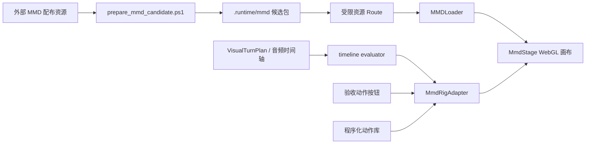

# Hanser L2D 板块：MMD 类 L2D 实施指南

## 1. 当前结论

Hanser 的现有 MMD 模型可以直接作为首个动态角色 Rig，不需要先把 JPG
拆成 PSD，也不需要先制作 Cubism 模型。浏览器实载已验证 PMX、37 个材质和
全部所需贴图可显示；`cloth2.png` 可临时补齐“安全裤”材质。

首版不运行 MMD 全量物理。模型本身的 61,950 顶点与 102,648 三角形不是主要
风险，847 个刚体、1,518 个关节才是持续实时展示的主要性能风险。

目标观感是“类 L2D”：固定正面正交相机、透明背景、仅上半身构图，以低幅度骨骼
动作、Morph 表情、自然眨眼和中文口型为主。

## 2. 首个验收范围

本分支 `codex/l2d-mmd-motion-preview` 提供四个可手动重播的动作：

| 动作 | 目的 | 主要通道 |
|---|---|---|
| 待机呼吸 | 证明角色可以长期自然驻留 | 上半身、头部、自动眨眼 |
| 挥手问候 | 证明句级动作与平滑回落 | 右臂、右肘、右腕、微笑 |
| 点头回应 | 证明低密度回应动作 | 头、颈、微笑 |
| 好奇歪头 | 证明表达与姿态可以组合 | 头、上半身、眉眼 Morph |

验收重点不是动作数量，而是：起势不跳、保持不过度、收势回到待机、循环无明显
抽动、待机至少露出双侧上臂轮廓、挥手全程手掌与前臂可见、聊天交互不被阻塞。
物理、VMD 舞蹈和逐音素中文口型不属于本轮门槛。

## 3. 运行时架构



职责边界：

- `scripts/prepare_mmd_candidate.ps1`：从配布目录建立隔离候选，当前用
  `cloth2.png` 补缺失贴图；不修改原模型。
- `/api/live2d/model/[...path]`：只开放清单内的 PMX/PNG，不提供任意文件读取。
- `MmdStage`：模型生命周期、正交相机、透明画布、灯光、ResizeObserver 和 GPU
  资源释放。
- `MmdRigAdapter`：落实既有 `RigAdapter` 契约，独占骨骼/Morph 最终写入，动作
  结束后回到待机。
- `mmd-motion-library.ts`：纯函数动作采样；动作只描述相对旋转与 Morph 权重，
  不持有 Three.js 场景状态。
- `timeline-evaluator.ts`：继续区分音频时钟与静音 presentation 时钟。验收按钮
  只作为本地动作触发器，后续由 VisualTurnPlan 替换。

## 4. 资源与兼容约束

默认候选目录：

```text
.runtime/mmd/hanser_v2.0_cloth2_test/
  hanser_ver2.0.pmx
  tex/*.png
  new/cloth1_BaseColor.png   # 当前由 tex/cloth2.png 复制
```

准备命令：

```powershell
powershell -ExecutionPolicy Bypass -File .\scripts\prepare_mmd_candidate.ps1
```

生产/其他机器可通过 `HANSER_MMD_MODEL_ROOT` 指向同结构目录。PMX 内部使用
Windows 反斜杠并同时出现 `TEX` 与 `tex`，Web 加载入口必须统一为 `/tex/`；不能
依赖部署文件系统大小写不敏感。

二进制资源不进入 Git。候选晋升时再按发布清单记录来源、作者署名、Rig revision
和一次边界完整性摘要。

## 5. 中文语音与嘴型

日文骨骼/Morph 名只是 MMD 标识符，不要求日语 TTS 或日语中间系统。

实施顺序：

1. 验收阶段保持静音，确认动作与表情。
2. 接入现有中文 TTS 音频包络，驱动 `あ` Morph 的开合并做 attack/release。
3. 需要更细嘴型时，将中文拼音韵母映射至 `あ/い/う/え/お`，辅音阶段回到闭口。
4. 音频时钟拥有嘴型，动作/表情不得竞争同一个 Morph。

## 6. 分阶段推进

### P0：已完成的资产探测

- PMX 可完整解析，贴图缺口已定位。
- `cloth2` 替代候选可实际渲染。
- 确认骨骼、表情和口型 Morph 足够支持首版。

### P1：当前动作验收

- 完成浏览器 MMD 画布和资源代理。
- 完成四个无物理动作及手动播放面板。
- 检查动作方向、穿模、曝光、构图、回落和持续渲染稳定性。

当前状态（2026-09-10）：上半身窗口尺寸已确认；待机双侧上臂可见；点头与好奇
歪头进入首轮候选；待机姿势已按验收意见回滚至原始自然下垂；挥手暂停调整，
不作为颜色校准的阻塞项。

浏览器渲染时必须保持贴图与输出均为 sRGB。该 PMX 的大多数带贴图材质还配置了
`0.8` 的中性漫反射色，在 Three.js 中会与贴图再乘一次而显灰。当前预览对“已绑定
贴图”的材质恢复白色基准，降低 MMD 环境色转换而来的材质自发光，再使用暖色
主光、弱冷色补光和低强度半球环境光。Canvas 仅使用中等幅度的饱和度与对比度
校正，不改变色相，避免破坏肤色与透明边缘。

### P2：对话驱动

- `dynamic_live2d` 开关控制面板加载。
- VisualTurnPlan 选择 `idle/greet/nod/curious`，静音使用 presentation clock。
- 中文音频存在时切换到 audio clock，以实际播放位置驱动嘴型。

### P3：性能与有限物理

- 先测无物理 30/60 FPS、帧时间与显存。
- 仅按白名单尝试少量头发/裙摆刚体；不能直接启用全量 1,518 关节。
- 若有限物理仍不稳定，改用烘焙摆动或程序化次级运动。

### P4：发布候选

- 冻结 Rig profile、动作参数和验收录像。
- 记录资源来源、署名、版本与回滚指针。
- 关闭开关时文字和语音功能保持原状。

## 7. 本地启动与验收

```powershell
cd .\chatbot
pnpm dev
```

打开聊天页，在桌面宽度下使用右上角“Hanser 动作预览”面板。依次播放四个动作，
观察每个动作至少两次。若模型未加载，先执行第 4 节的准备脚本；若使用其他目录，
设置 `HANSER_MMD_MODEL_ROOT` 后重启 Next.js。

本轮聚焦验证：

```powershell
cd .\chatbot
pnpm exec tsc --noEmit
pnpm exec tsx --test lib/live2d/mmd-motion-library.test.ts
```

动作参数的调整优先修改 `mmd-motion-library.ts`；不要为单个模型差异在 React
组件中堆叠条件分支。
