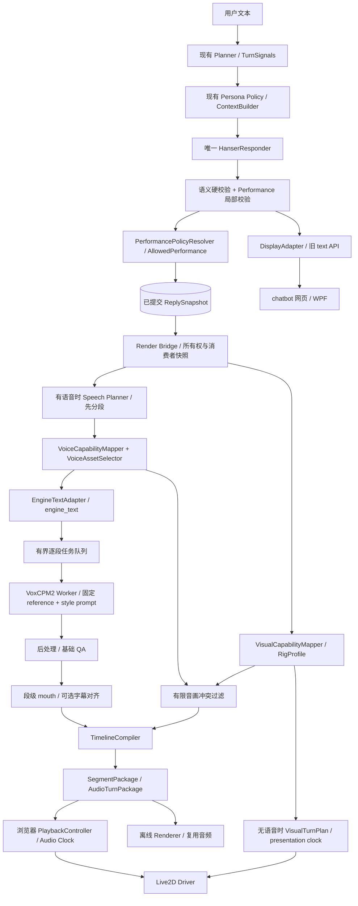
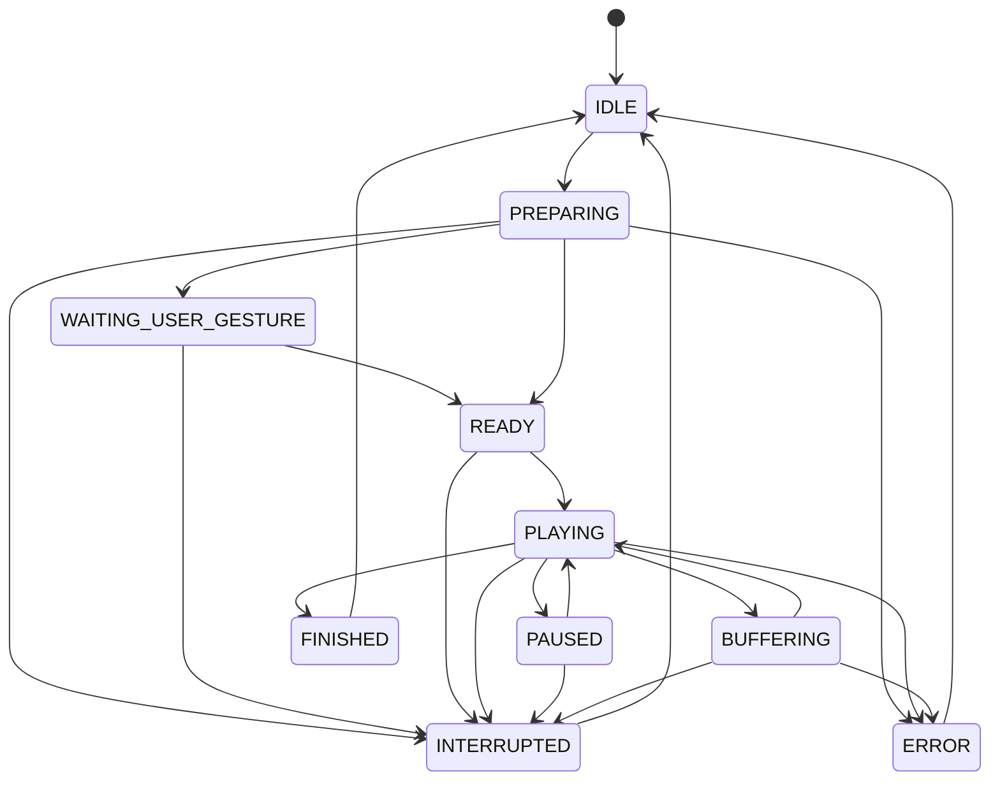

# 语音_L2D拓展组件架构

版本：1.1（职责拆分与最小表演契约修订后的实施基准）
日期：2026-09-09  
项目根目录：`H:\HanserAgent`  
状态：架构定稿；语音、真实风格 prompt 和 Live2D 尚未完成工程与听感验收。

## 0. 文档效力、需求与结论

本文完整替代以下两份设计稿，保留其来源名称用于追溯，不再要求实施者阅读旧稿：

- `Hanser_Agent_VoxCPM2_Live2D_语音运行时架构_v1.0_2026-09-09.md`，下称原 Voice 稿。
- `Hanser_Persona_Performance_VoxCPM2_Live2D_统一架构_v1.2_2026-09-09.md`，下称原 Performance 稿。

本文是语音与 Live2D 扩展的唯一现行架构，不替代[Persona 专项架构与执行规范](H:/HanserAgent/Hanser_Persona_专项架构与执行规范.md)。原 Performance 稿引用的带 `(1)` 文件名不是本项目规范路径，以前述实际文件为准。Persona 的人物事实与来源、明确拒绝、跨用户隔离、格式保护、冻结评估和回滚要求继续生效。已有日常对话专项工作可独立推进，不能用音色或表情掩盖 Text 的未证实项。

需要实现的产品能力：

1. 已校验的 Hanser 回复能以稳定、自然的目标音色朗读，保留中日英混排、数字、作品名等内容的正确读法。
2. 表演符合回复本身与当前互动边界，日常低强度，不把用户情绪直接复制给角色。
3. 网页客户端显示文字、播放声音并驱动 Live2D；WPF 旧文本客户端持续可用。
4. 首段就绪即可播放，后续段流水生成；支持停止、暂停、恢复与明确的重新生成。
5. 同一份已生成音频可用于重播和离线视频，音频播放位置决定口型、表情与字幕时序。
6. 语音组件失败、显存不足或素材缺失时，文字与既有 Memory/Wiki 主链正常工作。

**最终选择：统一 Responder 同次生成文字与可选的单一主 delivery；PerformancePolicyResolver 执行已有 Persona 边界，Voice/Visual 分别映射能力，分段后再选择具体真实 prompt。** 优先采用固定身份参考音频与小型真实风格库；Live2D 可保留与中性声音兼容的轻微表情。文本风格控制保留为独立实验通道。首版不建设第二个 emotion LLM、十三套强制一一对应的音频模型或通用数字人平台。

这里的“prompt”必须区分：`prompt_audio + exact transcript` 是真人录音及其准确转录；`control_text` 是引擎风格指令；Persona prompt 是语言模型上下文。三者不能互换。

## 1. 现有工程与两份原稿的完整差距审查

### 1.1 审查范围与证据口径

以下保留 1.0 定稿时的审查快照：覆盖两份原稿全文、Persona 规范相关边界、后端请求/回复/校验/信号/策略/上下文/幂等/持久化链、网页代理与类型、WPF 契约、依赖与启动脚本、现有相关测试及 Text 评估结论。语音相关文件与资产检索覆盖项目可见源码，排除第三方依赖目录。未逐一复核全部历史 DOCX、数据库内容、二进制应用或每条评估语料；这些不是已实现语音模块的证据。1.1 本轮仅调整架构并静态检查文档，不重跑这轮工程审查或测试。

以下“已有”指源码可定位；“未实现”指本次在项目内未发现相应实现，不能据此断言其他目录或另一台机器没有素材。没有启动 TTS、下载模型、加载真实音频或渲染真实 Live2D，不声称目标机器已经达到任何延迟或音质指标。

### 1.2 差距矩阵

| 领域 | 当前代码证据与事实 | 与文档要求的差距 | 实施裁决 |
|---|---|---|---|
| 唯一回复生成者 | [responder/service.py](H:/HanserAgent/backend/hanser_agent/responder/service.py:12) 的 `GeneratedResponse` 只有 text/raw_text/actions/attempts；`respond` 调用普通文本 generate | 没有 semantic_text、PerformanceIntent 或结构化输出协议 | 保留唯一 Responder，按开关扩展同次输出；不另建情绪生成器 |
| 校验与标点 | [validator.py](H:/HanserAgent/backend/hanser_agent/responder/validator.py:90) 的 normalize 会 strip、替换标点、合并空白，validate_output 先执行 normalize | 原稿生成时 span 会失效；语音拿最终 text 时也已丢失句法停顿 | 拆开语义硬校验与展示格式化；第 5 节明确迁移过程 |
| 上下文契约 | [context_builder.py](H:/HanserAgent/backend/hanser_agent/agent/context_builder.py:37) 已有 signals/behavior/settings、原样片段和 exact_output，另有 `_response_contract` | 当前仍提示纯文本；没有 sidecar 预算、schema 或能力开关 | 仅增加短输出契约与必要 token 预算，原样输出约束仍约束文字字段 |
| ModelGateway | `backend/hanser_agent/model_gateway.py` 已有 generate_json，但其失败处理可能切 fallback profile | 严格嵌套 Performance schema 会让坏 sidecar 引发整次模型重试/切换 | 顶层文字严格、performance 原始对象单独解析；不得为 sidecar 错误触发额外模型调用 |
| TurnSignals | [schemas.py](H:/HanserAgent/backend/hanser_agent/persona/schemas.py:49)、[signals.py](H:/HanserAgent/backend/hanser_agent/persona/signals.py:32) 已有 user_emotion，distress/tension 为 bool；来源与置信分字段处理 | 原稿 affect 嵌套结构、distress 等级与当前类型不同 | 首版复用已有观测，不强迁移；valence/activation 后置且保持字段级兼容 |
| Persona Policy | [policy.py](H:/HanserAgent/backend/hanser_agent/persona/policy.py:18) 已构建边界、affordances、caps；仅 v2 条件分支启用 | 已有架构基础，不能按“还没实现 Persona”重写 | 复用现有判断，不增加从情绪到固定行为脚本 |
| caps 单位 | [ExpressionCaps](H:/HanserAgent/backend/hanser_agent/persona/schemas.py:101) 的 hard_intensity_limits 是整数；teasing/profanity 等源自档位 | 原稿示例把 teasing 上限当 0–1 小数，且未覆盖 humor 等复合限制 | 增加一次版本化 caps→PerformanceConstraints 转换；不直接 min 两种单位 |
| Text API | [models.py](H:/HanserAgent/backend/hanser_agent/models.py:285) 的 ChatRequest/Response 以 text 为中心，含 sources/keywords/anchored 及请求状态 | 无 reply_id、输出偏好、speech ticket；generated_text/evidence_quote 并非现有字段 | 保留旧响应；新字段按 opt-in 省略，sources 不自动改名成引述 |
| 请求幂等 | [service.py](H:/HanserAgent/backend/hanser_agent/agent/service.py:53) 摘要只有 user/conversation/message；[request_state.py](H:/HanserAgent/backend/hanser_agent/agent/request_state.py:28) 已 claim/cache | 未冻结输出偏好、voice/profile/revision；请求重放不等于允许再次播放 | 扩展有效请求快照，语音 job 和客户端 playback 各自去重 |
| 回复持久化 | [service.py](H:/HanserAgent/backend/hanser_agent/agent/service.py:218) append_turn 返回两个消息 ID，但忽略 assistant ID；append 与 request complete 分属步骤 | 无持久化 canonical reply；进程崩溃窗口下仅靠内存交接会丢包或重复 | 原子保存 assistant reply 与扩展快照，复用 assistant ID；不建设第二套聊天历史 |
| post-turn | service 先落回复再 await post_turn，随后 complete/return；有后处理失败重试 | 原稿“文字立刻返回”不符合当前行为；播放成功不能成为 Memory 提交条件 | MVP 保留现有时序并计入延迟；语音独立失败，post-turn 异步化仅在测量有必要时单独改造 |
| 客户端实际流式 | [chat route](H:/HanserAgent/chatbot/app/(chat)/api/chat/route.ts:43) 先发 waiting，再 await 后端 JSON，最后单次 text-delta | 不是 LLM token 或音频流；abort 只取消 fetch，不保证后台推理取消 | 新增独立语音 job/event 通道，明确客户端停止与 worker 取消 |
| 网页集成 | [hanser-client.ts](H:/HanserAgent/chatbot/lib/hanser-client.ts:42) 仅有文本/trace 类型；`chatbot/package.json` 为 Next/React 项目 | 无 Audio Clock、Live2D 播放器、音频资源代理与权限处理 | 实现在 chatbot 内，避免另建前端产品；Next 只代理，GPU worker 不放 Next 进程 |
| 身份范围 | hanser-client 当前采用服务端配置的 HANSER_USER_ID，默认 local-user | 当前是本地单用户接入，不是已完成的多用户认证 | 首版保持本地部署；外网发布前补可信身份与所有权鉴权，不信任浏览器自报 user_id |
| WPF | [PythonAgentClient.cs](H:/HanserAgent/wpf_bridge/PythonAgentClient.cs:42) 读取 text/keywords/anchored/sources | 原稿直接替换为 ReplyEnvelope 会破坏旧契约 | 保留旧 API 和键；首版 WPF 继续纯文本，WebView2/原生播放后置 |
| Runtime 服务 | `backend/requirements.txt` 无 VoxCPM、音频对齐依赖；启动脚本启动 backend/chatbot | 无 voice_runtime、job scheduler、独立健康状态或进程清理 | 新建一个独立 Voice 服务，不把每个逻辑模块拆微服务 |
| Voice Profile | 未检出项目 WAV、voice manifest、VoxCPM2 adapter；现有 voice.md 是文风文件 | 没有已审核真人声音、精确转录、风格 prompt bank 或可执行配置 | 素材盘点/身份与使用范围/转录/听测为音色验证前置，不把文字资料当音色资产 |
| VoxCPM2 能力 | 原稿写固定 ultimate + 每段 control | 官方 CLI 明确拒绝 control 与 prompt transcript 同用；参考第 3 节 | 真实风格 prompt 路由作为首选候选；文字控制使用独立 reference-only 配置 |
| Speech Planner | 无专用朗读编译、读音词典、span map | Markdown/URL/代码清理、重复短句、emoji、停顿都未实现 | 规则编译，不加 LLM 润色；每次转换保留源映射 |
| QA/缓存 | 当前没有音频 QA、音频缓存或失败重试预算 | 原稿重试可能内外层相乘；Python hash seed 不跨进程稳定 | 一个 retry owner，分层缓存，seed 与 artifact metadata 第 10 节统一 |
| Alignment/Timeline | 无 stable-ts、Rhubarb、timeline compiler | 原稿将对齐当精确保证，且全量拼接会阻塞首段 | 实时段级 package + 离线全量 package；对齐质量显式标记 |
| Live2D 资产/驱动 | 未检出 model3.json/moc3、驱动或 rig profile | 原稿 ParamMouth* 和表情值仅示意，不是目标模型实测 | 接入时探测参数范围、绑定嘴型和表情所有权，缺失参数局部关闭 |
| 打断/状态 | 无 generation token、播放游标、pause/buffering 状态 | 旧结果可能在新轮到达后继续出声；单纯 currentTime-start 不处理暂停/欠载 | 第 11–12 节定义 job、playback 双状态与 epoch 隔离 |
| 离线导出 | 无共用 timeline evaluator 或逐帧渲染器 | 仅 seed 不足以保证 GPU 重生成逐样本一致；状态物理不能任意 seek | 保存音频、冻结 timeline；离线固定步长推进 physics/idle，复用结果 |
| 发布与评估 | full72 报告为正向候选，sequence final 011 为未证实；候选 manifest 仍 build_status=candidate | 不能把某次单轮通过当当前 Text、多轮与语音全通过 | 正式接主链前绑定具体已验收 Text 组合；允许独立 fixture 和素材可行性验证 |

### 1.3 首次定稿的验证记录与已知限制

1.0 定稿时从 backend 现有 `.venv` 执行以下聚焦测试，无真实模型调用、无生产数据库迁移；1.1 文档修订未再次执行：

```powershell
.\.venv\Scripts\python.exe -B -m unittest tests.test_api_contract tests.test_unified_responder tests.test_persona_policy tests.test_slice4_failures -q
```

结果：**32 项，31 项通过，1 项 ERROR**。失败为 `test_provider_200_empty_retries_same_responder_then_succeeds`：fixture 使用仅包含 messages 的 SimpleNamespace，缺少 responder 当前读取的 `required_verbatim_spans`。这是现有测试夹具与当前接口不匹配；本次未修改业务代码或用兜底掩盖它。后续维护应把夹具补为真实 ContextBundle/完整上下文，再针对该测试验证，不能因这一错误给生产代码增加泛化 getattr 防护。测试中的 injected post-turn、dense/reranker 失败日志属于故障注入，不能一概当生产故障。

测试堆栈显示当前 backend venv 使用 Python 3.13。已核对的 VoxCPM README 要求 Python >=3.10 且 <3.13，因此单独准备受锁定版本支持的 voice Python 环境，不能直接向现有 backend venv 安装。未进行真实 GPU 资源/端口/设备性能探测。

评估证据：[full72 单轮报告](H:/HanserAgent/backend/data/eval/persona_v2/runs/text_ab_full72_2026-09-08_001/report.md)、[sequence final 011 报告](H:/HanserAgent/backend/data/eval/persona_v2/runs/sequence_ab_permission_final_2026-09-08_011/report.md)。这些报告的适用组合与时间范围有限；上线时要重新绑定当时的实际 release，本文不宣布 Persona 发布。

## 2. 对原架构合理性与完整性的裁决

### 2.1 保留的核心

保留 Persona 决定内容边界、Responder 同次给出最终语言及 PerformanceIntent、确定性映射、语音进程与 Agent 解耦、固定真实声音锚、短段生成、口型与表情分轨、文本优先与独立故障域、离线复用音频等设计。有语音的表演仍以音频为主时钟；无语音的动态视觉采用明确标记的独立呈现时钟。

### 2.2 必须优化的设计

| 原问题 | 最终处理 | 原因与代价 |
|---|---|---|
| Speech Planner 从场景/标点重新猜情绪 | delivery 只来自 Responder 与 PerformancePolicyResolver 的合法裁决 | 避免第二套人格解释，缺失时 neutral |
| ultimate clone 同时叠加任意 control | 主路线按 delivery 选择真实风格 prompt；文字 control 独立通道 | 对齐官方能力；需真实素材和风格可迁移性听测 |
| 十三个 delivery 各建一套声音配置 | 十三个语义标签映射至少量声学族，多对一；只开放验收能力 | 标签粒度与可控声学粒度不同，减少素材稀疏与频繁音色切换 |
| 每种 intensity 都声称连续可控 | 声音用已评估档位或声明不区分；视觉在模型范围内平滑插值 | prompt 不是情绪旋钮，不伪造精度 |
| 生成后删标点再沿用 span | 保留唯一 validated semantic_text，展示单独格式化 | 需要小范围 validator/presentation 改造与 Text 回归 |
| 全部音频与对齐完成后返回 | 实时每段通过基础 QA 即可形成 ready package；离线才全量汇总 | 首段不被全长回复、ASR 或字幕对齐阻塞 |
| 任意 LiteTTS 自动兜底 | 默认 text-only；只有已配置且已验收的同身份 fallback 才启用 | 不能突然换成陌生音色；不把异常伪装为角色台词 |
| 将每个模块拆独立 service | Agent + 一个 Voice 服务 + 网页三边界；内部普通模块 | 初版无需 Redis、消息总线、单独情绪/缓存服务 |
| 并行生成任意后续段 | 默认一 GPU worker 串行推理，生成下一段与播放当前段重叠 | 控制显存、seed 并发污染与无用预取 |
| audioContext.currentTime-start 自动处理一切 | 显式 segment schedule、已播放 offset、pause/underrun 映射 | AudioContext 时钟本身不是媒体播放游标 |
| 后台生成完成即记作角色已表达 | 文字提交与播放观察分离，后者按实际播放回执去重 | 中断、静音、后台预生成不应形成“已经听到”的假状态 |
| 每段 ASR、三次外部重试叠内部重试 | 实时基础 QA，离线/候选再内容 QA；总尝试数唯一管理 | 降低开口延迟及重试放大 |
| 哈希/冒烟按每步重复 | 资产冻结、缓存身份和发布边界计算一次，普通编辑不重复 | 遵循项目 AGENTS.md；必要完整性约束仍保留 |

### 2.3 本轮八项建议的采用裁决

本轮优先减少首版复杂度并修正接口边界；八项均采用其核心方向，但不把未来优化提前实现为必需模块。

| 建议 | 裁决 | 落实方式与限度 |
|---|---|---|
| 拆开 PerformanceResolver | 采用 | PolicyResolver 只执行既有边界；Voice/Visual 各自映射能力。拆纯函数/类，不加微服务，不重新跑 Persona Policy |
| Voice 不作为 Live2D 硬上限 | 采用 | 各自受 Persona/自身能力约束，再做有限的音画冲突过滤；neutral 声音允许轻微笑意、关切或惊讶，不做强度取最小值 |
| P1 不让 LLM 写 Unicode span | 采用，优先级高 | 只输出主 delivery/intensity；程序保留必要 source map。未来 beats/anchor 另版本引入，不在 P1 先造定位器 |
| 增加 engine_text | 采用 | Adapter 生成并记录实际传给引擎的字符串、正文/控制区间与 speech→engine 映射；不假称能观测引擎内部所有处理 |
| 分段后选择具体 style prompt | 采用 | VoiceAssetSelector 用 segment 的语言/长度/句型等选资产；未经验证的维度保持 unknown，不训练第二个情绪分类器 |
| Prompt cache 优化后置 | 采用，优先级高 | P2 只用官方公共 API；有 profiling 证据与等价性评估后才启用显式底层缓存；音频结果缓存照常保留 |
| pause 移出音频 artifact | 采用 | 纯生成语音（含自然静音）独立缓存；额外 pause 放 timeline，播放调度与离线导出各只实现一次 |
| Performance 按消费者启用 | 采用契约，静音表演按需交付 | speech / dynamic_live2d / offline_performance 任一需要即可请求 sidecar；不为静音视觉调用 TTS，不将未来功能变成 P1 发布门槛 |

本文 1.1 全量更新相关链路和示例。受影响的拟实现扩展契约使用 `schema_version="1.1"`；之前 1.0 仅是设计稿，当前没有已上线的语音协议消费者，因此不额外建设 1.0 sidecar/span 迁移器。既有纯文本 API 兼容要求不变。

## 3. emotion / delivery 选择真实 prompt 的方案

### 3.1 可用性与语义边界

这个方案**可用，且适合本项目作为优先验证路线**。真实 Hanser 录音可以提供比泛化文字形容词更具体的节奏、咬字与表达风格。但“模型支持 prompt 条件”不等于“每个真实片段都能把预期情绪迁移到任意文本”。背景音乐、作品演技、录音年代、语种、麦克风距离、句尾走势和 prompt 文本都会影响结果。

最终控制链只保留一份语义决策：

```text
用户/互动观测 TurnSignals
  → Persona Policy（边界与可选回应空间）
  → HanserResponder（semantic_text + PerformanceIntent）
  → PerformancePolicyResolver（只执行同轮已有边界，输出 AllowedPerformance）
       ├─ Speech Planner → SpeechSegment → VoiceCapabilityMapper / VoiceAssetSelector
       │    → EngineTextAdapter → engine_text + reference/prompt + 固定推理配置
       └─ VisualCapabilityMapper → rig preset + 权重 + 少量动作
  → 音画冲突过滤（不重判语义，不将 voice 强度当 visual 上限）
  → TTS audio 与逐段 timeline
  → Audio-clock 播放和 Live2D
```

不新增贯穿全链的 emotion 数值。已有 user_emotion 表示用户侧观测，不直接选声音。若某上游以后输出 emotion，只能作为 Responder 输入；在主干接口中仍以 delivery 表示“这句话怎样表达”。Live2D 的“直接控制”指同一 ResolvedPerformance 直接决定其逻辑预设，**不指 LLM 自由生成 Cubism 参数或跳过边界校验**。

### 3.2 两条可执行声学路线

| 路线 | 固定项 | 变化项 | 使用条件 |
|---|---|---|---|
| A：真实风格 prompt（首选候选） | 同一身份 reference、模型 revision、基线 cfg/steps | 经审核的 style prompt 音频与准确 transcript | 从 neutral 开始；不同风格只在迁移听测通过后加入 |
| B：reference + 文字 control（独立对照） | 身份 reference、模型 revision、基线参数 | 项目预置的简短 control，不传 prompt audio/transcript | 只有证实比 A 更适用或 A 缺素材时，作为另一个已验收 profile 使用 |

官方源代码支持 reference、continuation 及 ref_continuation 三类 prompt cache，reference 与 prompt 的角色在缓存内分开。这给路线 A 提供接口基础，但不保证两种条件完全解耦。见 [VoxCPM2 prompt cache 实现](https://github.com/OpenBMB/VoxCPM/blob/main/src/voxcpm/model/voxcpm2.py)。

已核对 CLI 的 `validate_prompt_related_args` 明确拒绝 control 与 prompt_text/prompt_file 同用；`build_final_text` 将 control 编译为文本前缀。故不采用“prompt transcript + control”混用，也不通过绕过 CLI 偷偷把该组合变成默认能力。见 [VoxCPM CLI](https://github.com/OpenBMB/VoxCPM/blob/main/src/voxcpm/cli.py)。公共 generate 没有独立 delivery/intensity 参数；适配器只能传该锁定版本实际支持的参数。见 [VoxCPM core API](https://github.com/OpenBMB/VoxCPM/blob/main/src/voxcpm/core.py)。

以上是 2026-09-09 对上游 main 的核对结果，非项目已安装版本保证；实施时冻结 commit/package version 和模型 revision，适配测试以冻结版本为准。这里保留少量接口事实，不将外部 README 视为本机验收报告。

### 3.3 首版风格库：少量、多对一、按质量开放

先准备一个中性 prompt，随后根据确有素材的情况增加 soft、light_playful、firm 等少量风格族，通常先验证 3–5 个配置足够。数量是工作量建议，不是必须凑齐的指标。十三个 delivery 保持语义契约，不要求十三种可辨认声音，更不要求十三个模型。

下表是**待听测的配置起点**，不是已证实的 Hanser 声学属性。实际发布只保留成功的声学映射；未覆盖的声音回到 neutral，视觉独立选择低强度兼容表情，不自动清空。

| delivery | 表达含义 | 候选 prompt family | 视觉方向 |
|---|---|---|---|
| neutral | 普通自然口语 | neutral | idle / neutral |
| gentle | 温和但不幼态 | soft | 低权重 soft_smile |
| concerned | 克制关心具体问题 | soft 或 neutral | concerned_soft，不夸张悲伤 |
| serious | 认真澄清与事实说明 | firm 或 neutral | attentive / neutral |
| soft_surprised | 轻微惊讶 | light_reactive 或 neutral | 轻微抬眉 |
| excited | 积极、较强激活 | 经单独验收的 light_reactive | 小幅积极表情；默认不启用强档 |
| amused | 觉得事情有趣 | light_playful | 小幅笑意 |
| teasing | 善意调侃 | light_playful | teasing_soft；服从许可 |
| deadpan | 平静的反差表达 | neutral 或经审核 dry | 克制反应，非冷漠攻击 |
| annoyed_soft | 轻微不耐烦 | 经审核 firm | 轻微皱眉；无能力则 neutral |
| annoyed_playful | 玩笑式不耐烦 | 经审核 light_playful | annoyed_smile，不降为严肃怒脸 |
| embarrassed | 轻微局促 | soft 或 neutral | 低强度局促，不自动卖萌 |
| hesitant | 犹豫与保留 | neutral 或 soft | 轻微迟疑，无强制脸红 |

选择顺序：先执行硬边界，Speech Planner 完成分段后，VoiceCapabilityMapper 确定可用声学族/强度档，VoiceAssetSelector 再依据该段的语言、长度、句型和经过验证的节奏适用性挑选具体 asset。没有匹配项时声音回到允许的 neutral；视觉按第 3.5 节独立处理。运行时不遍历原始音频库、不按相似文本检索陌生片段、不让 LLM 生成文件路径、不随机抽样。

### 3.4 固定身份锚与切换粒度

- 同一个 voice profile 使用固定身份 reference；style prompt 必须来自同一已核验说话人，尽量同一稳定声线与录制条件。不能把不同角色配音形象混合后宣称音色仍一致。
- 在语言兼容矩阵允许时才跨语言复用；“模型支持中日语言”不代表某日语情绪 prompt 的中文效果已通过。
- P1 每轮只有一个主 delivery，默认不切换风格族。相邻段若同一 prompt 仍符合语言/长度等条件则优先复用；必须换资产时只允许已评估的同族兼容切换，不因问号猜成惊讶、生气等新 delivery。
- 未来启用 beats 后，首个可变风格版本最多一次明确的风格族切换，只在自然段边界与已验收切换对上发生。不可分割短句仍整体生成，不为两字表情切碎音频；没有可靠 anchor 定位则不用该 beat。
- 同一主 delivery 可以在不同语言段选择同族不同 prompt，但没有语言兼容资产/切换证据时宁可 neutral，不以维持资产一致为由使用不适用的 prompt。换轮重新按本轮判断，不继承上一轮 annoyed/teasing。
- prompt 只提供合成条件，不把参考录音直接拼进回答，也不把生成的上一段递归加入下一段 prompt。参考台词若被意外读出属于内容 QA 失败。

### 3.5 强度与跨模态匹配

intensity 的 0–1 值是表达意图，不是情绪概率，也不是模型能精确执行的声学幅度。默认 0.20；日常建议 0.15–0.45，但不随机采样制造表现频率。

声音先只支持 profile 实际验收的 low/medium 档；不同输入数值落入同一档可以选择同一音频 prompt，trace 明示 `voice_intensity_mode=discrete`。无档位时明示 `not_controllable`。不通过升音调、变速或增益把弱 prompt 伪装成强情绪。

视觉可连续插值，其硬上限来自 Persona 边界和 RigProfile；**不再与 Voice 强度档或 prompt 范围取数值最小值**。声音回到 neutral 时，合法的轻微笑意、关切、迟疑或轻微惊讶仍可保留。只对声明的明显冲突做有限过滤，例如普通平静声音配强烈怒脸/狂喜大动作，或玩笑式不耐烦被映射为认真攻击。

该过滤使用已验收 profile 的兼容特征和版本化规则，不把 `voice_resolved=neutral` 当作实时识别出音频绝对中性的证明；也不新增音频情绪识别模型。冲突时优先降级相应视觉特征或动作，保留其余合适表情，不能重写文本/allowed delivery 或反向要求 TTS 重生成。无语音消费者时跳过音画配对约束，但 Persona 与 rig 约束仍生效。

### 3.6 与其他方法相比的选择

| 方法 | 优势 | 局限 | 结论 |
|---|---|---|---|
| 单一中性 prompt | 音色稳定、缓存简单、素材要求最低 | 对幽默/迟疑的可控性有限 | 必须保留为基线和缺能力时回退 |
| 固定 reference + 少量真实风格 prompt | 以真实表达提供韵律线索，贴合目标角色；不依赖自由风格描述 | 素材风格可能无法迁移，切换可能漂移 | 本项目优先验证方案 |
| reference-only + 文字 control | 可扩展、无需每个风格都有 transcript | 遵从与音色相似度需实测，可能过演或读出指令 | 保留为受控 A/B 路线，不能自动成为兜底 |
| 仅按 emotion 切整套 speaker/reference | 概念简单 | 换风格同时换身份锚，归因困难 | 不采用 |
| 声音风格微调/LoRA | 数据充分时可能提高稳定性 | 训练、评估、授权素材与回滚成本高 | 只有固定 prompt 路线经诊断达不到目标时再立项 |

因此最佳处理不是把 emotion 当档位总开关，而是**统一语义意图 + 能力约束的真实风格库 + 音画共享解析结果**。最终是否优于中性基线由冻结听测决定；不把这次架构选择当作已经证明质量更好。

## 4. 总体结构与责任边界



部署只设三个主要边界：

1. **Agent backend**：保留现有 Persona/Wiki/Memory、回复与幂等状态。PerformancePolicyResolver 在此将同轮 BehaviorDecision 转为 AllowedPerformance 并随 ReplySnapshot 冻结，向 Render Bridge 下游传递可信快照。禁止 import VoxCPM2 或在这里加载其 CUDA 模型。
2. **Voice/Performance Runtime**：仍为一个独立服务，含轻量 Voice/Visual 能力映射、Speech Planner、EngineTextAdapter、队列、TTS、QA、对齐、timeline、artifact 模块。动态视觉可只启用轻量控制面，不要求模型/音色就绪。语音模式默认一个推理 worker；HTTP 事件循环不能直接执行同步 GPU 合成，需有单独执行线程/子进程，取消不能排在推理之后。
3. **网页客户端**：音频播放时钟、Live2D 参数混合与 UI。Next 路由做同源代理；不在服务器端扮演音频播放器。WPF 保持已有 text 路径。

PolicyResolver、VoiceCapabilityMapper/VoiceAssetSelector、VisualCapabilityMapper 和兼容过滤是有清楚输入输出的普通组件，不是四个新服务。Voice 与 Visual 都只消费同一 AllowedPerformance，互不拥有对方的风格决策。Runtime 输出最终逻辑视觉计划，浏览器只做 rig 参数投影与时间求值，不另维护一套语义分类。离线渲染复用同一 TypeScript evaluator/driver。

语音设置关闭时不加载 TTS 依赖、不申请其 GPU，但动态视觉或离线表演仍可请求 performance sidecar。所有表演消费者都关闭时不请求 sidecar，静态 avatar/普通 idle 也不构成消费者。文本服务启动不以 Runtime health 为前提。

## 5. Canonical 文本、Responder 与协议迁移

### 5.1 唯一真相与校验顺序

新链路明确区分：

```text
raw provider payload
  → candidate semantic_text + raw performance
  → 语义/原样片段/明确拒绝等现有硬约束检查
  → validated semantic_text（冻结，此后不改写）
  → 独立 performance 主标签校验 + 同轮边界裁决
      ├─ DisplayAdapter → ChatResponse.text
      └─ 按消费者派生：Speech Planner → speech_text → EngineTextAdapter → engine_text
                       或 VisualCapabilityMapper → 静音视觉计划
```

重构 StyleValidator 时保留现有硬规则与有界内容重试，只把用于普通展示的标点替换移到 DisplayAdapter。语义校验覆盖 canonical 文本，展示分支仍检查原样片段/日期/URL/代码/exact_output；不得因拆分丢失任一既有约束。Speech Planner 不调用展示 normalize。

新 Responder 输出可在同一次调用中产生带句法标点的 semantic_text；legacy_sparse 的稀疏标点仅作用于展示。JSON 与 natural punctuation 都会改变生成行为，因此必须作为 Text 候选做回归，不能假定只是无风险字段改名。

旧模型/旧调用路径仍使用旧 validator，适配时 canonical=已校验的 generated.text、performance=null；不能拿尚未通过原校验的 raw_text 抢先朗读。此兼容模式可能缺乏句法停顿，标记 `legacy_text_source`，不靠第二次 LLM 补标点。新链路通过前不替换默认生产行为。

### 5.2 Responder 输出与字段级降级

LLM 只输出以下对象；ID、版本快照、allow_tts、caps 和资产路径由可信程序注入：

```json
{
  "semantic_text": "诶？可以呀。",
  "performance": {
    "schema_version": "1.1",
    "delivery": "gentle",
    "intensity": 0.22
  }
}
```

- `semantic_text` 必须是非空字符串。旧字段只在明确 legacy 模式映射，不做 text/generated_text/semantic_text 多层猜测优先级。
- `performance` 可缺失或 null。provider 顶层解析仅保留该字段原始值，随后按字段校验，避免坏 sidecar 导致整个语义回答 fallback。
- P1 只接受一个代表整条回复的主 delivery/intensity，不含 default/segments/start/end/anchor/beat。delivery 限第 3 节十三项；未知标签回 neutral/0.20，合法标签的非法 intensity 回 0.20；数值须有限且在 [0,1]，不将任意字符串强转数值。随后仍执行所有硬 caps。
- 所有 SpeechSegment 继承该主标签，段语言、句型只影响声学资产适配，不产生新的情绪标签。短暂的惊讶等不必逐字标注；这是减少 P1 错误与生成负担的主动取舍。
- 同一回复内的纯展示格式化不改变合法主标签。若语义硬校验触发内容重新生成或文本替换，旧 performance 全部失效，只使用新候选 sidecar 或 neutral，不为重配表演调用模型。
- 纯 sidecar 错误不增加 LLM 调用。整段 JSON 缺损而文字不能可靠提取时走现有有界生成失败策略，不能把 JSON 原文展示/朗读或用正则猜一段答案。
- 未知可选字段忽略并记录一次；未知必需主版本拒绝该扩展能力。所有结构化输出的实际调用数、重试原因独立统计。

P1 的 Unicode 处理只承担正常文本切分与程序生成的 source map；不让 LLM 数字计数，也不要求客户端实现表演 span 定位。内部 source map 使用 code point 的 `[start,end)`，分段避免切开组合字素。词/字字幕未来启用时再做 codepoint↔UTF-16 对接；当前段级字幕无需此逻辑。冻结后不再隐式 NFC/NFKC 改写。

如后续评估证明主标签不足，再用新契约引入少量 beat：LLM 提供 canonical 中的原样短 anchor 与表演意图，由程序在校验后的文本上精确定位。唯一匹配才能直接使用；重复短语只有明确 occurrence/上下文能唯一定位时才接受，否则丢弃该 beat 并沿用主标签，不模糊猜配、不重试模型。定位后的 span 仅为程序内部派生产物，不成为另一个生成任务。P1 不实现这套可选功能。

### 5.3 ReplySnapshot 与旧 API

服务端最小内部快照：

```json
{
  "schema_version": "1.1",
  "request_id": "req_001",
  "reply_id": "assistant_message_001",
  "user_id": "local-user",
  "conversation_id": "conversation_001",
  "semantic_text": "诶？可以呀。",
  "display_text": "诶 可以呀",
  "performance": null,
  "allowed_performance": {"delivery": "neutral", "intensity": 0.2, "forbidden_features": []},
  "output_preferences": {"text": true, "speech": true, "dynamic_live2d": true, "offline_performance": false},
  "allow_tts": true,
  "language": "zh",
  "constraints_ref": "constraints_001",
  "render_profile_revision": "hanser-render-candidate-1",
  "text_source": "validated_semantic"
}
```

示例 ID/revision 为说明用值，不是现存资产。constraints_ref 指向同轮冻结的有效边界；它与快照一同持久化或内嵌，不能在播放时查一份已变动的全局 Policy。reply_id 复用实际 assistant message ID，request_id 是请求标识，conversation_id 是会话；不再并列引入同义 session_id。

`ChatResponse.text`、keywords、anchored、sources 继续保持现有语义与默认序列化。新客户端 opt-in 后可附加：

```json
{
  "text": "诶 可以呀",
  "keywords": [],
  "anchored": [],
  "sources": [],
  "request_id": "req_001",
  "reply_id": "assistant_message_001",
  "speech": {"schema_version": "1.1", "status": "eligible"}
}
```

`eligible` 只表示可申请声音，不宣称已就绪，不返回虚构 WAV URL。旧客户端不请求这些字段时省略它们。新扩展请求默认 text=true，其余 `speech / dynamic_live2d / offline_performance` 均为 false；允许 dynamic_live2d=true 且 speech=false，不能以 TTS readiness 决定该请求是否合法。

消费者判定在请求入口冻结：`performance_requested = structured_performance_feature_enabled && (speech || dynamic_live2d || offline_performance)`，各项使用经权限与产品开关解析后的有效偏好。全 false 时无需 sidecar；静态 avatar、非语义的眨眼/呼吸不触发 sidecar。offline_performance 表示申请表演意图，不自动表示创建导出任务或允许 TTS。

硬能力开关与模型输出版本分别管理。P1 支持上述消费者契约，静音动态视觉可到 P5 按实际需要交付；未实现的消费者可报告 unavailable，但不能迫使 Responder 改协议。历史回复没有 sidecar 时，新消费者使用 neutral，不为补表演重跑旧回复；若 offline 请求在生成前提出，可在原同次 Responder 调用中得到主标签。

sources 是检索结果，不是逐字 evidence_quote；它们默认 UI-only，不能拼进 speech_text。角色确实在 canonical 中说出的引文可按显式 narration policy 朗读，不能把所有引号都删除。URL/代码的处理见第 8 节。

### 5.4 持久化、启动语音与幂等

首版采用简单的**已提交回复 → 客户端显式申请语音 job**，避免在 Chat 请求和独立 Voice 服务之间建立无事务的自动派发：

1. Chat request 首次 claim 时冻结消费者集合、sidecar 开关与影响输出的显式偏好、Persona/渲染配置 revision；同 ID 重试使用首次有效快照。新内容或显式 revision 改变时报冲突。对未指定 revision 的重试不能重新取最新配置造成假冲突。
2. assistant message 与 ReplySnapshot 用同一 DB 事务保存，并关联 request_id；重试发现已提交 reply 时返回同一结果，不再次生成/append。快照同时保留可恢复的完整 ChatResponse（含 sources 等旧字段）与 post-turn 待处理标记/参数引用；请求完成或进程重启不能依靠丢失的内存结果重建。当前 append 与 complete 的崩溃窗口应在这处提交边界聚焦修复。
3. 网页收到 text 与 reply_id 后，有语音消费者才向 Render Bridge 申请 voice job；只有动态视觉时申请轻量 VisualTurnPlan，不经过 TTS。Agent 查持久化快照并校验所有权后派发。浏览器不能提交任意 semantic_text、caps 或 prompt 路径覆盖快照。
4. job 创建使用 `(owner, reply_id, render_profile_revision, mode, rendition_id)` 幂等键；同 ID 返回已有 job。普通 HTTP 重试不新增 rendition；用户明确重新生成声音才新增 rendition_id，不重新运行 Agent/Memory。
5. 首版保留现有 post-turn 顺序，首音总延迟包含其开销。恢复已提交回复时，post-turn 按原 user_message_id 独立恢复/幂等重试，不再 append 或重新生成回复；成功完成的后处理不重复执行。未来有测量依据时可把已具备持久化重试的后处理移出响应关键路径，另做回归；不为语音提前重写整套 Memory 生命周期。
6. 无需一开始搭建 outbox/消息总线。以后只有需要“页面断线也必须自动生成声音”时，才引入事务 outbox，并与上述 reply 提交同事务。

## 6. PerformancePolicyResolver 与独立能力映射

### 6.1 输入与输出

按职责而非部署拆分，所有组件均为确定性代码，不读取 Wiki/原用户输入重新推理，不调用模型：

| 组件 | 输入 | 输出与禁止越界 |
|---|---|---|
| PerformancePolicyResolver | 合法主 PerformanceIntent、同轮 BehaviorDecision/有效边界 | AllowedPerformance：允许的 delivery/intensity、禁止特征与来源 ref。无 VoiceProfile/RigProfile；只执行已有裁决，不产生新 Persona 边界 |
| Speech Planner | canonical、AllowedPerformance、朗读规则 | SpeechSegment[] 与文字/段特征；不选择具体声音资产 |
| VoiceCapabilityMapper | 每段 AllowedPerformance、VoiceProfile | 允许的声学族/强度档及 fallback 说明；不改变 allowed delivery |
| VoiceAssetSelector | 分段文本特征、声学候选、已审核资产与相邻段选择 | 具体 reference/prompt/transcript revisions；只选择兼容资产 |
| VisualCapabilityMapper | AllowedPerformance、RigProfile、视觉模式 | 独立视觉候选；不依赖 Voice 达到同样数值强度 |
| CrossModalCompatibility | 双方已解析的特征、有限兼容规则 | 仅过滤明显冲突的视觉特征并记录理由；无声音则跳过，不重选 prompt/重跑语义 |

Mapper/Selector 可先在同文件中实现独立函数；CrossModalCompatibility 只是少量规则，不引入第二个复合 Resolver 或模型分类器。每个 mapper 在筛选自身 preset 时执行随 AllowedPerformance 带下来的禁止特征，避免标签合法但底层 preset 带入 cutesy/innuendo 等被禁效果。

输出至少区分四个量：

- `requested`：Responder 最初的 delivery/intensity。
- `allowed`：通过 Persona 硬边界后可用的 delivery/intensity。
- `voice_resolved`：实际 prompt family/asset、强度档、clone mode。
- `visual_resolved`：由自身能力映射、经必要冲突过滤的表情、权重和动作。它可保留 neutral 声音支持的细微表情。

以下是分段选资产后汇总的 trace 视图，不是 PolicyResolver 一次返回声音与视觉的接口：

```json
{
  "schema_version": "1.1",
  "reply_id": "assistant_message_001",
  "requested": {"delivery": "teasing", "intensity": 0.6},
  "allowed": {"delivery": "teasing", "intensity": 0.35},
  "voice_resolved": {
    "clone_mode": "ref_continuation",
    "identity_reference_id": "hanser.identity.neutral.v1",
    "style_prompt_id": "hanser.style.light_playful.low.v1",
    "intensity_band": "low",
    "control_text": null
  },
  "visual_resolved": {"preset": "teasing_soft", "weight": 0.2, "motion": "none"},
  "decisions": [{"reason": "persona_teasing_level_1", "constraint_ref": "constraints_001"}]
}
```

此例仅解释已审核配置存在时的结果，不代表对应音频已经创建。

### 6.2 整数 Persona caps 与连续 Performance intensity

保持现有 ExpressionCaps 整数档位。由一个版本化 `PerformanceConstraintAdapter` 转为扩展专用的 `forbidden_delivery`、`max_intensity_by_delivery` 和 `forbidden_visual_features`，不可直接将原字段类型改为 float。

初始转换表是项目工程配置，须作为测试基准冻结，不声称它是心理学/声学测量：

| 当前边界 | Performance 处理 |
|---|---|
| teasing 档位 0 | 禁 teasing 与带调侃特征的 annoyed_playful |
| teasing 档位 1 | 上述允许项最高 0.35 |
| teasing 档位 2 | 上述允许项最高 0.55；不自动要求使用 |
| hard_disallowed 包含 humor | 禁 teasing、amused、annoyed_playful 及带幽默用途的 deadpan；neutral 替代，关闭笑声/俏皮动作特征 |
| hard_disallowed 包含 teasing | 禁 teasing 和本版定义为调侃型的 annoyed_playful；不连带禁止所有 gentle/amused |
| explicit_stop 的本轮边界 | 沿用 Policy 输出的禁止特征；停止正在进行的旧表演，不能让 playful_frame 重新放开 |
| style_in_factual_mode | 当前实现兼容映射为 neutral/serious 低强度，禁夸张动作；待对应 Text 策略改变后版本化调整 |
| cutesy / innuendo 禁止 | 禁用含对应特征的视觉/音频 preset，不把 gentle 等同于 cutesy |
| aggressive_teasing 禁止 | 禁带攻击特征的 preset；不能把所有轻松表达都全禁 |

profanity/innuendo 是内容尺度，不是声学响度：不得据其 0/1/2 数字决定声音激烈程度。若将来出现新特征，扩展配置要给出明确映射与测试；运行时不能解析 must_not 的自然语言去猜含义。每个已发布 preset 声明 feature tags，让边界可覆盖声音和视觉而不仅是 delivery 名称。

主标签必须先过 caps；下游 fallback/preset 筛选始终遵守随 AllowedPerformance 传递的禁止特征，不反复调用 PolicyResolver 或重新推理边界。硬边界来源记录 requirement/boundary ref；不以 scene、推测的 distress 或 voice capability 来恢复被明确撤销的许可。没有 BehaviorDecision 的 legacy 路径用 neutral，不额外推演幽默许可。

### 6.3 降级范围与变更寿命

performance 缺失直接 neutral/0.20。取消原稿“BehaviorDecision → scene → 情绪兜底”的多级猜测链；低风险并不意味着必须再猜一次角色心情。

P1 坏主标签按第 5.2 节局部降级；资源能力不足只影响自身声学/视觉实现，文本与已允许的语义意图不被改写。边界收紧、声音 fallback、视觉冲突过滤各自写 reason，避免一个 degraded 字段掩盖降级发生在哪一层。未来 beat 的丢弃亦需独立记录。

配置在 reply/job 入口冻结；切换新版 profile 不影响已生成段。用户新的明确停止属于控制事件，立即使旧 playback epoch 失效；这不是重新解释旧 PerformanceIntent。重播历史音频若与当前明确禁止的表演冲突，禁止自动重播或申请新的 neutral rendition，不篡改旧包。

## 7. Voice Profile、真实资产与 VoxCPM2 适配

### 7.1 资产生命周期

建议布局（均为待实现/待准备路径）：

```text
assets/voices/hanser/
  raw/                         原始素材，只读留存
  cleaned/                     清理候选，不覆盖原件
  reference/                   固定身份锚
  prompts/                     少量经审核风格音频
  transcripts/                 与 prompt 音频逐条对应
  manifest.jsonl               来源、说话人、转录、清理与审核状态
  profiles/                    不可变 voice profile revisions
assets/live2d/hanser/           模型与 rig profile，按许可存放
```

录音纳入运行库需记录：source_id/来源位置与时间段、说话人核验依据、使用范围、语言、风格族、强度档、时长、采样率、录音条件、transcript、清理操作、review_status、审核依据/评估 run、资产版本。来源无法确认的音频保持 candidate，不自动认定为 Hanser。

优先单人、干净、无 BGM、无强混响、非尖叫/极端角色演技的片段。准确转录胜过凑大量片段。不得用待合成文字代替 prompt transcript，也不能只按文件名“开心/生气”认定风格。录音与转录成对冻结；候选修改创建新 revision，不能覆盖已验收 reference。

声音使用范围与用户界面的角色模拟身份沿用 Persona 规范。授权事实写入资产清单，不在每句话加免责声明；已有适用授权不重复增加审批流程。

### 7.2 Profile 与运行配置

以下是配置形状示例，disabled/candidate 表示未准备可用资产：

```yaml
schema_version: "1.1"
profile_id: hanser_voice_candidate
profile_revision: candidate_1
status: candidate
enabled: false
backend: voxcpm2
model:
  id: openbmb/VoxCPM2
  revision: null                 # 真实部署必须冻结
  package_version: null
clone:
  mode: ref_continuation
  identity_reference_id: hanser.identity.neutral.v1
  default_style_prompt_id: hanser.style.neutral.low.v1
  recursive_generated_prompt: false
capabilities:
  approved_delivery: [neutral]
  voice_intensity_mode: discrete
  intensity_bands: [low]
  text_control: false
  style_switches_per_reply: 0    # P1 单主风格；未来 beats 经评估后再开放
runtime:
  api_mode: public
  explicit_prompt_cache: false # profiling 证明必要后才接底层 API
inference:
  cfg_value: 2.0
  inference_timesteps: 10
  normalize: false
  retry_badcase: false           # 外层 Runtime 统一重试预算
output:
  package_sample_rate: 48000
  channels: 1
```

这里省略了没有实物支撑的映射表值；实现加载器时缺必要资产应使该 profile 不可用，不能让 candidate 示例启动为健康服务。`speech.yaml` 管朗读与性能契约；voice profile 管真实声音；rig profile 管 Live2D；三份配置分工，不在多个文件重复保存同一映射真相。

### 7.3 VoxCPM2 API 适配原则

主路线调用概念为：EngineTextAdapter 编译出的 engine_text + 固定 reference_wav_path + 分段后选定的 prompt_wav_path + 该 prompt 的精确 prompt_text。不同风格更换的是已审核 prompt，不是 reference 身份锚。P2 先使用官方公共 generate API 跑通无额外控制的 neutral；P3 在相同 API 路径上比较风格 prompt。

P2 不接底层 prompt-cache API，不以其内部 tuple/私有状态为依赖。模型只需公共加载与生成接口常驻；sample rate 以真实返回/模型属性为准，metadata 记录 native rate 与 package rate，必要时仅在后处理边界重采样一次。后续确有优化收益再单独封装低层返回值，不能把底层 tuple 当 WAV，也不能假定两条调用路径完全等价。

Speech Planner 完成语言层规范化，EngineTextAdapter 显式处理锁定引擎所需的已知字符串转换，后端默认 normalize=false；此参数不构成“引擎内部绝不处理空白/换行”的保证。输入可追溯边界与未知内部处理的口径见第 8.5 节，不能通过多层重复 normalization 碰运气。

路线 B 的 control_text 只能从白名单编译进 engine_text 的控制区间，正文区间与控制区间分开记录；不得进 semantic_text/speech_text、字幕或 ASR 对照正文。用户正文中的括号不作为项目控制指令；前置括号是专门适配回归项。若冻结引擎无法区分并导致误读，只暂停该受影响路线并保留文字，不凭空发明逃逸 API。

### 7.4 Prompt cache、依赖与显存

- P2 仅公共 API，模型常驻；不主动调用底层 build_prompt_cache，不关闭或重复实现公共 API 自带的内部优化。
- 只有 profiling 将 prompt 读取/编码等重复开销与推理、排队分开，并证明其足以影响目标预算时，才立项显式缓存。须记录基线/优化路径、实际收益及质量/seed/内存影响；不能因为接口存在就提前接入。
- 若启用显式缓存，优先 neutral，其他少量配置按预算加载；identity 包括模型 revision、clone mode、reference revision、prompt audio/transcript revision 与编码设置。不混入自生成音频，保留可切回公共 API 的已验收路径。
- 一个 GPU 默认同时一个生成任务；不能让两个请求争用全局随机状态或 last_successful_seed。后续可基于 backend 实测能力提高并发，不能仅增加 worker_count。
- 独立进程不等于独立显存。部署前测量 LLM/embedding/reranker、TTS 和浏览器图形实际共驻峰值；优先固定 voice device 或远端 worker。必要时按明确任务边界调度已有模型 unload 能力，不每句反复卸载。
- `/health` 只说明进程活着；`/runtime` 分别报告 control_ready、voice_ready、visual_ready。voice_ready 包含模型/profile/资产/worker 状态，OOM 只将 voice_ready=false，不否定轻量视觉映射可用性；健康检查不重新加载模型。
- CPU、CUDA、远程等只在锁定 backend 支持时开放，`auto` 的选择结果显式上报。CPU 能启动不代表满足交互延迟。
- 使用独立支持版本的 Python 环境与锁定依赖；安装/模型下载不在 API import 或每次请求内触发。此文档任务不执行安装或模型调用。

## 8. Speech Planner：规则编译与 span 映射

### 8.1 朗读策略

输入是 canonical、AllowedPerformance 与朗读规则。输出 speech_text、尚未绑定声音资产的 SpeechSegment、source map 与转换记录，再交 VoiceCapabilityMapper/VoiceAssetSelector。禁止 LLM 改写、加称呼、补笑话、补解释或按标点另判人格情绪。

| 内容 | 默认朗读规则 | 追溯/例外 |
|---|---|---|
| 普通文字/问句/省略号 | 保留意义与句法停顿 | 不能为迎合 prompt 更改台词 |
| Markdown 强调/标题 | 去语法标记，保留正文 | 链接锚文本可读，目标 URL 默认不读 |
| 裸 URL | 使用受控占位“链接”或完整片段标记不可朗读 | 不读协议/域名逐字符；显示原文保持不变 |
| 代码块/结构化 JSON/长路径/hash | 整块不朗读，UI 显示“部分内容仅文字” | 不自动生成“我把代码放下面了”等新角色语句 |
| 引用 | 正文中的自然引用可朗读 | sources/内部 evidence 默认排除；不通过去掉否定或引用边界改变含义 |
| 数字/日期/单位/缩写 | 版本化读音规则/词典 | 保留原值，避免年份、范围、小数被误解 |
| 作品名/中日专名 | 已审核读音词典优先 | 不确定时保留文本并标词典缺口，不猜事实 |
| 233/www/emoji | 用词典明示保留/省略规则 | 不自动插入真人笑声或“哈哈”延长回答 |

URL/代码跳过可能造成语音信息少于文字，因此“不改语义”具体指不创造或反转原意，且每个省略显式记录。若一句只剩连接词或跳过后会误导，整句标 display_only，不能拼出残句。没有任何可朗读内容时返回 `no_speakable_content`，不创建空 TTS job。

若需求要求逐字念代码/URL，需单独的显式 narration mode 与测试，不能偷偷覆盖默认规则。protected verbatim 的展示仍保持原样；其 spoken 形式是否省略/转换由单独 narration policy 决定。

### 8.2 Source map

映射采用区间列表而非单一起止偏移，支持非一一对应转换：

```json
{
  "semantic_span": [0, 2],
  "speech_span": [0, 2],
  "operation": "copy",
  "precision": "exact"
}
```

operation 为 copy/replace/omit；replace 指数字、缩写等规则替换，omit 对应零长度 speech_span。每条记录包含 rule_id/version。多个源区间可合为一个 SpeechSegment；不能用一个 semantic_span 假装没有中间删除。

P1 的 source map 全部由文本转换程序产生，不含模型给出的表演 span。保留它是为追溯朗读转换与后续字幕，不以移除 LLM span 为由删除必要映射。canonical→speech→engine→audio 各段分别标精度，不能把字符或 best-effort 对齐声称为精确音素时间。

未来 beats 启用后，仅将已唯一定位到 canonical 的 anchor 沿可证明的映射迁移；跨省略/替换而无法安全定位时丢弃 beat，沿用主标签，不按长度比例猜 offset。未启用词/字字幕时，这些内部索引无需传给前端逐字渲染。

### 8.3 分段和停顿

初始可调参数：首段优先一个自然短句，常规 20–60 个中日字符，soft max=80、hard max=120；这些是工程初值，不是模型硬限制。短回复允许少于 4 字，不能为了 min_segment_chars 加台词。英文按词边界，emoji 按字素边界；不在数字、URL、作品名或引号配对中间强切。

句末标点优先，其次分号、自然逗号，再处理超长块。P1 不考虑模型 span/beat 边界。长度难以安全切开时将该结构化块设 display_only 或返回规划限制，不无限递归拆分。

Speech Planner 给出目标段间停顿，TimelineCompiler 在最终音频基础上生成实际 `pause_after_samples`。**缓存音频只含生成语音及其保留的自然静音，不含人为追加的段间 silence。** 如需目标停顿 300ms 而音频已有可确认的 120ms 尾静音，只计划额外 180ms；无法可靠测量时按校准保守规则处理并记录，不二次扣除。

不另设 pause_before，避免相邻段重复加间隔。extra pause 是 timeline 独立字段，可在同一音频上更换；后处理只修过量静音，不为了缓存去掉正常呼吸/尾音。音频本身的裁切参数仍进入音频 identity；段间停顿策略不进入。

所有时间最终转换成 timeline_sample_rate 下的整数 sample offset。音频长度 `audio.sample_count` 和计划间隔 `pause_after_samples` 分开，段时隙总长是二者之和；不要先对每段毫秒四舍五入后累加。改速、裁切、重采样和响度处理全部在 alignment 前完成；音频冻结后只可创建新 revision，更改额外 pause 只更新 timeline。

### 8.4 SpeechSegment 契约

```json
{
  "schema_version": "1.1",
  "reply_id": "assistant_message_001",
  "segment_id": "assistant_message_001:s0",
  "index": 0,
  "semantic_spans": [[0, 6]],
  "speech_span": [0, 6],
  "speech_text": "诶？可以呀。",
  "language": "zh",
  "allowed_performance": {"delivery": "gentle", "intensity": 0.22},
  "features": {"codepoint_length": 6, "utterance_type": "mixed", "rhythm_type": "unknown"},
  "target_gap_ms": 180,
  "mapping_revision": "mapper_1"
}
```

SpeechSegment 此时没有 style_prompt_id、engine_text 或 seed；它们分别在资产选择、引擎适配与合成身份确定后产生。display/canonical 不重复存进每段作为另一真相。speech_text 与 source map 保留，便于 QA 与离线复用。

### 8.5 EngineTextAdapter：可观察的引擎输入边界

正式文字链为 `semantic_text → speech_text → engine_text → VoxCPM2`。engine_text 是**适配器实际传给公共 generate 的 text 参数**，不是另一次语言生成，不把它宣称为可观察的模型内部最终 token 文本。

Adapter 输入分段 speech_text、选定 VoicePlan 与锁定 backend 的文本规则。只执行明确、版本化的必要空白/换行处理与路线 B 控制前缀插入，输出 engine_text、speech→engine source map、正文与非朗读控制区间、adapter revision。路线 A 不加 control，engine_text 可以与 speech_text 完全相同，使用 identity map 即可；不为分层强行改变文字。

例如以下仅演示路线 B 的前缀映射，不含 prompt audio/transcript，也不是已验收生成效果：

```json
{
  "schema_version": "1.1",
  "speech_text": "诶？可以呀。",
  "engine_text": "(温和)诶？可以呀。",
  "speech_to_engine": [{"speech_span": [0, 6], "engine_span": [4, 10], "operation": "copy", "precision": "exact"}],
  "control_spans": [[0, 4]],
  "spoken_engine_spans": [[4, 10]],
  "adapter_revision": "voxcpm2_text_1"
}
```

下游 ASR/dialog/alignment 的目标是 engine_text 的预期朗读正文投影，排除 control；它通过映射回到 speech/canonical，UI 主文字仍来自 display。正文投影是派生视图，不形成第四份可独立编辑的语言真相。若 adapter 改了换行/空白，记录实际调用字符串而非只记录转换前文本。

关闭 normalize 后仍需在锁定引擎版本上静态核查文本入口；内部不可观测处理标记 `internal_transform=unverified`，未来用少量针对性兼容/发音测试验证，不臆造精确 map 或读取私有状态来填字段。已知内部会改变朗读文字时，要在可支持的公共边界控制/复现该转换，或停止该不适用路径；不能一边已知目标不一致一边用原 speech_text 假做精确对齐。新增转换不得增生/反转语义。

### 8.6 分段后的 VoiceAssetSelector

先用 VoiceCapabilityMapper 将本段 AllowedPerformance 映射为 profile 支持的 family/band，再选具体音频。输入包括 delivery/intensity、语言或语种组成、段长度、utterance_type、经验证的 rhythm_type 以及上一段已选 asset，用于以下有界过程：

1. 硬筛选 speaker/资产审核状态/语言适用范围/被禁特征/明确的引擎或资产限制；无适用项按已有 neutral/text-only 策略处理。
2. 在兼容候选里按已审核的句型、长度范围与节奏适用性排序；这些通常是软偏好，不能未经测量就把每种句型和字数建成硬矩阵。
3. 相邻段的原 asset 仍适用时优先复用；只有配置优先级与已评估兼容切换允许时才更换。相同冻结输入输出相同选择，不靠随机分数。
4. utterance_type 先用文本中明确的问句/陈述/混合标记；rhythm_type 没有可靠规则时为 unknown。问句信息用于避免明显不适配的句尾韵律，不推导“问句=惊讶”等新 emotion。

prompt profile 可登记 approved_languages、preferred_length_range、utterance_types、rhythm_tags；没有证据的字段留空/unknown。P2 只有 neutral asset 时 Selector 退化为直接使用该兼容资产，不提前建设复杂打分器。资产选定后才编译 engine_text 和 seed；若 EngineTextAdapter 暴露真实引擎长度上限问题，在规划边界明确处理，不循环试遍资产。

## 9. 实时任务、协议与取消

### 9.1 MVP 服务接口

浏览器走 chatbot 同源代理，Agent 执行所有权/快照校验，Voice worker 仅接受受信任服务请求。下表是拟实现 API，当前代码尚不存在：

| 接口 | 行为 |
|---|---|
| `POST /v1/voice/jobs` | 外部提交 reply_id、mode、rendition_id；Agent 补齐冻结快照派发，返回 202 + job_id；幂等重试返回同一 job |
| `GET /v1/voice/jobs/{job_id}` | 查询 generation 状态、已就绪段、终态原因与最后 sequence；重连时读取快照 |
| `GET /v1/voice/jobs/{job_id}/events` | SSE 元数据事件，按 sequence 续传；音频不放进 SSE |
| `POST /v1/voice/jobs/{job_id}/cancel` | 幂等撤销排队与未播放部分；返回已接纳状态，不谎称 GPU kernel 已被抢占 |
| `POST /v1/voice/jobs/{job_id}/playback` | 接收 started/progress/paused/completed/interrupted，携带 playback_id、epoch、segment_id、phase=audio/gap 与对应 sample offset；不能把 gap 进度当音频已听长度 |
| `GET /v1/voice/artifacts/{artifact_id}` | 同源授权 WAV/timeline 资源，支持所需 Range 与 Content-Type，不暴露服务器文件路径 |
| `POST /v1/performance/visual-plans`（静音视觉交付时新增） | 根据已提交 reply_id、冻结消费者/rig revision 生成轻量 VisualTurnPlan；不得绕经 TTS，不造 audio artifact；同 snapshot/plan revision 幂等 |
| Runtime 内部 `/health`、`/runtime` | 进程存活、control/voice/visual readiness 与对应配置/队列状态；敏感路径和认证值不返回给 UI |

Voice 内部 synthesize 接口作为 backend 编排函数即可，第一版不额外公开 /tts/stream /tts/cancel 与 job API 形成两套生命周期。真正 PCM streaming 后置。

job 状态：`queued → preparing → generating → completed`；任何非终态可转 `cancelled` 或 `failed`。completed 表示全部请求的段已经生成，不代表用户已听完；部分段播出后剩余失败为 failed，附 `partial=true` 和已发布段列表，不把跳过内容算完整成功。

事件顺序：`turn.started`、零或多次 `segment.ready`、一个且仅一个终态 `turn.completed/turn.failed/turn.cancelled`。每个事件含 schema_version、job_id、reply_id、rendition_id、sequence；segment.ready 另含 segment_id/index、audio artifact ID/音频 sample_count、segment_duration_samples 与带 pause_after_samples 的 timeline revision。重复事件同 sequence 不重复入队；未知主要版本明确拒绝扩展，文字仍可显示。

SSE 断线后以 last sequence 续传，服务器保留有界事件窗口。过期则从 job snapshot 恢复，不能因重连从第一段自动重新播放。重播是用户操作，分配新的 playback_id；重播已有 rendition 不重新合成。静音 VisualTurnPlan 是有界轻量响应，不先套一套 TTS 队列/SSE；其呈现、停止与 epoch 由同一客户端 controller 管理。

### 9.2 首段流水线与背压

```text
一个完整且校验通过的 reply
  → 先编译轻量 SpeechSegment，再按段选择 prompt、编译 engine_text
  → 生成第 0 段 → 基础 QA/后处理 → 独立 pause + 最小 timeline → segment.ready
  → 播放第 0 段期间生成第 1 段
  → 按 index 顺序消费，末段完成后形成 final manifest
```

基础 timeline 可以使用音频振幅包络驱动口张开、TTS 段边界承载主表情与整段字幕；同一表情跨段平滑保持，不每段重新触发一次夸张入场。Rhubarb 在时限内完成时使用其结果，未完成则该段选择 amplitude 模式。实时默认不等待 stable-ts 或内容 ASR。已经开始播放的段不被迟到 alignment 就地替换；新结果可供下次重播/离线生成新 timeline revision。

默认单 worker、预取最多 2 个尚未播放段，并同时设置可预取音频秒数与队列字数上限；具体限额在设备基线上冻结。达到任一上限，producer 等待消费进度，不一次排入整段长回复的 GPU 作业。暂停后预取仅到上限；离线 job 低于交互优先级，切换只在段边界执行。

文本长度上限、job 数上限、排队超时与生成 deadline 属于真实接口容量边界，达到限制返回可识别错误；不截断并伪装成完整朗读。字数较多但合法的回复仍可显示全部 text。

当前用户输入为文本：默认“提交新消息”或“停止按钮”打断；不因输入框获得焦点或每个按键就自动取消。若未来增加麦克风/VAD，作为单独输入扩展提供 speech-start 事件，本架构不假称已具备语音输入。

### 9.3 取消语义与竞态

打断时前端先立即停止/短淡出声音并使本地 epoch 失效，再发送 cancel；本地静音不依赖服务往返。旧 epoch 的音频下载回调、segment.ready、onended 和模型加载回调不得进入新队列。cancel 事件与新任务互不复用 token。

Voice 服务收到取消后：标记 job 终态、移除未执行段、停止后续派发，通知能协作取消的 backend。对不能抢占的当前 GPU 调用，允许其安全结束后丢弃结果，不再重试或发布；不宣称 asyncio 取消就能停止 CUDA kernel。超时卡死的 worker 由独立管理边界重启，并明确结算受影响 job。

取消状态写入与发布 segment.ready 必须串行裁决：一旦 cancel 已提交，后到的结果不能发布；如果 ready 先到，前端 epoch 仍负责不播放。终态幂等，已 cancelled 的 job 不能 resume 合成；用户要继续需明确创建新 rendition，或重播已存在段。

失败后默认停止剩余朗读，UI 保留整条文字并显示语音未完成；不得跳过失败中间段继续念后文造成语义断裂。只重试尚未开始播放的失败段，不重新合成或自动重播已听到的成功段。

交互消费者长时间失联时停止继续预取并按配置回收 job；离线 job 可按其明确模式继续。网络断线不删除已生成资源，但也不使一个无人消费的任务无限占 GPU。

## 10. 音频处理、QA、缓存与重试

### 10.1 后处理与 QA 分层

标准交付的独立语音 artifact 为 mono、48kHz WAV/PCM16，内部处理 float32；只保留生成语音及经后处理保留的自然静音，不加入计划段间停顿。这是项目格式约定，实际 native rate 始终记录。不要来回转 MP3/44.1k/48k。响度目标如 -16 LUFS、峰值上限如 -1.5 dBTP 只是初始评估值；短片段 LUFS 不稳定时用同 profile 校准增益与峰值限制，不能每段强拉响度抹掉自然表达。

| 层 | 实时要求 | 离线/候选要求 |
|---|---|---|
| 基础结构 QA | 每个新 artifact 一次：非空、有限 PCM、采样率/通道可用、duration/sample_count 正确、非全静音 | 同样必须 |
| 基础声学 QA | clipping、异常长短/尾静音按校准阈值检查；记录原因 | 同样必须，并检查拼接连续性 |
| 内容 QA | 不默认阻塞首音；明确错误模式可启用有预算检查，已播放段不自动重播 | 对照 engine_text 的预期朗读正文投影做 ASR/听测，并回溯 speech_text，检查漏读、重复、误读、prompt 台词或控制语句泄漏 |
| 风格/身份 QA | 只执行已验收 profile，不在每轮新增情绪模型 | 固定文本盲听，身份相似度、自然度、表演适配、切换漂移分别判断 |

ASR 结果只是错误检测线索，不是人物相似度判断。中日混合、短句、专名需单独阈值/人工复核规则；未知评分写 unknown，不能把未检验当通过。内容检查排除 control 前缀与已跳过 URL 的原始全文；同时验证 engine 正文与 speech_text 的规则映射，不把“原文相同”误当“实际提交字符串相同”。

### 10.2 唯一重试预算与降级

Runtime 为总 retry owner：交互初始最多 2 次总生成尝试（首次 + 1 次），离线最多 3 次，且受 job 剩余 deadline 约束；禁止引擎内部重试与外层 retry 乘法放大。P2 公共 API 显式关闭 retry_badcase；未来启用底层路径时保持同一预算规则。若锁定引擎只能内部重试，则 adapter 消耗并报告同一总预算。

重试只针对明确 transport/临时 backend 错误或 QA hard fail；不因“感觉还能更像”自动重试。OOM、加载失败、确定性不支持的参数不循环原样调用。不同尝试可用已记录 seed+attempt_index，成功 attempt 记录实际使用 seed 与参数。

默认降级链：相同输入的已接受缓存 → 配置中明确已验收的同身份替代 backend/profile（可选）→ text-only。缓存检索本来就在生成前；异常后不能找一条近似话术代替实际回复。当前没有 LiteTTS 实现与已验收音色，故不把它列为首版必交项。

声学表演不可用但音色可用时使用 neutral prompt，视觉仍可保留合法且兼容的低强度表情；只过滤明显冲突。音色不可用时停止语音，若 dynamic_live2d 有效且已实现，则可按明确静音视觉模式呈现，否则 idle。所有降级带机器可识别 reason，禁止由角色编一句“我嗓子坏了”掩盖系统故障。

### 10.3 Seed 与分层缓存

不能使用 Python 内置 `hash()` 生成跨进程 seed，也不能同时把随机 reply_id 放入 seed 后声称不同回复能稳定命中同文本缓存。首版采用：

1. 资产选择与 EngineTextAdapter 完成后，规范序列化实际音频生成身份：speaker/model/backend 路径 revision、clone mode、reference/prompt/transcript revision、engine_text、adapter revision、实际 control、cfg/steps、normalize 与后处理设置。只纳入实际影响音频的强度档/参数；没有改变引擎输入的语义标签不强行制造新的音频 key。
2. 默认 seed 取该摘要固定字节形成 31-bit 非负整数；显式新 rendition 可提供 variant salt/seed，进入身份。reply_id 只用于关联，不默认进入可复用声音的身份。
3. 推理随机性仍可能受硬件/库版本影响。seed 可追溯不等于逐样本复现；严格重播用保存的音频，不重新调用模型。

缓存分层：

| 缓存 | 身份必须包括 | 不应包括 |
|---|---|---|
| 固定 prompt 编码缓存（后置） | 模型/编码版本、clone mode、reference 与 prompt/transcript revisions | reply_id、当前目标文本；P2 无项目显式缓存 |
| 合成音频 | 上述实际生成身份、seed、采样与后处理版本 | pause_after_samples、停顿策略、视觉 rig/expression、源文本展示样式 |
| 分析结果 | 音频 artifact ID、engine 朗读正文投影、分析工具/语言/配置版本 | 计划额外 pause、未改变输入的 UI theme |
| 时间轴 | 音频段长度/额外间隔、各段 source map、AllowedPerformance/最终视觉、rig/preset/compiler revision | 新的请求 ID |

因此同一音频可直接用于不同停顿的时间轴，离线拼入 silence 的 full.wav 是导出派生物，不覆盖独立语音缓存。canonical/speech/source map 属于具体 rendition；若不同文字规则得到相同 engine_text 而复用同一音频，不能顺手复用另一回复的源偏移。P2 保留音频结果缓存，后置的只是项目自行管理的 prompt 编码缓存。

资产摘要在纳入已审核版本时计算；缓存身份在 job 规划时一次计算并复用。不要每帧、每次 GET、每个下游函数反复哈希音频。文件存在/长度等基础边界检查与完整性复核分开；发布/冻结阶段再进行必要完整性证明。

新文件先写临时路径，经 QA 后原子发布 manifest；同 key 并发由一个生成任务负责。失败/取消的半成品不进入可播放缓存。缓存命中携带原 QA 状态/版本；质量规则有不兼容变化时重评或失效，不能把旧 passed 当新规则通过。

默认按 owner 隔离动态回复音频与索引；公共的固定角色 reference 可共享，不共享用户会话文本。设置磁盘配额/TTL/LRU，播放中的 artifact 被 pin，离线导出包显式保留；到期清理不能删除已审核原始资产。下载 URL 使用不可猜的 artifact ID 并校验所有权，ID 本身不当认证。

## 11. 对齐、时间轴与音频包

### 11.1 文本时间与口型时间的职责

stable-ts 用于文字/词级时间，字符拆分是 best-effort；Rhubarb 用于音频口型分类，两者不能互相代替。VoxCPM 的时间戳是生成后的可选处理，不能视为 TTS 流式输出自带精确字时间。[VoxCPM README](https://github.com/OpenBMB/VoxCPM/blob/main/README_zh.md) 提供了相关能力与环境要求。

Rhubarb 对非英语使用 phonetic recognizer，dialogFile 使用 **engine_text 的预期朗读正文投影**，经映射关联 speech_text；不是包含 URL/Markdown/控制前缀的原回复。其输出是动画嘴型 cue，并不是中文精确音素标注；dialogFile 可提供辅助，不能保证每个字都有准确边界。见 [Rhubarb 官方说明](https://github.com/DanielSWolf/rhubarb-lip-sync)。

对齐失败时：词/字高亮关闭，保留整段字幕与精确 TTS 段长度；Rhubarb 失败用从最终 PCM 计算的振幅包络，或在 rig 不支持时保持闭口。不要伪造均分字时间为准确 alignment。P1 主 delivery 不依赖字级对齐；未来 beats 无可靠音频映射时沿用主表情。

### 11.2 时间基准与 package

有声音的包使用 sample_rate=48000 的逻辑媒体时间轴。每个段的 source 音频 sample_count 只覆盖音频 artifact；mouth/音频 alignment 仅在此范围。expression/motion 可按配置延续到本段额外 gap，额外 gap 中嘴闭合。`segment_duration_samples = audio.sample_count + pause_after_samples`，下一段 start_sample 为当前 start_sample 加该时隙长度。source mapping 使用字符单位，audio/timeline 使用样本单位，不能混用。

`SegmentPackage` 是实时最小可播放单位，`AudioTurnPackage` 是同批段的最终清单，两者共享段身份，不要求实时先拥有 full.wav。

```json
{
  "schema_version": "1.1",
  "job_id": "voice_job_001",
  "reply_id": "assistant_message_001",
  "rendition_id": "default",
  "segment_id": "assistant_message_001:s0",
  "index": 0,
  "audio": {
    "artifact_id": "audio_artifact_001",
    "sample_rate": 48000,
    "channels": 1,
    "sample_count": 86400
  },
  "segment_duration_samples": 95040,
  "timeline": {
    "artifact_id": "timeline_artifact_001",
    "revision": "timeline_1",
    "clock": "audio",
    "pause_after_samples": 8640,
    "mouth_precision": "amplitude",
    "subtitle_precision": "segment"
  },
  "qa": {"basic": "passed", "content": "not_run"},
  "degraded_reasons": []
}
```

例中语音 artifact 为 1.8 秒、86400 个样本，不含额外 padding；timeline 另安排 0.18 秒/8640 个样本的间隔，因此时隙合计 95040 个样本。数值用于说明单位，不是假定 TTS 已生成结果。实时用调度间隔实现，导出时才拼 silence，两处不叠加。

最终包包含 ordered segment entries、全局 start_sample、总 duration_samples（包含计划 gap）、optional full_audio_artifact_id、timeline revision、semantic/speech/engine 映射、requested/allowed/各端 resolved performance、prompt/model/profile revisions 与实际 seed/QA。每段的音频 sample_count 与 timeline duration 不混用。失败/取消包只能标 partial；不能附一个宣称覆盖全文的 full.wav。

轨道统一为 audio、mouth、expression、motion、subtitle。每个有声区间使用 `[start_sample,end_sample)`；audio/mouth 不越过音频长度，expression/motion/subtitle 不越过所属计划时隙/声明范围。全局毫秒仅为 UI 派生显示。静音 VisualTurnPlan 不虚构 audio.sample_count，其时钟与字段见第 12.6 节。

段级 timeline 一经交付即不可变；晚到的高精度分析生成新 revision，当前 playback 固定旧 revision 到段末/播放结束。视频导出可以显式选择新 revision，不能把“升级口型”冒称对实时视觉的逐帧复现。

## 12. PlaybackController 与 Live2D

### 12.1 音频时钟的可执行定义

有声音模式采用 Web Audio 的已解码短段缓冲与明确调度表；MVP playbackRate=1。驱动输入是 segment_id、phase=audio/gap、相应局部样本 offset 与冻结 timeline revision。音频局部位置与计划 gap 位置明确区分；无声音模式不走这套假音频游标。

正常播放区间内可由 `(audio_context_time - scheduled_start_time) * sample_rate + resume_offset_samples` 求局部位置，并限制在已调度的音频/计划 gap 区间。gap 是该时钟上的已知静默间隔，可不创建专门 silence buffer；不是网络欠载。暂停、欠载、seek 或换设备时必须重建映射，不能一直累加最初 startTime。Web Audio 的时钟和输出时间戳为调度/设备延迟估计提供基础，接口不自动维护应用的媒体游标。见 [Web Audio 规范](https://www.w3.org/TR/webaudio/)。

- 暂停：记录 audio/gap phase 与对应 offset，停止后续已调度 buffer；恢复时重建 schedule，只执行尚未消费的音频或 gap。单个 buffer source 不作为可无限复用播放器，暂停不能使 gap 从头再来。
- 欠载：先按已调度时钟消耗本段计划 gap；只有下一段预定起点到达而未 ready 才进入 BUFFERING，逻辑游标停在此边界。下段到达后重新设起播锚点，已经消费的 gap 不重放；额外欠载时长不计入计划 gap 或音频 artifact。
- seek：首版仅对已完成、可用的 package 开放；停止旧 sources、增加 epoch、定位包含目标位置的段并重建 schedule。
- requestAnimationFrame 只负责采样视觉状态，不推进媒体时间；页面降帧恢复后应跳到当前音频位置，而非补放过期表情。
- 自动播放受阻/AudioContext suspended：状态为 waiting_user_gesture，不上报已播放；通过启用声音按钮启动，不靠后台静音音频绕过用户手势。
- 音频设备输出延迟采用可用时间戳/延迟信息与实测校准；设备切换后重建锚点。不能承诺普通浏览器实现天然 sample-perfect 音画同步。

应用 timeout 可用于调度、网络时限、取消恢复和 idle，不用于替代说话时钟。音频已停止后 80–150ms 的嘴型/表情退出可用本地单调时间执行；这属于停止过渡，不是继续运行旧语音 timeline。

### 12.2 播放状态机



以上是主要转换；资源/解码错误可从任一非终态进入 ERROR。客户端 playback 状态与第 9 节 generation job 状态各自维护：job completed 时客户端仍可能 paused；playback interrupted 时旧 GPU 任务可能正安全退出。不要用一个 status 字段同时表示二者。

同一页面只有一个主动音频输出 controller。多标签页自动播放默认只允许当前申请的 active playback session；其他标签可显示文本。重新载入聊天历史不自动播出全部旧消息。

### 12.3 Rig Profile 与参数所有权

优先把 Live2D 能力实现为 chatbot 中的 client component 和可复用 TypeScript 库。模型加载在浏览器客户端执行，处理 WebGL context lost/unmount 时释放 texture、audio node 与监听器；模型失败只影响视觉，音频可以继续。

加载模型后读取真实参数、min/max/default、motion/expression 文件与 lipsync/eye-blink groups，建立版本化 RigProfile。`ParamMouthOpenY`、`ParamMouthForm` 只是常见命名，不是所有模型都具备；缺 form 可以只驱动 open，缺 mouth 参数只关闭口型，不连带禁用仍可用的表情/动作，不给不存在的参数塞值。

Live2D 提供音量驱动嘴部参数的接入方式，实际数值仍需遵守模型范围与更新顺序。[Cubism lip-sync 说明](https://docs.live2d.com/en/cubism-sdk-manual/lipsync/) 是适配参考，不能代替 Hanser rig 校准。

| 轨道/组件 | 写入权限 |
|---|---|
| MouthDriver | 嘴开合的最终值；mouth form 在本段由口型与受限表情偏置合成后一次写入 |
| ExpressionMixer | 眼眉/笑意等批准参数；说话时不得通过 expression 文件覆盖 mouth open |
| Motion/Idle | 被分配的头部/身体参数，句级小动作；不能再包含竞争 mouth keyframes |
| Blink/Breath | 按组混合，和表达眼睑/呼吸参数的权重关系在 RigProfile 中固定 |
| Physics | Cubism 物理按固定顺序推进；保护 mouth 等最终所有者，不让多层每帧累加漂移 |

每帧先从确定的基础状态求 motion/idle/blink/expression/physics，最后由嘴型等受保护通道输出合成结果，再 update/draw。具体 SDK 接口顺序在驱动里锁定并验证，禁止不同模块随意调用 set/addParameter。首版不让模型原生 lipsync 与自定义 MouthDriver 同时驱动同一个嘴；静音模式不启动 lipsync，嘴保持模型休息状态。

### 12.4 Mouth mapping 与动画密度

Rhubarb 的形状不应照抄原稿的一套数值；尤其 A 对应闭唇辅音形状，不能固定设为显著张口。X 为休息/闭口；B–H 按真实 rig 可表达范围校准，形状不足时允许合并。每个 mapping 需用固定 cue 序列做视觉检查。

振幅模式从最终音频计算包络，noise floor、gain、attack/release 为 profile 参数，不能从嘴张大小推断 excited/happy。平滑初值可用 attack≈45ms、release≈70ms，但需要依据短辅音与闭唇动作校准，不能让最低保持时间吞掉重要闭口。

表情采用区间权重与 attack/release，而不是每词触发动作；微动作通常句级最多一个，默认 none。先支持 mouth、低权重表情、自然 blink/breath，再考虑全身动作。不以提高动作数量证明更像人物。

停止时嘴回到模型休息值、表情逐步释放、动作 blend-out；不把所有参数硬置零，零不一定是模型默认值。

### 12.5 展示、声音与记忆的独立提交

聊天回复一旦成功提交，按既有规则进入 history/post-turn；语音未播出不撤销文字，也不重新写用户 Memory。不得因播放回执缺失回滚文本或丢掉明确拒绝。

可选的近期 PerformanceObservation 只记录实际开始播放/已播放的段，携带 playback_id、segment_id、播放样本范围与 interrupted/completed，按事件唯一键去重。没有回执就是 unknown，不推断“已听到”。初版只保留为诊断记录，不立即拿它建立新的人格状态服务或自动调整后续情绪。

### 12.6 静音动态表演：独立消费者与独立时钟

dynamic_live2d=true 且无语音时，VisualCapabilityMapper 从同一 AllowedPerformance 生成 `VisualTurnPlan`，不要求 VoiceProfile、Speech Planner、prompt 选择或 TTS；音画兼容过滤也不参与。计划只含主表情与有界微动作、attack/hold/release、rig revision、plan_id/epoch，声明 `clock=presentation`、`audio_present=false`，使用毫秒单位而非虚构音频样本。

首个静音实现只需一次低密度主表情：在该回复实际可见且获准呈现时起播，按 RigProfile 中显式的有界持续时间保持后释放。此时长是 UI 动画设计，不声称对应逐字阅读速度或音素；不建设文字朗读时长预测器。客户端用可暂停的单调 presentation clock；静音不会有 mouth cues，不生成空 WAV、静音 TTS 或伪 TTFA。

有声音的动态表演仍严格使用 audio clock，不能同时启动 presentation clock 控制同一组参数。如果声音在开口前不可用且静音消费者有效，可显式切换为静音计划；已出声后失败/取消先释放当前表演，不自动从头重演整句。用户切换静音/声音模式时旧 epoch 失效，是否从当前阶段继续或停止由显式模式切换策略决定，默认停止当前表演，不重跑 Responder。

用户“关闭声音”只改变声音偏好，当前有声表演按上段规则默认停止并释放，后续回复仍可静音动态呈现；用户“停止当前表演/提交新消息”取消当前任一模式。具体 UI 分开命名，不能把关闭声音视为永久禁止动态表情，也不后台继续合成无人需要的静音语音。静音动态记录 presented/interrupted/unknown，不能写成 heard；页面后台、重复挂载与历史恢复不自动重复触发。仅有 offline_performance 消费者时保存意图/计划而不自动启动实时播放。

P1 只预留并冻结消费者契约；P5 按产品需要加入上述最小计划，不为扩展性提前建设完整静音分句/beat 动画系统。

## 13. 离线高质量出片与录制

离线同样从已校验快照和已接受音频段工作，允许生成阶段使用更完整内容 QA、stable-ts/Rhubarb 对齐。**Renderer 本身不调用 TTS**；只有显式新 rendition 的生成任务可以产生新音频。

有声导出包至少包含 full.wav 或独立语音段+额外 pause 清单、全局 timeline、semantic/speech/engine 映射、模型/rig/preset revision、音频 QA、生成 metadata、输出 fps/分辨率与渲染器版本。按音频段+pause 清单导出时才拼入一次 silence；若已有 full.wav，则不再重复插 pause。媒体路径采用包内相对资源引用，不依赖某台机器的绝对 cache 路径。

区分两种导出，避免承诺不可能的复现：

1. **presentation export**：复用已生成音频，按计划静音拼接，可采用升级的高质量口型。消除网络欠载间隔，不声称逐帧等于实时会话。
2. **playback capture**：记录真实 playback schedule、暂停/欠载/打断及实际已播放部分；重建时保留这些间隔/截断，固定实时采用的 timeline revision。没有完整播放日志时不能冒称现场复刻。

有声逐帧时间从冻结 timeline 的 duration_samples 导出，包含额外 pause；导出 full.wav 的总样本数应与其一致。帧 f 的采样时刻为 f/fps。逻辑轨道可以任意 seek，但 physics/blink/breath 具有状态：离线从固定初态和 seed 以固定步长顺序推进，指定 preroll 与丢弃区间；不能仅调用 timeline.seek(t) 就宣称得到一致物理状态。

浏览器渲染器按确定的 renderFrame 协议推进，再由 FFmpeg 合成。帧数按音频长度取整并明确末帧 padding，避免重复累积毫秒误差。音轨来自已接受音频，不拼入 reference/prompt 录音。不承诺不同 GPU/SDK 逐像素一致；可复核的底线是固定音轨、时序、资源版本和评估误差范围。

静音导出显式使用 VisualTurnPlan 的 duration_ms、clock=presentation 与 audio_present=false；无需 VoiceProfile/TTS，也不创造 full.wav/音频 QA 数据。offline_performance 只让 Responder 同次提供主意图，是否随后生成有声或静音视频由明确 export 请求决定。两种包按 clock/audio_present 分别校验，不能让消费者从一个空音频字段猜模式。

## 14. 可观测性、配置、资源与故障边界

### 14.1 最小 trace

每个 reply/job 记录 request/reply/job/rendition/playback/segment IDs、有效消费者与 clock、配置 revision、requested/allowed/voice_resolved/visual_resolved、caps ref、资产选择依据、engine adapter revision/输入身份、实际 seed、尝试数、cache hit、QA 状态、各段 source mapping 精度、alignment 模式、额外 pause、各阶段耗时与取消原因。无声计划不伪造 TTS 数据。不要保存模型思维链；用户文本/音频只按当前所有权和保留策略存放，不在普通日志重复整段打印。

指标定义保持可比较：

- `TTFA_user`：用户提交消息到实际首个非静音输出，包含 Agent、post-turn、排队与浏览器启动。
- `TTFA_voice`：Voice job accepted 到实际首音，与 TTFA_user 分开；自动播放被阻止的等待单独标记。
- `RTF_compute`：TTS 计算时间 / 生成语音时长，不含人为 padding；另报排队与后处理时间。
- 听感/失败：生成失败率、重试率、prompt 泄漏率、未执行 QA 比例、过演率、跨模态冲突率、相邻风格切换漂移。
- 播放：欠载次数/时长、首段长度、cancel 到实际静音时延、epoch 过滤的迟到事件数、资源峰值。

冷启动/热启动、cache hit/miss、语言/文本长度和硬件分组报告 p50/p95。没有真实出声就不能把 segment.ready 当 TTFA。显式 prompt cache 的优化只在 profiling 有证据后进入计划，分别报编码/推理时间与内存收益。无声模式的 TTFA/RTF 为 not_applicable；没有模型调用的文档阶段，待测音频指标为 NOT_MEASURED。

### 14.2 失败矩阵

| 失败 | 对文字的影响 | 语音/视觉处理 |
|---|---|---|
| performance 缺失/坏字段 | 无 | 主标签 neutral/非法强度默认值，记录 reason；不补 span 或调用模型 |
| 未知 schema 主版本 | 旧 text 仍可用 | 拒绝该扩展，不猜协议 |
| voice profile 未验收/缺资产 | 无 | speech unavailable，不从 raw 库随机选替代；已有静音视觉能力可独立工作 |
| Voice 回 neutral | 无 | 保留合法轻微表情，仅过滤明显冲突，不把视觉强度自动归零 |
| engine_text 映射不可确认 | 无 | 不假做精确对齐；已知朗读内容不一致时停用该路径，不继续缓存为 passed |
| TTS OOM/超时/硬 QA 失败 | 无 | 有界预算，已配置替代或 text-only；剩余段不跳读 |
| ASR/stable-ts 不可用 | 无 | 按模式标 not_run/failed；段级字幕，离线质量任务可判未达要求 |
| Rhubarb 不可用 | 无 | amplitude/闭口；离线请求的精细口型要求若未达则不报高质量通过 |
| Live2D 加载失败/WebGL 丢失 | 无 | 音频继续，视觉暂不可用；恢复只跟当前 playback，不重播声音 |
| 自动播放被阻止 | 无 | waiting_user_gesture，暂停预取增长 |
| 用户打断 | 既有已提交文字保留 | 本地立即静音，失效 epoch，服务器撤销后续 |
| worker 重启/服务退出 | 无 | 明确结算未完成 job，保留接受后的缓存，不自动播放旧作业 |
| artifact 过期/磁盘不足 | 无 | 返回明确状态，可显式重新申请；不返回失效文件冒充 ready |

### 14.3 发布、隔离与回滚

仅新增扩展相关的 revision 组合：Text release/Responder contract、Performance schema/PolicyResolver、speech mapper/lexicon、engine adapter、voice model/profile/prompt bank/selector、visual mapper/兼容规则、rig/presets、timeline/compiler/client protocol。用 release manifest 绑定兼容组合；未启用某消费者时不要求它不存在的资源 revision。

启用开关区分 structured performance、speech runtime、dynamic_live2d、offline export，按第 5.3 节有效消费者计算是否生成 sidecar。默认关闭新增能力；未过 Text 回归时不能开启改变生成契约的开关。关闭 speech 只停止新 TTS job，不强制关闭其他表演消费者；已有呈现遵守第 12.6 节显式模式切换，不在旧请求中途偷偷更换 profile。

候选冻结/发布边界记录资源摘要与评估结论，发布指针原子切换；在途 job 用入口快照。回滚恢复上一组兼容代码/配置/资源，不回滚用户最新拒绝、聊天历史或 Memory。DB 扩展采用新增可选列/表与旧字段兼容，旧客户端忽略新字段；不要要求删库回滚。

本地默认 loopback，只由受信任 Agent/Next 转发；若未来外网/多用户部署，新增 job/event/cancel/artifact 接口均需可信身份、所有权检查和资源限额，不能仅凭 conversation_id 或随机 ID 放行。音频服务不开放任意文件路径/远程参考 URL 上传接口，避免把 profile 选择变成本地文件读取入口。

## 15. 目标代码布局与改动顺序

下列为实现落点，不是要求现在创建全部空文件；本次只交付本文。

```text
backend/hanser_agent/
  responder/
    service.py                 同次结构化输出，legacy 分支兼容
    validator.py               保留硬约束，拆出展示格式化
    performance.py             PerformanceIntent 与局部校验（唯一 schema 定义）
    performance_policy.py      只执行已有边界，产生 AllowedPerformance
    presentation.py            semantic → display
  agent/service.py             回复快照与既有提交链的连接
  agent/conversation.py        assistant ID / 原子快照持久化
  agent/request_state.py       有效请求快照、重试与已提交回复恢复
  render_bridge.py             快照/所有权校验、语音 job/静音 plan 代理
  models.py / api.py           消费者 opt-in 请求/响应与 Render Bridge 接口
  prompts/persona/speech.yaml  朗读规则；主标签/消费者 schema 以代码定义为准

voice_runtime/                 独立 Python 环境与依赖锁
  api.py / jobs.py             服务、事件、有界队列、取消与状态
  contracts.py                音频/任务契约，导出 JSON Schema
  performance.py              VoiceCapabilityMapper、VisualCapabilityMapper、有限冲突过滤
  speech.py                   文本规则、分段、source mapping
  voice_assets.py             分段后的 VoiceAssetSelector
  engine_text.py              实际引擎输入、控制/正文区间及映射
  profiles.py                 已审核资产与冻结 revisions
  tts/base.py                  最小 backend 协议
  tts/voxcpm2.py               P2 仅官方公共 API；底层缓存后置
  audio.py / qa.py / cache.py  后处理、质量、artifact 生命周期
  alignment.py / timeline.py  工具适配、多轨编译、独立额外 pause
  config/                     prompt 路由、词典、能力与模式配置

chatbot/lib/voice/             job/event client、含 gap phase 的 PlaybackController
chatbot/lib/live2d/            RigAdapter、mixer、timeline evaluator
                              静音交付时增加明确的 presentation clock
chatbot/components/voice/     启用声音、停止/暂停、状态
chatbot/components/live2d/    客户端 canvas、模型加载/卸载
chatbot/app/.../api/voice/     同源控制、事件与资源代理
renderer/                     离线 renderFrame 协议和 FFmpeg 编排
assets/voices/ / assets/live2d/
backend/data/eval/performance_v1/  冻结病例、rubric、能力评估结果
```

表中路径是职责落点，不要求一类一文件；Mapper/Selector 初期可在一个模块里用独立函数实现，复杂度增长再拆。PerformanceIntent/AllowedPerformance 在 responder 侧定义一次并导出共享 Schema/类型，Runtime 消费导出的纯数据契约，不依赖整个 Agent/Persona 推理实现。音频与 job 契约以 voice contracts 为源。不得因职责拆分改写已稳定 TurnSignals/BehaviorDecision 或新增服务间往返。

### 15.1 分阶段交付与门槛

| 阶段 | 工作与产物 | 验收及允许范围 |
|---|---|---|
| D0：本次文档 | 代码差距、架构裁决、协议和测试计划；只保留本文 | 静态检查；不调用模型、不安装依赖、不修改运行代码 |
| P0：契约与 fixture | 主标签/消费者 schema、PolicyResolver、独立能力映射、source/engine map、job/gap fixtures | 不运行真实 LLM/TTS；旧 JSON/WPF、主标签、转换映射与取消状态测试通过；不造 beat 定位器 |
| P1：Text 接口迁移 | 语义/展示分支、同次主 delivery/intensity、消费者判定、持久化快照、Text 回归 | 需后续任务明确允许模型评估；无模型 span/anchor；静音消费者契约可用但不要求完整静音动画 |
| P2：公共 API 中性基线 | 来源/转录、独立 voice env、neutral reference/prompt、EngineTextAdapter 与公共 generate | 有可用资产及后续推理授权后才做 20 条基线；不主动接底层 prompt cache，不以假音频通过 |
| P3：分段后 prompt 选择 | 少量 family/band/语言适用性与 VoiceAssetSelector；同 API 比较中性/风格 prompt | 主 delivery 不变；句型/长度只做有证据的匹配；同族切换需评估，不强凑十三种 |
| P4：最小交互闭环 | opt-in job、逐段生成、独立语音缓存/额外 pause、amplitude mouth、Audio Clock、停止/暂停/背压 | gap 与 BUFFERING 分清；不重复静音；取消后不播旧段；文字/Memory 不重复或回滚 |
| P5：独立视觉能力与对齐 | 真实 rig、VisualMapper/冲突过滤、按需最小静音 VisualTurnPlan、Rhubarb/可选 stable-ts | neutral 声音保留合适微表情；无声不调 TTS；不引入句内 beats 作为门槛 |
| P6：离线导出 | 有声/静音 package、固定步长渲染、presentation/capture 区分 | silence 只拼一次；无声不造 WAV；时钟/帧数与资源版本可检验 |
| P7：冻结多模态验收/发布 | 冻结 Text/voice/rig/client 组合、相关综合验证与回滚说明 | 全部适用硬门禁通过；未测项明确未证实，不依平均分放行 |

显式 prompt-cache 优化不是固定阶段必交项：P2 之后 profiling 证明重复编码成本明显，再单独比较公共/缓存路径并冻结可回滚结果。beats/anchor 同样只在主标签方案存在实测表达缺口时另立版本，不因 roadmap 预留而提前实现。

契约 fixture 与素材静态整理可以分别准备；不要求先写完所有引擎才能讨论契约，也不要求先训练音色。当前用户要求架构文档为主、尽量不调用模型，因此本次范围严格止于 D0。以上真实推理、听测、部署都是未来工作，不会由本文自动触发。

## 16. 测试、评估与完成定义

### 16.1 不调用模型的聚焦测试计划

| 改动边界 | 关键用例 |
|---|---|
| Responder/兼容 | 旧纯文本路径/旧响应省略新字段；主标签+非法强度/未知标签；未知版本；JSON 损坏不朗读 JSON；内容重试替换旧 sidecar；无 LLM span |
| 消费者 | 全关闭/仅 speech/仅 dynamic_live2d/仅 offline 及组合；开关冻结与请求重试；静态 idle 不触发 sidecar；TTS 故障不改 Responder contract |
| Semantic/display | legacy_sparse 仍符合旧格式；语音保留标点；exact_output、日期/URL/代码/引用保护；语义替换后旧主标签失效 |
| Unicode/source map | 中文、日文、emoji/字素边界、重复“哈哈”、URL 省略、数字扩展的程序映射；P1 无生成式 span/beat 定位测试负担 |
| Policy/独立映射 | 整数档位与 float 不混算；deny 特征不泄漏进 preset；unknown 不全禁；Voice neutral 时保留合法微笑/轻微惊讶，明显怒脸才被过滤 |
| Prompt 路由 | 先有 SpeechSegment 再选 asset；同 speaker/语言硬条件；长度/句型软偏好与 unknown；固定 reference；同族连续性；禁止 prompt+control 混用 |
| EngineTextAdapter | identity map、换行/空白转换、控制前缀与正文区间；实际调用 text 等于记录 engine_text；alignment/QA 不含 control；未知内部转换不伪造精确映射 |
| 请求/任务幂等 | 相同 ID 重试不再生成/写 Memory；参数冲突；配置变更仍沿用首次快照；回复提交后崩溃恢复；重播与新 rendition 区分 |
| 缓存/QA | 新 artifact 基础 QA；坏音频不发布；visual/pause 改动复用相同音频；engine_text/有效参数改动正确失效；源映射不串回复；播放 pin 与到期回收 |
| 取消与队列 | cancel 在生成前/中/ready 后；乱序与重复事件；迟到结果；暂停到背压上限；worker 重启；同用户新轮与跨用户隔离 |
| 时钟/Live2D | 音频/gap 内暂停恢复、gap 后欠载、seek/掉帧/autoplay/context lost；嘴与表情写入冲突；静音 presentation clock 不驱动假口型，不与 audio clock 同时写参数 |
| 离线 | 音频长度+额外 gap 的全局位置、silence 只加一次、full.wav 不重复插间隔；静音计划无 WAV；固定步长 physics；partial 不冒充完整成片 |

这些是后续实现相关模块时的测试范围，不要求本次新建测试或对未实现模块运行空测试。每次只执行与改动直接相关的用例；候选冻结前再做一次必要综合验证，遵循项目减少重复冒烟与防御性包装的约束。

### 16.2 后续真实音频 Golden Set

冻结集合至少包含普通闲聊、被夸、安静陪伴、轻调侃、认真事实、用户失落、拒绝玩笑、deadpan、惊讶、犹豫、短句、长解释、数字/日期/专名、Markdown/代码/URL、中日英与混合语言。每个 case 记录一组允许/禁止 delivery 与最大强度，不规定唯一“正确情绪”。

prompt bank 的专门评估包括同一目标文字换 prompt、同一 prompt 换目标文字、prompt 与目标语言交叉、短/长句与问句/陈述适配、同族相邻资产切换和长会话同锚。未来 beats 开放跨风格时再评轻松↔认真切换，不能把它提前当 P1 可用能力。防止只把 prompt 原文重生成得像，就宣称风格可以迁移。

对照顺序：

1. Text only 与 Text + neutral：先排除文字和音色基础问题。
2. 固定身份锚+中性 prompt，对比同锚+真实风格 prompt。
3. 在明确语言/场景子集比较 reference-only+固定文字 control；它是不同 clone mode，不把差异归因成单个词的效果。
4. 同音频下 neutral visual 对比独立 resolved visual，特别比较 neutral 声音配合法微表情与强制 neutral 视觉；静音视觉单独评，不混入音质/RTF 分母。

盲听/盲看分别评人物音色相似度、自然度、读音、语义与 delivery 匹配、过演、声音与表情冲突、切换连续性。熟悉人物者的判断与一般自然度评分分列；ASR/embedding 相似度不代替目标人物听感。报告样本量、失败/缺失与不确定性，不把一个短句试音当语音系统通过。

### 16.3 硬门禁与性能目标

继承 Persona 硬门禁，并新增下列有限集必须零失败的工程门禁：未校验文本进入 TTS、语音新增/反转事实、参考 transcript/control 被念入回复、明确拒绝后仍出现对应声音或动作、跨用户音频访问、取消后旧 epoch 再出声、重试重复提交 Memory、无效资源冒充可播放包。有限测试零失败仅表示该集合通过，不推演所有未来输入零风险。

性能不在尚未测量的硬件上许诺。先记录实际 GPU/CPU、常驻模型组合、语言、平均段长、网络与浏览器，再冻结预算。用于立项估算的初始目标：热启动 TTFA_voice p95 不超过 2 秒、RTF_compute p95 小于 1、本地停止到静音 p95 不超过 150ms、可观察的持续音画偏移不超过约 80ms；全部为 **NOT_MEASURED 的待校准目标**，不是当前通过结果。达不到时按排队/推理/后处理/播放逐层定位，不能用隐藏失败段或省略停顿伪造低延迟。

Text 品质、音色还原、风格可控、音画同步与性能各自裁决；只有全部适用项通过才称对应范围完成。某个 style prompt 未证实可保持禁用，不阻塞已验收 neutral 能力；neutral 可用也不等于所有 delivery 均可控。

## 17. 未决资源、最终实施约束与本次交付记录

### 17.1 实现前需要落实的资源

| 项目 | 当前结论 | 如何解除 |
|---|---|---|
| 真正可用的 Hanser reference/prompt | 项目内未发现音频与审核清单 | 提供/定位可用素材，完成来源、转录与适用范围记录 |
| 风格族与切换能力 | 尚无真实音频结果 | 先 neutral，再以少量固定文本评估；只登记成功映射 |
| Live2D 模型与参数 | 项目内未发现模型资产 | 提供合法可用模型，读取参数并完成 rig 校准 |
| VoxCPM2 锁定版本/依赖 | 尚未安装验证；backend Python 与已核对要求不匹配 | 独立支持版本环境，冻结 adapter+model revision |
| GPU 共驻与延迟 | 未测量 | 后续明确允许时做目标硬件基线，不从上游演示外推 |
| Text 生产准入组合 | 已有正向候选，也有多轮未证实记录 | 绑定最终通过的实际 Text release；扩展契约再做相关回归 |

这些是将来实现/验收所需输入，不阻塞本次架构文档定稿，也不在本次自动请求模型调用、下载或部署。

### 17.2 必须遵守的最终约束

1. Persona、事实与交互边界沿用原项目；唯一 Responder 同次产生文字与可选表演意图。
2. canonical 是通过硬校验的 semantic_text；Display 与 Speech 各自派生，不回写语义。
3. P1 只生成一个主 delivery/intensity；PolicyResolver 执行已有边界，Speech Planner 分段后再选真实 prompt；固定身份锚与小型已审核库。
4. Voice 与 Visual 独立映射同一 AllowedPerformance；neutral 声音允许合适微表情，有限兼容过滤只处理明显冲突。嘴型始终来自音频，无声不造口型。
5. 按 speech/dynamic_live2d/offline_performance 消费者生成可选 sidecar，分支缺能力分别降级；不自由猜情绪或更换陌生音色。
6. semantic→speech→engine→audio 保持可追溯；音频 artifact 不含额外计划 pause，gap 与欠载分开。有声用 audio clock，无声显式用 presentation clock，迟到结果受 epoch 约束。
7. 文本提交、声音生成和实际播放三个事实分开记录；语音失败不重复生成语言或写 Memory。
8. 固定资产与缓存用于复用，seed 用于追溯；离线 Renderer 复用音频，不假定 GPU 重生成完全一致。
9. 默认一个轻量渲染控制/Voice 服务，启用语音时一个推理 worker；P2 只用公共 API，显式 prompt cache 待 profiling 证明必要。职责拆分不增加微服务或重复校验。
10. 所有真实效果必须以独立评估证明。本次不调用任何推理模型，听感、性能与 Live2D 真机效果均未执行。

### 17.3 本次文档维护范围

1.0 首次定稿完成原稿/代码审查与真实 prompt 路由设计，并已删除两份被替代设计稿。1.1 本轮在同一文件中评估并落实第 2.3 节八项建议，同步修改契约、组件时序、缓存、时钟、故障、目录、阶段与测试计划，不再保留并行架构稿。

本轮只编辑本文；其他 Persona/主架构/历史审查文件保留。静态检查通过：8 个 JSON 示例、1 个 YAML 示例可解析，18 个章节连续、17 处本地引用有效，engine 正文区间映射与音频/额外停顿时长算式一致。未调用模型或重跑业务测试，没有修改业务代码、模型配置、prompt 资产或运行服务，没有安装下载、训练或上线。第 1.3 节是首次定稿时的测试记录，不能据此称本轮运行代码或语音实现已通过。
